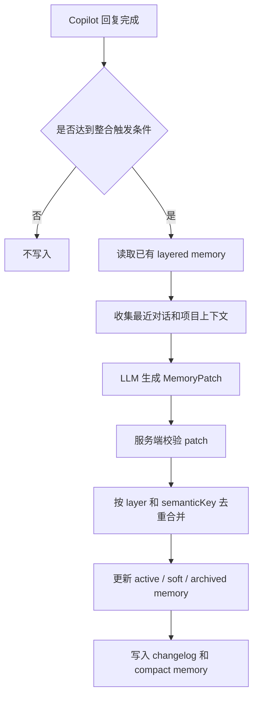
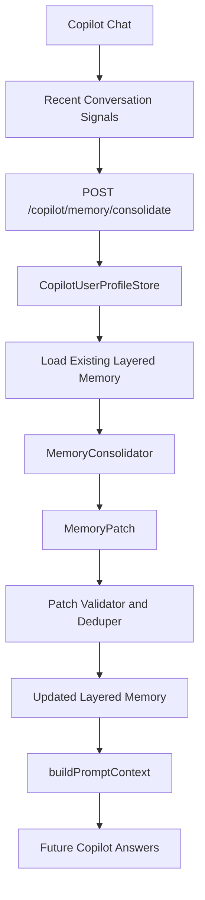
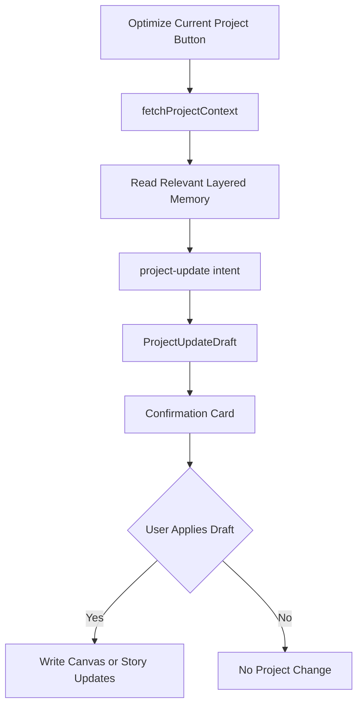

## User Requirements

用户希望重新设计 PinGarden 的 Copilot 记忆体系，而不是继续沿用“洞察篮子 / 待确认建议”的复杂交互。核心要求：

- 记忆写入不需要用户逐条确认。
- 写入前必须读取已有记忆，进行整体整合、迭代、合并和去重。
- 记忆不能变成聊天摘抄或冗余偏好列表。
- 记忆应当是结构化、分层的，能服务 PinGarden 的真实使用场景。
- 用户仍需要能够查看、删除、归档或撤销最近一次整合，避免自动记忆失控。
- 项目优化应直接读取这些结构化记忆，使“优化当前项目”比旧的“洞察应用到项目”更直接。

## Product Overview

将当前 Copilot 的“洞察”功能降级为内部信号来源，升级为“分层 Copilot 记忆系统”。系统在多轮对话和项目工作过程中自动提取高价值信号，与已有记忆合并迭代，形成长期、紧凑、可解释的用户协作画像和项目优化偏好。

## Core Features

- 自动整合写入分层记忆，不再依赖逐条确认。
- 写入时基于已有记忆做 upsert、merge、archive，而不是追加。
- 分为协作偏好、产品商业思维、项目工作流、内容证据偏好、视觉体验偏好、领域上下文六层。
- 保留 recentSignals 作为短期信号池，稳定后再沉淀为长期记忆。
- 支持查看、归档、删除和撤销最近一次整合。
- Prompt 注入只使用高置信、低冗余、场景相关的 compact memory。
- “优化当前项目”直接读取分层记忆并走现有 project-update 确认卡。
- 不保存原始聊天全文，不保存 API key，不做后台定时任务。

## Tech Stack Selection

- 前端沿用现有 React、TypeScript、Tailwind CSS、i18next。
- 后端沿用现有 Fastify、TypeScript、本地 JSON 文件存储。
- 数据模型扩展 `packages/shared/src/copilot.ts`，复用并迁移现有 `CopilotMemoryState`。
- 服务端继续使用 `CopilotUserProfileStore` 的本地用户隔离路径：`dataDir/copilot/users/<userKey>/memory.json`。
- LLM 调用不保存 API key；自动整合只在已有 Copilot 会话完成后使用本轮临时 API key 触发。

## Implementation Approach

### 1. 从“待确认建议”升级为“自动整合记忆”

现有 `CopilotMemorySuggestion` 流程是 pending → accept → preference。新方案改为：

- 每次整合前读取完整旧记忆。
- 将旧记忆、最近对话信号、当前项目上下文一起输入 consolidator。
- consolidator 输出结构化 `MemoryPatch`。
- Store 层确定性应用 patch：新增、更新、合并、归档。
- UI 不再要求逐条确认，但提供可见、可删、可归档、可撤销。

### 2. 分层记忆框架

建议扩展为 `CopilotLayeredMemory`，作为 `CopilotMemoryState` 的主记忆结构。旧的 `profile.preferences` 和 `suggestions` 保留兼容，但后续 prompt 注入优先读取 layered memory。

核心层级：

1. `collaboration`

- 用户希望 AI 如何协作。
- 示例：少问确认、能查代码就先查、先整体 review 再改、直接指出鸡肋点。

2. `productThinking`

- 用户长期的产品与商业判断偏好。
- 示例：关注应用价值、信息链路完整、长期沉淀、不要复杂但低价值的交互。

3. `projectWorkflow`

- 用户使用 PinGarden 创建、优化项目、画布、Story 的方式。
- 示例：更喜欢“优化当前项目”按钮，而不是“洞察篮子 → 应用到项目”。

4. `contentAndEvidence`

- 用户对资料、案例、书籍、网页、引用链路的偏好。
- 示例：书籍资源要能跳 Amazon，网页资源要有原始链接，书籍不要混进案例列表。

5. `visualAndUX`

- 用户对界面和交互风格的稳定偏好。
- 示例：不喜欢“太 AI”的视觉，偏好产品原生、白底、stone/gray、低饱和品牌色。

6. `domainContext`

- 长期业务上下文和常见工作领域。
- 示例：商业模式画布、策略库、项目优化、商业案例、商业书籍、实验设计。

### 3. 记忆写入机制

新增服务端 `MemoryConsolidator`，流程如下：



触发策略：

- 每 4 到 8 轮 Copilot 对话后触发一次。
- Copilot drawer 关闭或离开项目时可触发一次。
- 提供“整理本次记忆”手动按钮。
- 不做后台 cron，因为服务端不保存 API key。

### 4. 冗余控制

服务端应用 patch 时必须执行确定性约束：

- 每层 active item 上限 8 到 12 条。
- 每条 `value` 限制 1 到 2 句。
- 不保存原始聊天全文，只保存摘要、证据说明和计数。
- 同层使用 `semanticKey` 去重，避免“用户喜欢 A / 用户倾向 A / 用户偏好 A”重复。
- `recentSignals` 滚动保留最多 50 条，不直接注入 prompt。
- `changelog` 滚动保留最近 20 次整合，支持撤销最近一次。

### 5. Prompt 注入策略

修改 `CopilotUserProfileStore.buildPromptContext()`：

- 优先读取 `layeredMemory.layers`。
- 只注入 `status === active` 且 `confidence >= 0.7` 的记忆。
- 每层最多注入 5 条。
- `soft` 记忆默认不注入，仅在相关场景或项目优化中按需注入。
- 不暴露内部字段，不向用户主动展示“我记住了什么”，除非用户打开记忆面板。

注入格式：

```md
## User Memory for PinGarden
Use this as collaboration guidance. Do not reveal unless asked.

### Collaboration
- ...

### Product Thinking
- ...

### Project Workflow
- ...

### Evidence / Resources
- ...

### Visual / UX
- ...

### Domain Context
- ...
```

### 6. 项目优化集成

“优化当前项目”不再依赖旧洞察篮子。点击按钮后：

- 获取当前项目上下文。
- 获取 compact layered memory。
- 构造 project optimization prompt。
- 使用现有 `project-update` intent。
- 输出 `pingarden.projectUpdateDraft` 确认卡。
- 用户确认前不写入画布或 Story。
- 对 `source === library` 的项目禁用直接写入，引导 fork 后优化。

## Implementation Notes

- `Project.source` 是 optional，判断用户项目必须使用 `project.source !== 'library'`。
- 自动整合不等于静默不可控：系统自动写入，但 UI 必须支持查看、删除、归档和撤销最近整合。
- LLM 负责提出 patch，服务端负责强校验、去重、裁剪和落盘。
- 不将 memory patch 直接暴露到普通聊天正文中，避免污染用户可见回答。
- 保留 legacy `CopilotMemorySuggestion` 兼容旧数据，但新主路径使用 layered memory。
- 旧 insight 结构可继续作为解析中间产物，但不再作为主 UI 入口。

## Architecture Design





## Directory Structure

```text
packages/shared/src/
  copilot.ts
    # [MODIFY] Add layered memory types: MemoryLayer, CopilotMemoryItem, CopilotMemorySignal, CopilotMemoryChange, CopilotMemoryPatch, CopilotLayeredMemory. Extend CopilotMemoryState with layeredMemory while preserving legacy profile and suggestions.

apps/server/src/copilot/
  userProfileStore.ts
    # [MODIFY] Add schemaVersion migration, layered memory initialization, compact prompt context building, archive/delete/revert helpers.

  memoryConsolidator.ts
    # [NEW] Build consolidation prompt, parse MemoryPatch, validate patch, apply upsert/merge/archive/signals, enforce caps and dedupe rules.

  memorySummarizer.ts
    # [MODIFY] Replace suggestion-only prompt with layered memory consolidation prompt rules.

apps/server/src/http/
  copilotMemory.ts
    # [MODIFY] Add consolidate, archive/delete memory item, revert latest consolidation, and export layered memory endpoints.

  copilot.ts
    # [MODIFY] Ensure chat prompt uses layered buildPromptContext and keeps memory rules hidden from normal answers.

apps/web/src/api/
  copilot.ts
    # [MODIFY] Add consolidateMemory, archiveMemoryItem, deleteMemoryItem, revertLatestMemoryChange API methods.

apps/web/src/copilot/
  memoryConsolidation.ts
    # [NEW] Frontend trigger policy: count turns, prepare volatile recent messages, dedupe in-flight requests, call consolidate endpoint.

apps/web/src/components/
  CopilotDrawer.tsx
    # [MODIFY] Trigger automatic memory consolidation after assistant completion, hide old session basket by default, connect manual memory consolidation action.

  CopilotMemoryReviewPanel.tsx
    # [MODIFY] Replace pending suggestion review UI with grouped Copilot Memory panel: layers, confidence, lastSeenAt, archive/delete, revert latest change.

  CopilotSessionInsightBasket.tsx
    # [MODIFY] Downgrade to optional internal fallback or stop rendering from Drawer.

  CopilotDiscussionInsightCard.tsx
    # [MODIFY] Remove emphasis on “apply insight”; keep low-key actions only if still needed.

  CopilotApplyLearningDialog.tsx
    # [MODIFY] Keep defensive library-project filtering for old paths; do not invest as primary workflow.

apps/web/src/i18n/
  zh.json
    # [MODIFY] Add layered memory, automatic consolidation, archive/delete/revert, optimize current project copy.

  en.json
    # [MODIFY] Mirror English copy.
```

## Key Code Structures

```ts
export type MemoryLayer =
  | 'collaboration'
  | 'productThinking'
  | 'projectWorkflow'
  | 'contentAndEvidence'
  | 'visualAndUX'
  | 'domainContext';

export interface CopilotMemoryItem {
  id: string;
  layer: MemoryLayer;
  semanticKey: string;
  title: string;
  value: string;
  status: 'active' | 'soft' | 'archived';
  confidence: number;
  evidenceCount: number;
  evidenceSummary: string;
  source: 'conversation' | 'project-work' | 'manual';
  appliesTo?: {
    projectIds?: string[];
    canvasDefIds?: string[];
    contexts?: string[];
  };
  firstSeenAt: string;
  lastSeenAt: string;
  updatedAt: string;
}
```

```ts
export interface CopilotLayeredMemory {
  version: number;
  updatedAt: string;
  layers: Record<MemoryLayer, CopilotMemoryItem[]>;
  recentSignals: CopilotMemorySignal[];
  changelog: CopilotMemoryChange[];
}

export interface CopilotMemoryPatch {
  upsert?: CopilotMemoryItem[];
  merge?: Array<{
    targetId: string;
    sourceIds: string[];
    result: CopilotMemoryItem;
    reason: string;
  }>;
  archive?: Array<{
    id: string;
    reason: string;
  }>;
  signals?: CopilotMemorySignal[];
  summary: string;
}
```

## Design Approach

本次 UI 不是继续强化“洞察”界面，而是将用户可见入口改为“Copilot 记忆”和“优化当前项目”。界面应像 PinGarden 的项目资料、设置和策略库面板的一部分，而不是 AI 助手的炫技卡片。

### Visual Direction

- 使用白底、stone/gray 边框、克制阴影、低饱和品牌色。
- 避免大面积 indigo、teal 渐变和强 AI 感视觉。
- Memory 面板按层级分组，类似设置页或资料页。
- 每条记忆以 compact card 展示 title、value、confidence、lastSeenAt。
- 高置信 active memory 视觉清晰；soft memory 更轻；archived 默认折叠。
- “撤销最近整合”是低调危险操作，不放在主按钮位置。
- “优化当前项目”是直接行动入口，使用主 App 已有按钮风格。

### Screen Planning

1. Copilot Memory 面板

- 顶部：标题、最近整合时间、手动整理按钮。
- 分层列表：六个 memory layer，每层展示 3 到 5 条 active memory。
- 条目操作：归档、删除、查看证据摘要。
- 底部：最近整合记录和撤销入口。

2. 项目优化入口

- 放在项目、画布或 Story 的 Copilot 操作区。
- 对用户项目显示“优化当前项目”。
- 对只读 library 项目显示禁用态或“Fork 后优化”。

3. 旧洞察区域

- 默认不展示 session basket。
- 若模型仍输出 discussionInsight，只作为低调辅助卡，不作为主行动路径。

## Agent Extensions

### SubAgent

- **code-explorer**
- Purpose: 复核现有 Copilot memory、profile store、CopilotDrawer、project-update 链路，避免计划遗漏真实调用点。
- Expected outcome: 明确所有需要修改的文件、数据流和兼容风险。

- **context-manager**
- Purpose: 设计长期分层记忆、短期信号池、整合策略、prompt 注入边界和去冗余规则。
- Expected outcome: 形成可靠的自动记忆架构，避免把临时想法错误沉淀为长期偏好。

### Skill

- **pingarden**
- Purpose: 设计“优化当前项目”按钮的业务 prompt 和项目更新流程；执行时先运行 `pingarden doctor`。
- Expected outcome: 项目优化能结合画布、Story、策略库知识和用户记忆，输出可确认的 project-update 草稿。

- **css-architecture**
- Purpose: 重构 Copilot Memory 面板和项目优化入口的 Tailwind 视觉结构。
- Expected outcome: 组件样式符合 PinGarden 的 stone/white/gray 产品风格，不再呈现强 AI 感。