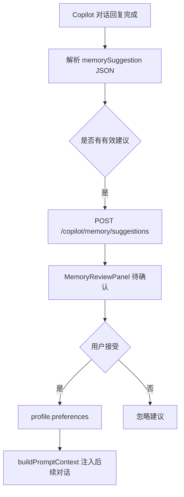
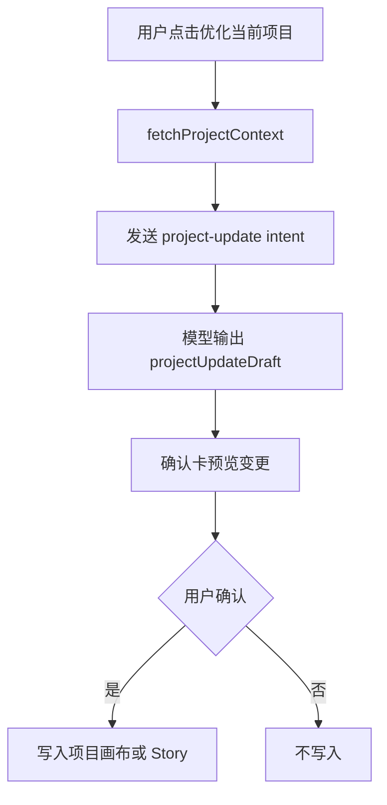

## User Requirements

用户希望重新审视当前“洞察”功能，而不是继续只做样式打磨。核心判断是：当前“洞察篮子 / 应用洞察到项目”的交互偏复杂，价值不够直接，有“鸡肋”感。

## Product Overview

将“洞察”从显性的复杂交互降级为底层结构化能力，把产品价值转向两条更直接的主线：

1. **自动存储偏好**：系统在多轮对话后，自动识别用户稳定偏好、思考习惯或协作方式，生成“待确认偏好建议”；用户确认后才进入长期偏好，并影响后续 Copilot 回答。
2. **项目优化**：提供明确的“优化当前项目”入口，让用户不用绕过“洞察篮子”，直接触发项目审计与优化建议，并生成可确认的项目更新草稿。

## Core Features

- 自动识别并生成待确认偏好建议，不静默写入长期偏好。
- 复用现有本地 Copilot Profile、Memory Suggestion、Accept/Ignore 机制。
- 在项目/画布/Story 工作流中提供“优化当前项目”按钮。
- 点击优化按钮后直接走现有 `project-update` intent，输出可确认的项目更新草稿。
- 对只读策略库项目禁止直接优化写入，引导 Fork 或新建项目。
- 弱化或隐藏旧的“会话洞察篮子”和“应用洞察到项目”复杂流程。
- 保留结构化 insight 作为内部中间产物，但不再作为主产品入口。

## Tech Stack Selection

- 前端沿用现有 **React + TypeScript + Tailwind CSS + i18next**。
- 后端沿用现有 **Fastify + TypeScript**。
- 数据模型复用现有 `packages/shared/src/copilot.ts`：
- `CopilotUserPreference`
- `CopilotReasoningHabit`
- `CopilotMemorySuggestion`
- `CopilotMemoryState`
- `CopilotProjectUpdateDraft`
- API 复用现有 Copilot Memory 和 Project Update 能力，不优先新增 shared schema。

## Current Codebase Facts

已确认现有底座：

- `apps/web/src/copilot/useSessionInsightBasket.ts`
- 当前“洞察篮子”只是内存数组，刷新即丢，cap=20。
- `apps/web/src/components/CopilotSessionInsightBasket.tsx`
- 负责展示“会话洞察篮子”。
- `apps/web/src/components/CopilotApplyLearningDialog.tsx`
- 当前“应用洞察到项目”弹窗会列出 `projectsApi.list()` 的全部项目，包含 `source === 'library'` 的只读策略库项目。
- `apps/server/src/http/copilotMemory.ts`
- 已有 `GET /copilot/memory`、`POST /copilot/memory/suggestions`、accept、ignore、delete preference 路由。
- `apps/server/src/copilot/userProfileStore.ts`
- `acceptSuggestion()` 已能把 suggestion 转为 `profile.preferences[]`。
- `buildPromptContext()` 已会把已确认 preferences / reasoningHabits 注入后续 Copilot prompt。
- `apps/server/src/copilot/memorySummarizer.ts`
- 已有 memory suggestion prompt 规则，但前端没有解析和入库链路。
- `apps/web/src/components/CopilotMemoryReviewPanel.tsx`
- 已有待确认偏好建议 UI。
- `apps/server/src/copilot/protocols.ts`
- `project-update` intent 已支持输出 `pingarden.projectUpdateDraft`。
- `apps/web/src/api/copilot.ts`
- 已有 `fetchProjectContext()`、`getMemoryState()`、`acceptMemorySuggestion()`、`ignoreMemorySuggestion()`、`deleteUserPreference()`。
- 缺少 `createMemorySuggestion()`。
- `apps/web/src/components/CopilotDrawer.tsx`
- 已有 `handleSend(... intent: 'project-update')` 相关路径，可复用。

## Implementation Approach

### 1. 降级旧“洞察”显性流程

不继续把“会话洞察篮子”作为主体验打磨。旧功能的问题不是单纯样式，而是产品路径过绕：

聊天产生洞察 → 加入篮子 → 应用洞察 → 选择目标 → 选择动作 → 再生成草稿。

新方案改成：

- 长期价值走“待确认偏好建议”。
- 项目价值走“优化当前项目”按钮。
- 旧洞察卡只保留轻量入口，或默认隐藏篮子。

### 2. 自动偏好建议

利用已有 `POST /copilot/memory/suggestions`，补齐前端链路：

- 在 `apps/web/src/api/copilot.ts` 新增 `createMemorySuggestion(input, displayName)`。
- 在 `apps/web/src/copilot/projectDraft.ts` 增加结构化 JSON 提取能力，例如识别：
- `kind: "pingarden.memorySuggestion"`
- 或符合 memory suggestion shape 的 fenced JSON block。
- 在 `CopilotDrawer.tsx` 的 assistant 回复完成后：
- 解析 memory suggestion；
- 自动调用 `createMemorySuggestion()` 写入 pending suggestions；
- 不自动 accept；
- 仍由 `CopilotMemoryReviewPanel` 让用户确认。

这样“自动存储偏好”第一阶段实际是“自动生成待确认偏好建议”，兼顾自动化和安全性。

### 3. 项目优化入口

把项目优化从“洞察应用”中解耦出来，变成显性按钮：

- 在项目相关工作区增加“优化当前项目”入口。
- 点击后直接构造项目优化 prompt，并使用 `intent: 'project-update'`。
- 复用 `fetchProjectContext(projectId, lang, opts)` 获取项目上下文。
- 输出仍走现有 `pingarden.projectUpdateDraft` 确认卡流程，确认前不写入。
- 对 `source === 'library'` 的项目禁用直接优化写入，展示“Fork 后优化”或引导新建项目。

### 4. UI 风格调整

不再大规模打磨旧 insight 交互，而是把需要保留的 UI 调整为主 App 风格：

- `CopilotMemoryReviewPanel.tsx` 从 indigo/AI 感面板改为 stone/white。
- “优化当前项目”按钮使用现有 Library / MyProjects 的按钮风格。
- 若保留 insight card，仅保留低调的“保存为偏好建议 / 用于优化当前项目”操作，不再强调“洞察篮子”。

## Performance and Reliability

- 解析 memory suggestion 仅在 assistant 回复完成时执行，复杂度 O(n)，n 为单条回复文本长度。
- 创建 pending suggestion 走已有服务端 JSON 文件存储，数量已由 `userProfileStore.addSuggestion()` 限制为最多 50 条。
- 不做后台 cron，因为当前 Kimi API key 由前端每次请求传入，服务端不保存 key，无法可靠无感定期调用模型。
- 不静默保存已确认偏好，避免把临时想法误记为长期偏好。
- 项目优化复用已有 project-update 确认卡，保持“用户确认前不写入”的安全边界。

## Architecture Design

新的能力分为两条主链路：





## Directory Structure

```text
apps/web/src/api/
  copilot.ts
    # [MODIFY] 新增 createMemorySuggestion(input, displayName)，复用现有 /copilot/memory/suggestions。

apps/web/src/copilot/
  projectDraft.ts
    # [MODIFY] 增加 memory suggestion JSON 提取函数；保持 projectDraft/projectUpdate 解析不变。

apps/web/src/components/
  CopilotDrawer.tsx
    # [MODIFY] assistant 回复完成后自动创建 pending memory suggestion；隐藏或弱化旧 session basket；接入项目优化入口。

  CopilotMemoryReviewPanel.tsx
    # [MODIFY] 保留 accept/ignore/delete 逻辑，视觉改为 stone/white，并更突出“待确认偏好”。

  CopilotSessionInsightBasket.tsx
    # [MODIFY] 默认不作为主入口渲染，或仅保留内部兜底；不再作为核心体验。

  CopilotDiscussionInsightCard.tsx
    # [MODIFY] 弱化“应用到项目”，可改为“保存为偏好建议 / 用于优化当前项目”的轻量操作。

  CopilotApplyLearningDialog.tsx
    # [MODIFY] 保底过滤 source === 'library'，避免旧路径选择只读项目；不继续作为主流程投入。

apps/web/src/i18n/
  zh.json
    # [MODIFY] 新增“优化当前项目”“待确认偏好建议”等文案，弱化“洞察篮子”。

  en.json
    # [MODIFY] 同步英文文案。
```

## Implementation Notes

- `Project.source` 是 optional，过滤用户项目必须使用 `project.source !== 'library'`。
- Memory suggestion 自动入库只创建 `pending`，不自动 `accept`。
- 若同一回复重复解析出相同建议，需要前端去重或依赖后端 50 条 cap，建议前端按 `title + suggestedValue` 做单轮去重。
- 只读 library 项目不走 `project-update` 写入路径。
- 不引入后台任务，不保存 API key，不改变隐私边界。
- 旧 insight 结构可继续由模型输出，但 UI 不再把它作为主产品动作。

## Design Approach

本次不是继续强化“洞察”界面，而是降低它的存在感，让用户感知到两个更自然的产品能力：

1. “系统逐渐理解我的偏好”
2. “我可以直接优化当前项目”

### Visual Direction

整体遵循 PinGarden 现有风格：白底、stone/gray 边框、克制阴影、低饱和品牌色。避免大面积 indigo、teal 渐变和明显 AI 助手感。

### UI Changes

- Memory Review 面板改成“待确认偏好”区域，像设置或项目资料的一部分，而不是 AI 卡片。
- “优化当前项目”按钮使用现有 `border-gray-200 bg-white` 或 `bg-gray-900 text-white` 风格。
- 旧洞察卡不再强调“加入篮子 / 应用到项目”，改为更轻的辅助操作。
- 对只读策略库项目，按钮状态应清晰表达不可直接写入，可引导 Fork 后优化。

## Agent Extensions

### SubAgent

- **context-manager**
- Purpose: 复核 Copilot 长期偏好、待确认记忆、prompt 注入和多轮上下文边界，避免把临时洞察误设计成长期记忆。
- Expected outcome: 明确自动建议、用户确认、后续 prompt 注入之间的可靠链路。

### Skill

- **css-architecture**
- Purpose: 调整 Memory Review、优化入口和保留洞察卡的 Tailwind 样式，使其复用现有 App 的 stone/white/gray 视觉体系。
- Expected outcome: 删除强 AI 感视觉，保持组件样式一致、局部、可维护。

- **pingarden**
- Purpose: 设计“优化当前项目”按钮触发的业务 prompt，确保它能产出有效的画布、Story、实验或策略优化建议。
- Expected outcome: 项目优化入口能直接驱动 `project-update` 草稿，而不是停留在泛泛建议。