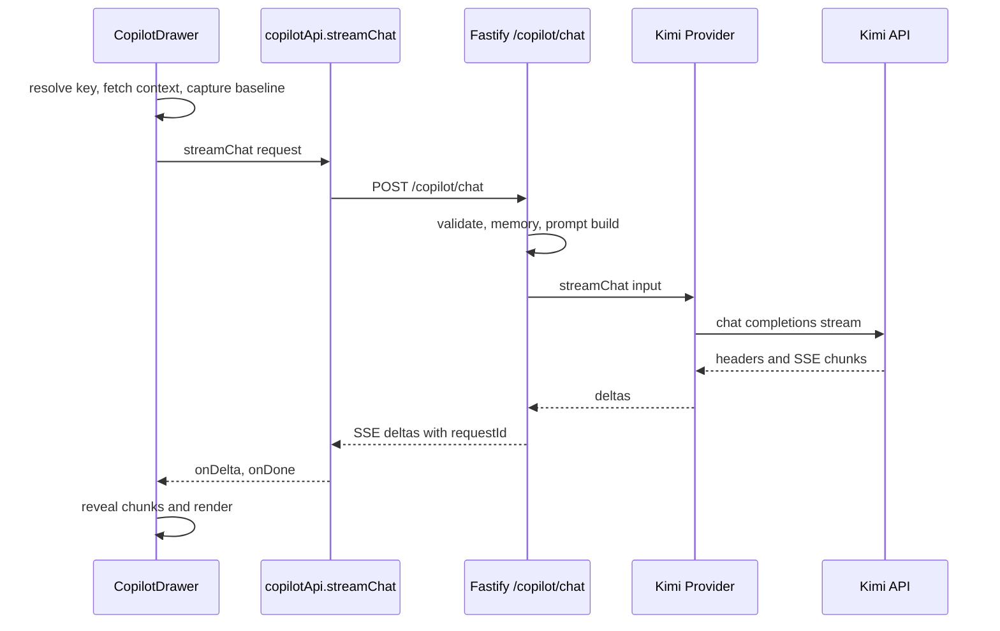

## 用户需求

用户希望分析 Auto Pilot 在发送消息后返回耗时较长的问题，并建立一套可持续的性能诊断和对标机制。

## 产品概述

Auto Pilot 需要在用户发出消息后，能够清晰区分“等待中”的不同阶段，并让开发侧可以判断慢在哪里：是前端准备上下文慢、网络慢、服务端处理慢、上游 Kimi API 慢，还是前端展示和渲染慢。

## 核心功能

- 拆分 Auto Pilot 一次对话请求的完整耗时链路。
- 记录关键阶段耗时，包括前端准备、服务端预处理、上游 API 首包、首个 token、总耗时、前端展示耗时。
- 建立可重复运行的性能 benchmark，用于对比不同场景的 p50、p95、首包时间、首 token 时间和总耗时。
- 基于数据识别优化点，例如上下文获取、项目快照、用户记忆读取、上下文长度、前端 reveal 展示节奏等。
- 保持日志安全，不记录 API Key、用户完整对话正文、图片原文或敏感 payload。

## Tech Stack Selection

当前项目沿用既有技术栈：

- 前端：React、TypeScript、Vite。
- 后端：Fastify、TypeScript、Pino/Fastify logger。
- AI 流式链路：前端 `fetch` 读取 SSE，服务端 `/copilot/chat` 代理 Kimi HTTP 或 Kimi CLI。
- 云端：CloudBase CloudRun 容器服务，当前线上使用 `PINGARDEN_AI_PROVIDER=kimi-http`。
- 测试和基准：Node.js 脚本，复用现有 `scripts/cloud-smoke-test.mjs` 风格。

## Implementation Approach

采用“先观测，再优化，再固化基准”的方式处理性能问题。先为 Auto Pilot 请求链路增加端到端阶段计时，让每次慢请求都能定位到具体阶段；再增加可重复运行的 benchmark 脚本，按不同上下文场景对比 p50/p95；最后根据数据做低风险优化，例如提前展示用户消息、缓存上下文、裁剪 prompt、减少不必要的串行等待。

当前代码中已经确认的关键链路：

1. 前端 `apps/web/src/components/CopilotDrawer.tsx`

- `handleSend` 会先解析 key、可选获取 attached context、可选 capture update baseline，然后才 append 消息并调用 `copilotApi.streamChat`。
- 这意味着用户感知的等待可能发生在真正请求 `/copilot/chat` 之前。

2. 前端 `apps/web/src/api/copilot.ts`

- `streamChat` 负责 POST `/copilot/chat` 和解析 SSE。
- 当前没有记录 request start、response headers、首个 SSE frame、首个 delta、done 等节点。

3. 后端 `apps/server/src/http/copilot.ts`

- 已有结构化日志和 `X-Request-Id`，但目前只记录 started、completed、upstream error、client abort 等粗粒度事件。
- 缺少服务端预处理、memory read、prompt build、上游首包、首 delta 等阶段细分。

4. 上游 provider

- `apps/server/src/llm/kimiHttpProvider.ts` 负责 Kimi HTTP 流式请求，是云端主要慢点候选。
- `apps/server/src/llm/kimiCliAdapter.ts` 本地模式可能是整段返回，不一定是真 token streaming，应单独标记。

5. 前端 reveal

- `apps/web/src/copilot/reveal.ts` 以 24ms 间隔分块展示。网络完成后，仍可能因为 reveal queue 造成可见完成时间延迟。

## Latency Breakdown Design

一次 Auto Pilot 请求建议拆成以下阶段：

- `client.keyResolveMs`：读取或解密 API Key。
- `client.contextFetchMs`：获取 library、case、project、canvas 或 story context。
- `client.baselineCaptureMs`：项目更新模式下捕获 baseline。
- `client.requestBuildMs`：组装 outbound messages 和附件 payload。
- `client.requestToHeadersMs`：POST 发出到收到响应头。
- `client.headersToFirstFrameMs`：收到响应头到首个 SSE frame。
- `client.headersToFirstDeltaMs`：收到响应头到首个可见 delta。
- `client.networkDoneMs`：网络流结束时间。
- `client.revealDoneMs`：前端 reveal 队列完全展示完成时间。
- `server.preUpstreamMs`：服务端 validation、清理消息、附件校验、memory prompt、system prompt 构建。
- `server.upstreamHeadersMs`：服务端调用 Kimi 到收到上游响应头。
- `server.upstreamFirstDeltaMs`：调用 Kimi 到收到首个 upstream delta。
- `server.totalMs`：服务端总处理时间。
- `server.deltaChunks` 和 `server.deltaChars`：输出规模。
- `server.attachedContextChars`、`messageCount`、`attachmentCount`：影响性能的输入规模指标。

## Implementation Notes

- 日志只能记录指标、长度、计数、requestId、provider、intent、lang，不记录正文、API Key、图片 dataUrl。
- 前端通过响应头 `X-Request-Id` 关联服务端日志。
- Benchmark 的真实 Kimi 测试必须通过环境变量传入 API Key，例如 `PINGARDEN_SMOKE_KIMI_API_KEY`，不得写入仓库或日志。
- 优化应先做低风险项：
- 提前 append 用户消息和显示“准备上下文”状态，降低感知等待。
- 缓存同一 `attachedRef + lang + query` 的 context，避免重复请求。
- 对 prior conversation 和 attached context 增加长度统计与裁剪策略。
- 在 reveal 队列过大时加速 flush，避免“网络已完但 UI 还慢慢吐字”。
- 不把性能测试混入普通 smoke 的默认关键路径太重；真实模型 benchmark 单独脚本运行。

## Architecture Design



## Directory Structure

```
BusinessModelCanvas/
├── apps/
│   ├── server/
│   │   └── src/
│   │       ├── http/
│   │       │   └── copilot.ts
│   │       │       # [MODIFY] 为 /copilot/chat 增加细粒度阶段计时日志：
│   │       │       # validation、memory、prompt build、upstream start、first delta、total。
│   │       │       # 保持不记录正文和 API Key。
│   │       └── llm/
│   │           ├── aiProvider.ts
│   │           │   # [MODIFY] 扩展 provider 输入，支持可选 metrics 回调或事件上报。
│   │           ├── kimiHttpProvider.ts
│   │           │   # [MODIFY] 记录 Kimi HTTP 上游 headers、first delta、done、chunk 统计。
│   │           ├── kimiCliProvider.ts
│   │           │   # [MODIFY] 透传本地 CLI provider 的指标回调，方便本地和云端对比。
│   │           └── kimiCliAdapter.ts
│   │               # [MODIFY] 标记 CLI spawn、stdout first line、first assistant delta、exit 等阶段。
│   ├── web/
│   │   └── src/
│   │       ├── api/
│   │       │   └── copilot.ts
│   │       │       # [MODIFY] streamChat 增加 requestId 和 client timing callbacks：
│   │       │       # request start、headers、first frame、first delta、done、error。
│   │       ├── components/
│   │       │   └── CopilotDrawer.tsx
│   │       │       # [MODIFY] 记录并展示调试用 requestId；拆分 key/context/baseline/stream/reveal 阶段。
│   │       │       # 低风险优化：更早显示用户消息和准备状态。
│   │       └── copilot/
│   │           ├── reveal.ts
│   │           │   # [MODIFY] 根据队列长度优化 reveal 节奏，避免大段响应展示完成慢。
│   │           └── performance.ts
│   │               # [NEW] 前端 Copilot timing 类型、聚合和安全格式化工具。
├── scripts/
│   ├── cloud-smoke-test.mjs
│   │   # [MODIFY] 保持现有功能 smoke；可输出基础请求耗时，不承担真实模型性能基准。
│   └── copilot-latency-benchmark.mjs
│       # [NEW] Auto Pilot 性能 benchmark 脚本。
│       # 支持 no-context、library-context、project-context、long-conversation、image-turn 等场景。
│       # 输出 p50、p95、TTFB、TTFT、total、chars/sec、requestId 列表。
├── docs/
│   ├── CLOUD_RELEASE_TEST_PLAN.md
│   │   # [MODIFY] 增加 Auto Pilot 性能门禁和 benchmark 使用说明。
│   └── COPILOT_PERFORMANCE.md
│       # [NEW] 性能指标定义、标杆阈值、排查决策树、优化策略记录。
└── package.json
    # [MODIFY] 新增 benchmark 脚本，例如 benchmark:copilot。
```

## Benchmark and Baseline Proposal

建议新增独立命令：

```
PINGARDEN_SMOKE_KIMI_API_KEY=sk-xxx pnpm benchmark:copilot -- --url https://pingarden-274959-7-1259605451.sh.run.tcloudbase.com --runs 5
```

建议输出指标：

- `ttfbMs`：请求到响应头。
- `ttftMs`：请求到首个 delta。
- `totalMs`：请求到 done。
- `firstFrameMs`：请求到首个 SSE frame，包括 stream-open。
- `serverPreUpstreamMs`：服务端准备耗时。
- `upstreamHeadersMs`：Kimi API 响应头耗时。
- `upstreamFirstDeltaMs`：Kimi 首 token 耗时。
- `charsPerSec`：流式输出吞吐。
- `requestId`：用于回查 CloudRun 日志。

建议对标初始阈值，后续用真实数据校准：

- 无上下文普通问答：TTFB 小于 2 秒，TTFT 小于 8 秒。
- 带 library filtered context：TTFT 小于 12 秒。
- 带 project context：TTFT 小于 15 秒。
- 总耗时按输出规模归一化，重点看 chars/sec 和 p95。

## Agent Extensions

### SubAgent

- **code-explorer**
- Purpose: 继续核对 Auto Pilot 调用链、上下文获取、记忆、provider 和测试脚本的所有相关 call site。
- Expected outcome: 确认不会遗漏影响延迟的关键路径，并避免改动破坏现有 Copilot 功能。

### Integration

- **tcb**
- Purpose: 查询 CloudBase CloudRun 线上版本、运行配置和部署后日志，按 requestId 对照性能指标。
- Expected outcome: 能把前端慢请求与 CloudRun 服务端日志关联，判断慢点是否来自上游 Kimi API、服务端预处理或网络。