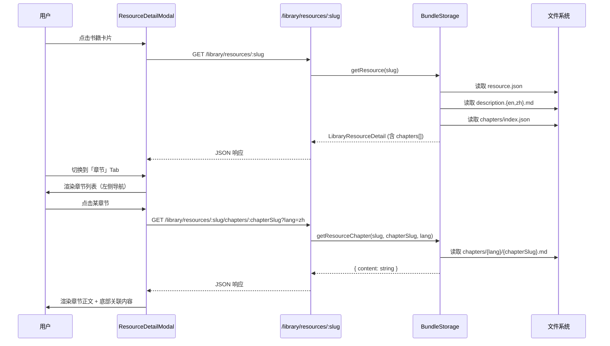

## 技术栈

- 类型定义：TypeScript（packages/shared/src/index.ts）
- 后端：Fastify + Node.js（apps/server/src/storage/BundleStorage.ts、apps/server/src/http/library.ts）
- 前端：React + TypeScript + Tailwind CSS（apps/web/src/components/ResourceDetailModal.tsx、apps/web/src/api/library.ts）
- 国际化：react-i18next（apps/web/src/i18n/{en,zh}.json）

## 实现方案

### 整体策略

在现有 `LibraryResourceDetail` 数据模型上向后兼容地扩展章节能力。每本书的章节数据存入 `packages/case-library/resources/<slug>/chapters/` 目录，包含元数据索引和按章拆分的双语 Markdown。后端在 `BundleStorage` 中新增章节加载方法，前端在 `ResourceDetailModal` 中增加第四个 Tab。整条链路从类型定义到后端加载、API 暴露、前端渲染都遵循项目已有的 `description.md` 加载模式。

### 核心设计决策

1. **章节内容与描述分离**：保留现有 `description.md` 作为全书阅读地图/概述，新增 `chapters/` 作为结构化章节数据。两者互补不冲突。
2. **按需加载章节内容**：列表 API 只返回章节元数据（标题、摘要、关联），正文通过独立端点 `GET /library/resources/:slug/chapters/:chapterSlug` 获取，避免首次请求响应体过大。
3. **章节 slug 约定**：`NN-kebab-case-title` 格式，如 `01-canvas`、`02-patterns`，与 `BOOK_REBUILD_SPEC.md` 中的约定一致但适用范围不同（library resources 而非 canvas knowledge）。
4. **跨引用使用现有 slug 体系**：章节级关联直接复用 `relatedCaseSlugs[]`、`relatedPatternSlugs[]` 等字段，前端可复用已有的 `CaseMiniCard`、`SlugSection` 组件渲染。

### 性能考量

- 章节列表元数据轻量（~2KB/本），包含在 `LibraryResourceDetail` 响应中一次返回
- 章节正文按需加载，单次请求 ~5-15KB
- BundleStorage 在初始化时一次性扫描全部 `chapters/index.json`，运行时纯内存查询，无额外 I/O
- 章节 Markdown 渲染复用前端已有的 `ReactMarkdown` 组件，无新增依赖

## 架构设计

### 数据流

### 模块划分

- **类型层**（packages/shared）：新增 `ResourceChapterMeta`、`ResourceChapterDetail` 接口，扩展 `LibraryResourceDetail` 增加 `chapters` 可选字段
- **存储层**（BundleStorage）：新增 `loadChapterIndex()`、`getResourceChapter()` 方法，初始化时扫描章节索引
- **API 层**（library.ts）：新增 `GET /library/resources/:slug/chapters/:chapterSlug` 端点
- **前端层**（ResourceDetailModal）：新增 `ChaptersTab` 组件，左侧章节树 + 右侧内容渲染；扩展 API 客户端

## 实现要点

### 向后兼容性

- `LibraryResourceDetail.chapters` 为可选字段，未提供章节数据的资源行为不变
- 前端仅在 `chapters` 数组非空时显示「章节」Tab
- 现有 `description.md` 不受影响

### 内容创作规范

- 每章 markdown 文件遵循固定模板：章节标题 → 页码范围 → TL;DR → 分节正文 → 关键概念
- 双语版本并存，文件名一致（`chapters/en/01-canvas.md`、`chapters/zh/01-canvas.md`）
- 章节级关联引用需与 `resource.json` 中的全局关联去重——章节只列出该章专有的关联

### 非代码内容

- 12本书的章节 content 以 Markdown 文件形式落地在 `chapters/` 目录下，由方案中的内容创作任务覆盖
- 部分内容可参考已有的 `description.md`（如 christensen-innovators-dilemma 已有章节级结构）和 `BOOK_REBUILD_SPEC.md` 的章节划分逻辑

## 使用的 Agent 扩展

### SubAgent

- **code-explorer**
- 用途：探索项目中 shared types、BundleStorage、library.ts、ResourceDetailModal、i18n 文件的具体实现细节，确认修改切入点和现有模式
- 预期结果：获取精确的文件行号、函数签名、组件结构，确保计划中的修改路径和接口与代码库一致