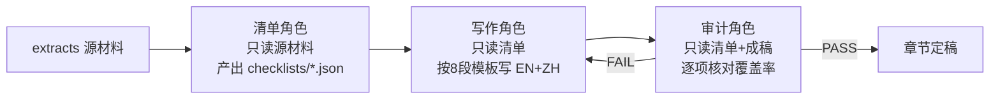

## 产品概述

为 PinGarden 资源库中的 12 本商业书籍做两件事：(1) 系统性提升每本书章节内容的质量，确保所有书目都达到统一的高标准；(2) 重新设计资源库中书籍的卡片列表与详情弹框，提升浏览与阅读体验。

## 核心目标

### Part A — 书籍质量与内容提升

- 恢复并强制执行已有的质量规范与审计流程（`CHAPTER_QUALITY_SPEC.md` 的"清单 → 写作 → 审计"四阶段），该规范此前只在首批 3 本书完整落地，后续大量跳过。
- 以 A 级达标书（BMC / VPC / Invincible，每章 EN 3.8K–7.8KB，概念/论证/案例齐全、含审计报告）为统一基准，把所有书目拉齐到同等深度。
- 多角色分离：覆盖清单、章节写作、内容审计由互相独立的角色完成，互相制衡；审计未通过的章节打回重写。
- 逐本推进、逐章核对，禁止"批量加速"导致的内容空泛。

### Part B — 书籍卡片与弹框 UI 优化

- 重新设计资源库书籍卡片，强化书籍质感与信息层级（封面/书脊视觉、章节数、作者、推荐语、标签、阅读入口）。
- 重新设计书籍详情弹框，优化章节阅读体验（章节导航、正文排版、关联内容），兼容"有章节书籍"与"无章节数据资源"两类。

## 各书当前质量分级（实测）

| 级别 | 书目 | 状态 |
| --- | --- | --- |
| A 级（达标） | BMC、VPC、Invincible | 清单+写作+审计齐全，作为基准 |
| B 级（需补深度+审计） | Christensen、Testing BI、Scenario Planning | 有清单无审计，内容偏薄 |
| F 级（需重做） | Blue Ocean Strategy/Shift、Porter CS/CA、Art of Long View、Platform Revolution | 无清单无审计、内容极薄；BOS 还有文件错乱 |


## 验收标准

- 每本书均具备：完整 `checklists/` + `chapters/*.{en,zh}.md` + `audit-report.md`，审计逐项 PASS。
- 内容深度对标 A 级，EN/ZH 覆盖同一份清单。
- 前端：`pnpm typecheck` 全绿 + `pnpm --filter @pingarden/web build` 成功，卡片与弹框正常渲染。

## 技术栈

- **内容流水线**：源材料已全部提取至 `extracts/`（12 本均为 Tier A，可逐项核对原文）；流程产出 = 覆盖清单 JSON + 双语 Markdown + 审计报告 Markdown。
- **PDF 提取（如需补充/复核）**：`tools/extract-pdf.py`（PyMuPDF），已验证可用。
- **前端**：React + TypeScript + Tailwind CSS，`react-markdown` 渲染章节正文，`react-i18next` 国际化。
- **后端**：Fastify，章节 API 已就绪 `GET /library/resources/:slug/chapters/:chapterSlug`。
- **类型层**：`packages/shared/src/index.ts` 已有 `ResourceChapterMeta` / `ResourceChapterDetail`。

## 实现方案

### Part A：四阶段质量流水线（恢复审计门控）

关于用户提问"之前的审计和质量规范有没有写进去"：规范文件 `CHAPTER_QUALITY_SPEC.md`（v2）**已存在但只在首批完整执行**，B/F 级书目均跳过了审计与清单环节。本计划将该规范升级为 v3（标注 12 本全为 Tier A、把"审计全 PASS"设为强制完成门槛、写入 A 级深度基准），并对所有未达标书目重新跑全流程。

每本书严格执行三角色分离（均由 `[subagent:code-explorer]` 承担，但职责互斥）：



- **清单角色**：读 `extracts/<book>/chapters/*.txt`，提取概念/论证/案例/逻辑链/术语/nuance，写入 `checklists/<chapter>.json`。
- **写作角色**：仅依据清单，按 8 段结构（核心论点→本章定位→核心概念→关键论证→案例→应用启示→关联→关键要点）写 EN+ZH，两语覆盖同一清单。
- **审计角色**：逐项核对成稿是否覆盖清单全部条目，产出 `audit-report.md`；任一项 FAIL 即打回写作角色修正。

### Part A 执行批次（逐本逐章，不批量加速）

1. **清理与规范固化**：删除 blue-ocean-strategy 孤儿文件（`ch01-blue-ocean.{en,zh}.md`、`ch02-six-paths.{en,zh}.md`），升级 `CHAPTER_QUALITY_SPEC.md` 至 v3。
2. **B 级补强**（Christensen 9 章、Testing BI 4 章、Scenario Planning 5 章）：复核既有清单 → 按 A 级深度重写偏薄章节 → 补审计报告。
3. **Blue Ocean 两本**（Strategy：保留并复核已重写的 ch01–03，补 ch04–09；Shift 全 8 章）：清单→写作→审计。
4. **Porter 两本**（Competitive Strategy 7 章、Competitive Advantage 8 章）：清单→写作→审计。
5. **Long View + Platform Revolution**（各 7 章）：清单→写作→审计。
6. **全量终审**：核对 12 本均有 audit-report 且全 PASS，修补遗漏。

### Part B：卡片与弹框重设计

- `ResourceList.tsx`（卡片）：重做 `ResourceCard`，引入书籍质感（书脊/封面色块或首字母徽标）、清晰信息层级（标题/作者/类型/章节数/推荐语/标签）、悬停微交互。需兼容无章节的数据类资源（隐藏章节数）。
- `ResourceDetailModal.tsx`（弹框）：优化阅读体验——更克制的头部、章节左导航 + 右正文（优化 prose 排版、字号行距）、关联内容区。保持现有 4 Tab 语义与后端 API 不变，仅重构展现层。
- 章节数来源：复用 `LibraryResourceDetail.chapters`（列表页可走轻量字段或在卡片懒加载，避免 N+1）。

### 实现要点

- **向后兼容**：后端 API、类型定义、i18n key 复用现有；仅当 UI 需要新文案时在 `apps/web/src/i18n/{en,zh}.json` 增补，禁止硬编码用户可见字符串。
- **性能**：卡片列表不逐卡请求章节详情；章节数若不在列表响应中，则统一在 manifest/列表接口补充计数字段，避免 N+1 请求。
- **质量门控**：审计未全 PASS 的书目不得标记完成；内容必须可追溯到源材料，禁止臆造概念或失效的 slug 交叉引用。

## 目录结构（涉及的新增/修改文件）

```
packages/case-library/
├── CHAPTER_QUALITY_SPEC.md            # [MODIFY] 升级 v3：12本全 Tier A、审计强制门槛、A级深度基准
└── resources/<book-slug>/
    ├── chapters/index.json            # [既有] 章节索引（slug 真相源）
    ├── checklists/<chapter>.json      # [NEW/MODIFY] 覆盖清单（B/F级补齐）
    ├── chapters/<chapter>.{en,zh}.md  # [MODIFY] 按清单重写至 A 级深度
    └── audit-report.md                # [NEW] 每本书审计报告，逐项 PASS

apps/web/src/components/
├── ResourceList.tsx                   # [MODIFY] 卡片重设计（书籍质感+章节数+信息层级）
└── ResourceDetailModal.tsx            # [MODIFY] 弹框重设计（章节阅读体验）

apps/web/src/i18n/{en,zh}.json         # [MODIFY] 如需新增卡片/弹框文案
```

清理项：`blue-ocean-strategy/chapters/ch01-blue-ocean.{en,zh}.md`、`ch02-six-paths.{en,zh}.md`（孤儿文件，删除）。

## 设计目标

为商业书籍资源库打造"精品图书馆"质感的浏览与阅读体验。整体延续 PinGarden 现有的暖琥珀色调（amber）与克制留白，但提升书籍的视觉辨识度与信息层级，使卡片像书架上的藏书、弹框像沉浸式阅读器。

## 重设计页面（2 个）

### 1. 资源库书籍卡片（ResourceList / ResourceCard）

自上而下分块：

- **封面区**：左侧书脊色块或首字母徽标（按资源类型着色），右侧标题 + 类型 badge，建立书籍辨识度。
- **推荐语区**：推荐理由（line-clamp 控制行数），暖色细描边背景区分。
- **元信息区**：作者 · 年份，次级灰度文字。
- **底部标签区**：标签 chips（最多 3）+ 章节数徽标（仅书籍显示）+ 关联数。
- **交互**：悬停轻微抬升 + 边框转琥珀 + 阴影，键盘可聚焦。数据类资源（无章节）隐藏章节徽标，保持布局一致。

### 2. 书籍详情弹框（ResourceDetailModal）

自上而下分块：

- **顶部导航条**：类型 badge + 标题 + 作者/出版/年份，右侧关闭按钮；去除冗余 slug 噪音。
- **推荐语条**：暖色高亮条，一句话推荐理由。
- **Tab 栏**：详细说明 / 章节 / 关联内容 / 参考文献，章节 Tab 带计数。
- **章节阅读区（核心）**：左侧 200–220px 章节树（序号 + 标题，当前项高亮），右侧正文采用优化后的 prose 排版（更舒适的字号、行距、标题层级、引用块、关联案例卡片）。
- **响应式**：弹框 max-w-4xl、限高滚动；窄屏下章节树可折叠为顶部下拉。

## 设计风格

精品编辑/图书馆风：温暖、克制、专业。大量留白、清晰的字体层级、暖琥珀点缀色、柔和阴影与圆角，阅读正文使用更适合长文的字号行距。

## Agent 扩展

### SubAgent

- **code-explorer**
- 用途：承担 Part A 三角色流水线——清单角色（读 `extracts/` 源材料产出 `checklists/*.json`）、写作角色（依据清单写 EN+ZH 章节）、审计角色（逐项核对覆盖率产出 `audit-report.md`）；三角色职责互斥、互相制衡。同时用于核对交叉引用 slug 在 `manifest.json` / canvas 清单中的有效性。
- 预期结果：每本书产出完整且可追溯的覆盖清单、达到 A 级深度的双语章节、逐项 PASS 的审计报告。

### Skill

- **pdf**
- 用途：当某本书源材料需要复核或重新按章拆分时，读取 `BusinessBooks/` 下 PDF 并输出结构化 txt（对齐既有 `extracts/<book>/` 格式）。
- 预期结果：补全或修正任何缺失/错乱的源章节文本，保证清单角色有可靠原文可依。