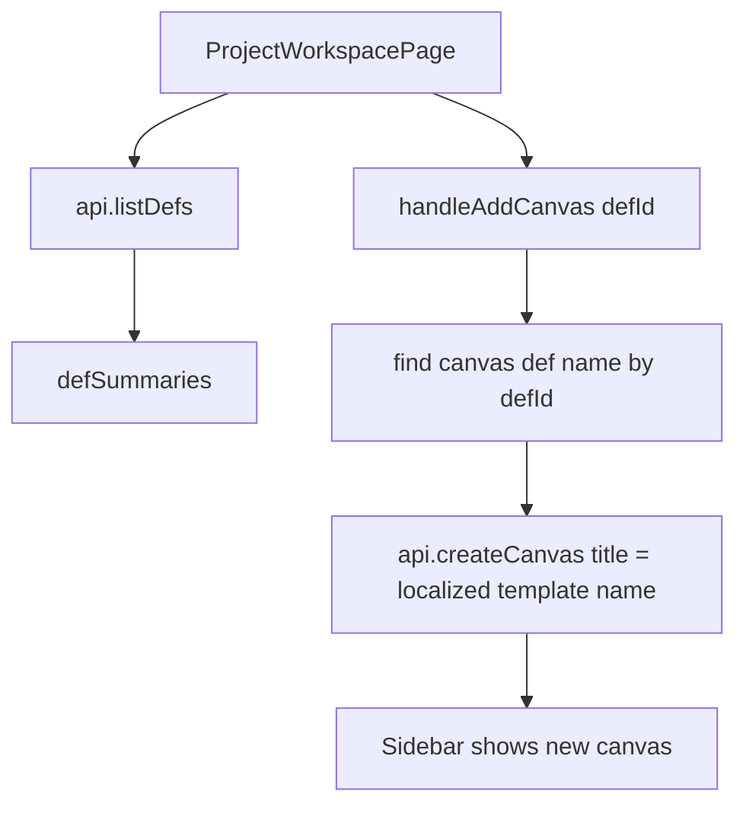

## User Requirements

用户希望统一 PinGarden 创建画布时的默认命名规则。

## Product Overview

当前通过具体画布模板入口创建画布时，默认名称已经使用画布类型名称，例如“三层增长地图”。但在项目页面内点击“+ 添加画布”时，新建画布默认名称仍是“未命名 · 日期”。用户认为这不必要，希望项目内新增画布也默认使用所选画布类型名称。

## Core Features

- 项目内点击“+ 添加画布”后，新画布标题默认使用当前语言下的画布模板名。
- 中文环境下使用中文画布类型名，例如“三层增长地图”“BCG 增长份额矩阵”。
- 英文环境下使用英文画布类型名，例如“Three Horizons Map”。
- 不再使用“未命名 · 日期”或“Untitled · 日期”作为画布默认名。
- 不自动重命名已有“未命名”画布。
- 不修改故事默认名“未命名故事”。

## Tech Stack Selection

继续使用现有 PinGarden 技术栈和前端结构：

- 前端：React + TypeScript + Vite
- i18n：react-i18next 与现有 `lang` 状态
- Canvas 定义来源：`api.listDefs()` 返回的 `CanvasDefSummary`
- 修改范围：仅调整项目工作区内创建画布的默认标题逻辑

## Implementation Approach

在 `apps/web/src/pages/ProjectWorkspacePage.tsx` 中修改 `handleAddCanvas(defId)` 的默认标题生成逻辑。当前逻辑使用 `未命名 · 日期` 或 `Untitled · 日期`，应改为从已加载的 `defSummaries` 中查找对应 `defId` 的画布定义，并使用 `name[lang]` 作为默认标题。

处理策略：

1. 优先使用当前 UI 语言的画布名称。
2. 如果当前语言名称不存在，回退到英文名称。
3. 如果定义尚未加载或未找到，使用 `defId` 作为安全 fallback，避免创建失败。
4. 保持 `api.createCanvas`、`setCanvases`、`navigate` 等后续行为不变。
5. 不影响 `NewProjectPage.tsx`，因为该页面已经使用 `withCanvas.name[lang]` 作为默认标题。

## Implementation Notes

- 复用 `ProjectWorkspacePage.tsx` 已有的 `defSummaries` 状态，不新增 API 请求。
- 不引入新的 i18n key，因为画布名称已由 canvas bundle manifest 提供。
- 不处理重复标题，例如同一项目中多张“业务组合地图”可以共存；后续如需要可单独设计编号规则。
- 不改后端，因为 `POST /canvases` 当前只接收前端传入标题，默认命名是前端责任。
- 不改已有数据，避免对用户已有画布造成不可预期影响。

## Architecture Design

当前链路：



## Directory Structure Summary

```
BusinessModelCanvas/
└── apps/
    └── web/
        └── src/
            └── pages/
                └── ProjectWorkspacePage.tsx
                    # [MODIFY] 修改 handleAddCanvas 的默认标题逻辑。
                    # 从 defSummaries 中查找所选 defId 的画布类型名称，
                    # 使用当前语言的 name 作为新画布 title，
                    # 替代当前“未命名 · 日期 / Untitled · 日期”逻辑。
```

## Validation Plan

- 读取 `ProjectWorkspacePage.tsx` 修改后的 lints。
- 运行 `pnpm typecheck`。
- 运行 `pnpm --filter @pingarden/web build`。
- 如本地服务已运行，依赖 Vite 热更新；如未生效再运行 `./start.sh`。
- 手动验证：在项目内点击“+ 添加画布”，选择任意画布，新建项标题应为画布类型名。