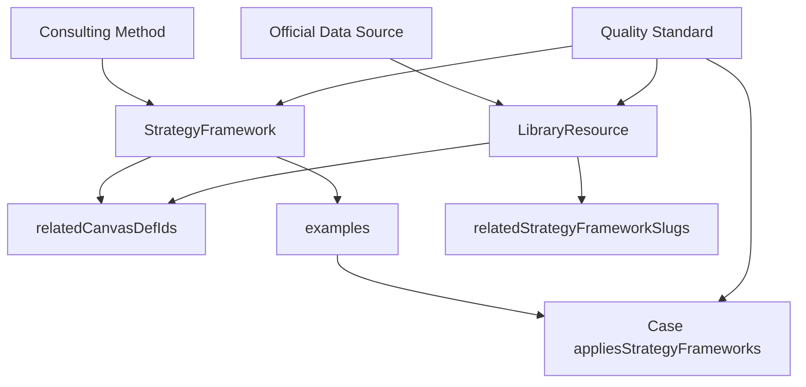

## User Requirements

用户认可第一批新增战略框架方向，但要求在正式写入前先设定明确的内容质量标准，避免新增框架和资料写得过于简单。

## Product Overview

PinGarden 策略库将补充一批顶级咨询公司或战略权威提出的方法论，并与现有画布、案例、资料形成可教学、可使用、可验证的内容体系。新增内容不应只是简介，而应能帮助用户判断何时使用、如何使用、如何解读结果，以及如何落到具体画布和案例中。

## Core Features

- 第一批新增框架保持不变：McKinsey Three Horizons、BCG Growth-Share Matrix、McKinsey 7S、Bain Elements of Value、Porter Five Forces。
- 为新增框架建立统一质量标准，覆盖方法定义、适用场景、画布映射、操作步骤、结果解读、案例说明、常见误用和权威来源。
- 为新增数据资料建立质量标准，确保资料说明包含数据用途、画布使用方式、局限性和证据纪律。
- 为案例反向标签建立质量标准，避免给案例滥加框架标签。
- 执行时以质量标准作为验收门禁，内容未达到标准不进入 manifest 或最终校验。

## Tech Stack Selection

继续沿用当前 PinGarden 架构，不新增数据库、不改 API 模型、不做 UI 重构：

- 前端：React + TypeScript + Vite
- 后端：Fastify + TypeScript
- 内容包：`packages/case-library/`
- 框架层：`packages/case-library/strategy-frameworks/<slug>/`
- 资料层：`packages/case-library/resources/<slug>/`
- 案例层：`packages/case-library/cases/<slug>/case.json`
- 共享类型：`packages/shared/src/index.ts`
- 加载链路：`apps/server/src/storage/BundleStorage.ts`

已确认现有结构支持本次扩展：

- `StrategyFramework` 已支持 `references`、`examples`、`relatedCanvasDefIds`。
- `LibraryResource` 已支持关联画布、案例、实验、模式、战略框架和来源。
- `BundleStorage` 按 `manifest.json` 加载内容包，新增内容后需要重启服务才能在页面看到最新数量。

## Implementation Approach

本次新增内容先建立“质量门禁”，再写入框架和资料。所有新增条目必须达到“可教学、可操作、可关联、可验证”的标准。

### 第一批框架

1. `mckinsey-three-horizons`

- 关联画布：`portfolio-map`、`experiment-canvas`、`evidence-scorecard`、`business-model-canvas`
- 重点：增长组合、探索/开发分层、创新投资节奏。

2. `bcg-growth-share-matrix`

- 关联画布：`portfolio-map`、`business-model-canvas`
- 重点：业务组合、市场增长率、相对份额、资源配置。

3. `mckinsey-7s`

- 关联画布：`innovation-culture-map`、`design-criteria-canvas`、`business-model-canvas`
- 重点：战略、结构、系统、技能、人员、风格、共同价值观一致性。

4. `bain-elements-of-value`

- 关联画布：`value-proposition-canvas`、`jobs-to-be-done`、`empathy-map`、`customer-journey`
- 重点：客户价值层级、价值主张差异化、体验设计。

5. `porters-five-forces`

- 关联画布：`business-model-environment`、`business-model-canvas`、`design-criteria-canvas`
- 重点：行业吸引力、竞争压力、商业模式环境扫描。

### 第一批数据资料

- `world-bank-data-catalog`
- `oecd-data-explorer`
- `world-bank-enterprise-surveys`
- `wipo-global-innovation-index`

这些数据资料作为 `resources`，用于支持环境扫描、行业分析、创新指标、组合管理和国家/市场背景判断。

## Quality Standard

### Strategy Framework 质量标准

每个新增 `strategy-frameworks/<slug>/` 必须满足以下标准：

1. **方法身份清晰**

- 说明框架是什么、关联机构或作者是谁、回答什么战略问题。
- 必须区分它和 PinGarden 已有框架的差异，避免重复。

2. **适用场景具体**

- 必须包含 “When to use / When not to use”。
- 明确适用决策场景，例如组合配置、增长排序、组织对齐、客户价值设计、行业压力分析。

3. **画布映射明确**

- 对 `relatedCanvasDefIds[]` 中每个画布逐一解释映射方式。
- 不能只列画布名，必须说明框架如何转成画布上的对象、便签、分区或判断。

4. **操作流程完整**

- 每个框架说明至少包含 5–7 个步骤。
- 步骤需要覆盖：输入资料、填写画布、分析判断、输出结论、下一步动作。

5. **结果解读充分**

- 必须说明用户如何阅读分析结果。
- 需要解释典型图形、象限、结构或信号代表什么，以及对应管理动作。

6. **案例具备教学价值**

- `examples[]` 中每个案例必须真正能说明该方法。
- 说明文件中需要有 “What to notice in examples” 段落，解释为什么这些案例适合。

7. **常见误用具体**

- 每个框架至少写 4–6 条常见误用。
- 不能写泛泛提醒，必须与该框架本身相关。

8. **来源权威**

- 优先引用 McKinsey、BCG、Bain、HBR/HBS 等官方或权威来源。
- 不使用随机博客作为主来源。
- `framework.json.sources` 或 `references` 需要包含清晰 label、URL、年份和必要说明。

9. **双语一致**

- `description.zh.md` 和 `description.en.md` 结构与深度一致。
- 不允许一边完整、一边只是摘要或占位。

10. **AI Skill 可操作**

- `skill.zh.md` 和 `skill.en.md` 必须包含选择标准、填写顺序、画布映射、关键问题和红旗信号。
- 内容应简洁但能指导后续 AI 使用该框架。

### Resource 质量标准

每个新增 `resources/<slug>/` 必须满足：

1. **资料角色清晰**

- 说明它提供什么数据，支持哪些战略问题。

2. **能落到画布**

- 说明如何把数据转成画布便签、分析判断或证据说明。

3. **局限性明确**

- 说明覆盖范围、更新频率、时间滞后、指标可比性、宏观/企业层级差异等限制。

4. **不打包原始大数据**

- 只链接官方入口或报告，不下载大型数据文件进应用包。

5. **证据纪律**

- 强调数据用于支持假设，不自动证明战略选择正确。

### Case Link 质量标准

更新 `case.json.appliesStrategyFrameworks[]` 时必须满足：

1. 框架确实解释了案例中的一部分战略逻辑。
2. 不因为公司知名或创新就添加标签。
3. 如果案例缺少足够说明，需要补充简短故事或说明段落。
4. 宁可少选高质量案例，不做大而全的弱关联。

## Architecture Design



## Directory Structure Summary

```
BusinessModelCanvas/
├── docs/
│   ├── STRATEGY_FRAMEWORK_EXPANSION.md
│   │   # [NEW] 记录第一批框架、数据资料、画布适配矩阵、案例映射和分批策略。
│   └── STRATEGY_FRAMEWORK_QUALITY_STANDARD.md
│       # [NEW] 记录框架、资料、案例链接的质量标准和验收清单。
│
├── packages/
│   └── case-library/
│       ├── manifest.json
│       │   # [MODIFY] 加入新增 strategyFrameworks 和 resources，保持展示顺序清晰。
│       │
│       ├── strategy-frameworks/
│       │   ├── mckinsey-three-horizons/
│       │   │   ├── framework.json
│       │   │   ├── description.zh.md
│       │   │   ├── description.en.md
│       │   │   ├── skill.zh.md
│       │   │   └── skill.en.md
│       │   │
│       │   ├── bcg-growth-share-matrix/
│       │   ├── mckinsey-7s/
│       │   ├── bain-elements-of-value/
│       │   └── porters-five-forces/
│       │       # [NEW] 每个目录结构同上，必须满足质量标准。
│       │
│       ├── resources/
│       │   ├── world-bank-data-catalog/
│       │   ├── oecd-data-explorer/
│       │   ├── world-bank-enterprise-surveys/
│       │   └── wipo-global-innovation-index/
│       │       # [NEW] 每个资源包含 resource.json、description.zh.md、description.en.md。
│       │
│       └── cases/
│           ├── ping-an-group/case.json
│           ├── nestle-portfolio/case.json
│           ├── bosch-accelerator/case.json
│           ├── alibaba-group/case.json
│           ├── procter-gamble-cd/case.json
│           ├── nespresso/case.json
│           ├── drybar/case.json
│           ├── stitch-fix/case.json
│           ├── citizenm-hotels/case.json
│           ├── novo-nordisk-novopen/case.json
│           ├── swiss-private-banking/case.json
│           ├── mobile-telco-unbundling/case.json
│           ├── carvana/case.json
│           ├── aliexpress/case.json
│           └── patagonia/case.json
│               # [MODIFY] 仅在案例证据充分时补充 appliesStrategyFrameworks[]。
```

## Implementation Notes

- 优先复用现有 `StrategyFramework` 和 `LibraryResource` schema，不新增字段。
- 所有框架先写质量完整的 Markdown，再进入 manifest。
- 每个 framework 的 `examples[]` 必须和 case 反向标签一致。
- 权威来源核对时优先官方页面；二手资料只可辅助理解，不作为主 citation。
- 新增内容后必须执行校验、构建并重启服务，因为 `BundleStorage` 启动时扫描内容包。
- 不新增 UI，不引入数据库，不复制大型数据文件或 PDF。

## Agent Extensions

### Skill

- **pingarden**
- Purpose: 按 PinGarden 策略库六层架构判断新增内容应进入 Strategy Framework、Resource 还是 Case 关联。
- Expected outcome: 新增方法论能正确映射到现有画布、案例和资料层，不误归类为 Pattern。

- **browsing**
- Purpose: 核对 McKinsey、BCG、Bain、HBR/HBS、World Bank、OECD、WIPO 等官方或权威来源。
- Expected outcome: 每个框架和数据资料都有可信来源，避免引用低质量二手资料。

### SubAgent

- **code-explorer**
- Purpose: 复核现有 strategy-frameworks、resources、cases、canvases 的结构和依赖关系。
- Expected outcome: 明确最小改动范围、可复用画布、可挂接案例和校验影响。