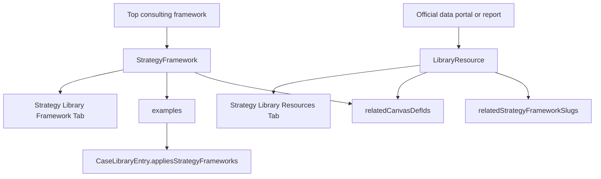

## User Requirements

用户希望继续扩展 PinGarden 策略库，但这次重点不是普通书籍资料，而是筛选一批由顶级咨询公司提出或长期使用的战略分析方法论，并判断它们是否适合录入。

## Product Overview

策略库应补充一组更接近咨询交付场景的方法框架，让用户在分析企业、行业、增长机会、组织能力和客户价值时，可以直接选择合适的分析框架，并与现有画布、案例和资料形成连接。

## Core Features

- 新增一批高适配战略分析框架，优先考虑 McKinsey、BCG、Bain 等顶级咨询公司公开方法论。
- 每个框架需要说明适用场景、核心结构、使用步骤、常见误用、适配画布和示例案例。
- 优先选择能与现有画布结合的框架，而不是为了数量新增孤立条目。
- 补充权威数据资料入口，用于支持环境扫描、行业分析、组合管理、创新指标和国家/市场背景判断。
- 框架页与资料页应形成清晰关系：框架负责“怎么分析”，资料负责“数据从哪里来、如何阅读”。
- 新增内容在策略库中以卡片和详情页形式展示，用户能从框架卡片进入方法说明，并看到关联画布、案例和资料。

## Tech Stack Selection

继续沿用当前 PinGarden 架构，不新增数据库、不改动核心 API 模型：

- 前端：React + TypeScript + Vite
- 后端：Fastify + TypeScript
- 内容包：`packages/case-library/`
- 框架层：`packages/case-library/strategy-frameworks/<slug>/`
- 资料层：`packages/case-library/resources/<slug>/`
- 共享类型：`packages/shared/src/index.ts`
- 加载链路：`apps/server/src/storage/BundleStorage.ts`
- 策略库 API：`apps/web/src/api/library.ts`

已核实当前结构：

- 当前已有 6 个战略框架：蓝海战略、商业模式环境扫描、商业模式组合管理、创新指标、情景规划、平台战略。
- 当前已有 8 条资料资源。
- 当前有 15 个可复用画布，包括 `portfolio-map`、`business-model-environment`、`value-proposition-canvas`、`innovation-culture-map`、`scenario-matrix`、`platform-ecosystem-map` 等。
- `StrategyFramework` 已支持 `references`、`examples`、`relatedCanvasDefIds`，足够承载本次框架扩展。
- `LibraryResource` 已支持关联画布、案例、模式、实验和战略框架，适合承载数据资料入口。

## Implementation Approach

本次采用“先适配画布，再新增框架”的策略。每个候选方法论必须满足至少一个条件：

1. 能直接映射到现有画布；
2. 能补强现有框架的分析深度；
3. 能与现有案例形成可解释的教学示例；
4. 有权威公开来源可引用；
5. 不与现有框架重复。

### 第一批建议新增框架

#### 1. `mckinsey-three-horizons`

- 来源方向：McKinsey 官方 `Enduring Ideas: The three horizons of growth`
- 适配画布：
- `portfolio-map`
- `experiment-canvas`
- `evidence-scorecard`
- `business-model-canvas`
- 适合补强：
- `business-model-portfolio-management`
- `innovation-metrics`
- 示例案例候选：
- `ping-an-group`
- `nestle-portfolio`
- `bosch-accelerator`
- `alibaba-group`
- `procter-gamble-cd`
- 判断：高度适合。它和 PinGarden 现有组合地图、创新指标、探索/开发体系非常接近。

#### 2. `bcg-growth-share-matrix`

- 来源方向：BCG 官方 Growth-Share Matrix 页面
- 适配画布：
- `portfolio-map`
- `business-model-canvas`
- 适合补强：
- `business-model-portfolio-management`
- 示例案例候选：
- `nestle-portfolio`
- `ping-an-group`
- `alibaba-group`
- `procter-gamble-cd`
- 判断：适合。可以作为组合地图的经典咨询视角，不需要先新增画布。

#### 3. `mckinsey-7s`

- 来源方向：McKinsey 官方 `Enduring Ideas: The 7-S Framework`
- 适配画布：
- `innovation-culture-map`
- `design-criteria-canvas`
- `business-model-canvas`
- 适合补强：
- `innovation-metrics`
- 组织能力与战略落地分析
- 示例案例候选：
- `bosch-accelerator`
- `procter-gamble-cd`
- `ping-an-group`
- `patagonia`
- 判断：适合。它不是商业模式画布本身，但很适合解释战略、组织、能力和文化是否一致。

#### 4. `bain-elements-of-value`

- 来源方向：Bain Elements of Value 官方页面与交互图
- 适配画布：
- `value-proposition-canvas`
- `jobs-to-be-done`
- `empathy-map`
- `customer-journey`
- 适合补强：
- 价值主张设计
- 客户收益层级
- 用户体验差异化
- 示例案例候选：
- `nespresso`
- `drybar`
- `stitch-fix`
- `citizenm-hotels`
- `novo-nordisk-novopen`
- 判断：高度适合。它可以让 VPC 不只停留在 pains/gains，而是进一步拆解客户价值层次。

#### 5. `porters-five-forces`

- 来源方向：HBR / HBS 上 Michael Porter 的 Five Forces 文章与资料页
- 适配画布：
- `business-model-environment`
- `business-model-canvas`
- `design-criteria-canvas`
- 适合补强：
- 行业吸引力分析
- 竞争压力判断
- 商业模式环境扫描
- 示例案例候选：
- `swiss-private-banking`
- `mobile-telco-unbundling`
- `carvana`
- `aliexpress`
- `patagonia`
- 判断：虽然不是咨询公司原创，但属于顶级战略权威框架，且被咨询行业广泛使用；建议作为第一批或紧随第一批加入。

### 第二批候选框架

暂不立即实现，先进入候选池：

- `ge-mckinsey-nine-box`：适合组合管理，但需确认权威来源与和 BCG Matrix 的边界。
- `ansoff-growth-matrix`：适合增长选项，但不是顶级咨询公司来源。
- `strategy-choice-cascade`：适合设计准则与战略选择，但需确认来源定位。
- `value-chain-analysis`：适合活动系统与成本结构，但和 BMC/环境扫描可能有重叠。
- `capability-maturity`：适合组织转型，但需要先选定权威版本。

### 第一批建议新增数据资料

数据资料不作为 Strategy Framework，而作为 `resources` 加入，用来支持框架分析：

1. `world-bank-data-catalog`

- 支持：宏观环境、国家市场、发展指标、经济背景。
- 关联：`business-model-environment`、`scenario-planning`、`porters-five-forces`。

2. `oecd-data-explorer`

- 支持：产业、创新、生产率、贸易、创业和全球化指标。
- 关联：`business-model-environment`、`innovation-metrics`、`scenario-planning`。

3. `world-bank-enterprise-surveys`

- 支持：企业经营环境、监管、融资、基础设施、劳动力等约束。
- 关联：`business-model-environment`、`business-model-canvas`、`porters-five-forces`。

4. `wipo-global-innovation-index`

- 支持：国家/地区创新能力、创新投入与产出、生态比较。
- 关联：`innovation-metrics`、`mckinsey-three-horizons`、`business-model-portfolio-management`。

## Implementation Notes

- 不新增 UI 类型，继续复用当前 Strategy Framework 和 Resource 列表/详情页。
- 每个新框架必须同时创建：
- `framework.json`
- `description.en.md`
- `description.zh.md`
- `skill.en.md`
- `skill.zh.md`
- 每个新资料必须同时创建：
- `resource.json`
- `description.en.md`
- `description.zh.md`
- 新框架必须加入 `manifest.json.strategyFrameworks[]`。
- 新资料必须加入 `manifest.json.resources[]`。
- 每个框架的 `examples[]` 必须引用已存在案例。
- 被引用案例的 `case.json.appliesStrategyFrameworks[]` 需要补齐反向标签，否则校验会失败。
- 数据资料只引用官方入口，不下载或打包大型数据文件，避免包体膨胀。
- `BundleStorage` 启动时扫描内容包，新增内容后需要重启本地服务才能在页面看到最新数量。
- 避免把咨询框架做成商业模式 Pattern；这些内容应进入 Strategy Framework 层。

## Architecture Design



本次扩展后的内容关系：

- 咨询方法论进入 `strategy-frameworks`，承担“分析方法”角色。
- 官方数据入口进入 `resources`，承担“证据来源”角色。
- 现有画布承担“用户可填写的工作空间”角色。
- 现有案例承担“方法如何落地”的示例角色。

## Directory Structure Summary

本次计划新增 5 个第一批战略框架、4 个数据资料资源，并更新 manifest 与案例反向关联。

```
BusinessModelCanvas/
├── packages/
│   └── case-library/
│       ├── manifest.json
│       │   # [MODIFY] 将新增 strategyFrameworks 和 resources 加入展示顺序。
│       │
│       ├── strategy-frameworks/
│       │   ├── mckinsey-three-horizons/
│       │   │   ├── framework.json
│       │   │   │   # [NEW] McKinsey Three Horizons 元数据、来源、关联画布和案例。
│       │   │   ├── description.zh.md
│       │   │   │   # [NEW] 中文方法说明：三层增长、组合动作、画布使用方式。
│       │   │   ├── description.en.md
│       │   │   │   # [NEW] 英文方法说明。
│       │   │   ├── skill.zh.md
│       │   │   │   # [NEW] 中文 AI 使用指引。
│       │   │   └── skill.en.md
│       │   │       # [NEW] 英文 AI 使用指引。
│       │   │
│       │   ├── bcg-growth-share-matrix/
│       │   │   ├── framework.json
│       │   │   │   # [NEW] BCG 增长份额矩阵元数据、来源、案例和组合画布关联。
│       │   │   ├── description.zh.md
│       │   │   ├── description.en.md
│       │   │   ├── skill.zh.md
│       │   │   └── skill.en.md
│       │   │
│       │   ├── mckinsey-7s/
│       │   │   ├── framework.json
│       │   │   │   # [NEW] McKinsey 7S 元数据、组织适配维度和文化画布关联。
│       │   │   ├── description.zh.md
│       │   │   ├── description.en.md
│       │   │   ├── skill.zh.md
│       │   │   └── skill.en.md
│       │   │
│       │   ├── bain-elements-of-value/
│       │   │   ├── framework.json
│       │   │   │   # [NEW] Bain Elements of Value 元数据、价值主张画布关联和案例。
│       │   │   ├── description.zh.md
│       │   │   ├── description.en.md
│       │   │   ├── skill.zh.md
│       │   │   └── skill.en.md
│       │   │
│       │   └── porters-five-forces/
│       │       ├── framework.json
│       │       │   # [NEW] Porter Five Forces 元数据、行业环境分析来源和案例。
│       │       ├── description.zh.md
│       │       ├── description.en.md
│       │       ├── skill.zh.md
│       │       └── skill.en.md
│       │
│       ├── resources/
│       │   ├── world-bank-data-catalog/
│       │   │   ├── resource.json
│       │   │   │   # [NEW] 世界银行数据目录资料卡，关联环境扫描和情景规划。
│       │   │   ├── description.zh.md
│       │   │   └── description.en.md
│       │   │
│       │   ├── oecd-data-explorer/
│       │   │   ├── resource.json
│       │   │   │   # [NEW] OECD 数据入口资料卡，关联产业、创新和宏观分析。
│       │   │   ├── description.zh.md
│       │   │   └── description.en.md
│       │   │
│       │   ├── world-bank-enterprise-surveys/
│       │   │   ├── resource.json
│       │   │   │   # [NEW] 企业调查数据资料卡，支持经营环境和行业约束分析。
│       │   │   ├── description.zh.md
│       │   │   └── description.en.md
│       │   │
│       │   └── wipo-global-innovation-index/
│       │       ├── resource.json
│       │       │   # [NEW] WIPO 创新指数资料卡，支持创新指标和组合管理。
│       │       ├── description.zh.md
│       │       └── description.en.md
│       │
│       └── cases/
│           ├── ping-an-group/case.json
│           ├── nestle-portfolio/case.json
│           ├── bosch-accelerator/case.json
│           ├── alibaba-group/case.json
│           ├── procter-gamble-cd/case.json
│           ├── nespresso/case.json
│           ├── drybar/case.json
│           ├── stitch-fix/case.json
│           ├── citizenm-hotels/case.json
│           ├── swiss-private-banking/case.json
│           └── mobile-telco-unbundling/case.json
│               # [MODIFY] 按实际适配结果补充 appliesStrategyFrameworks[]。
│
└── docs/
    └── STRATEGY_FRAMEWORK_EXPANSION.md
        # [NEW] 记录咨询框架筛选标准、画布适配矩阵、数据来源清单和分批策略。
```

## Validation Plan

执行阶段完成后需要验证：

- 新增 JSON 均可解析。
- `manifest.json` 中所有 slug 都有对应目录。
- 每个 framework 的 `examples[]` 都引用已存在案例。
- 每个案例的 `appliesStrategyFrameworks[]` 都引用已存在框架。
- 每个 resource 的关联框架、画布、案例 slug 都存在。
- 运行：
- `node apps/cli/dist/index.js case validate`
- `pnpm typecheck`
- `pnpm --filter @pingarden/web build`
- 重启服务：
- `./start.sh`
- 验证 API 返回新增数量：
- `/library/strategy-frameworks`
- `/library/resources`

## Agent Extensions

### Skill

- **pingarden**
- Purpose: 按 PinGarden 的策略库六层架构判断框架应归入 Strategy Framework、Resource 还是未来 Canvas。
- Expected outcome: 新增方法论与现有画布、案例、资料层级保持一致，不把咨询框架误归类为 Pattern。

- **browsing**
- Purpose: 核对 McKinsey、BCG、Bain、HBR/HBS、World Bank、OECD、WIPO 等官方或权威来源。
- Expected outcome: 每个框架和数据资料都有可信来源，避免引用二手博客或随机下载站。

### SubAgent

- **code-explorer**
- Purpose: 复核现有 `strategy-frameworks`、`resources`、`cases`、`canvases` 的结构和依赖关系。
- Expected outcome: 明确可复用画布、可挂接案例和最小文件改动范围，降低破坏现有策略库的风险。