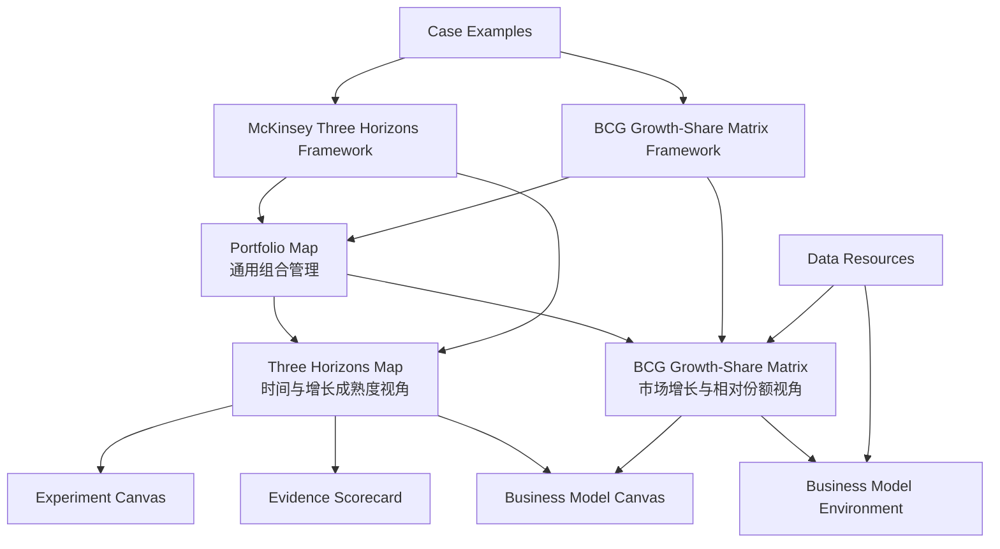

## User Requirements

用户确认第一批咨询公司/战略权威框架方向可行，并进一步要求补充与 McKinsey Three Horizons、BCG Growth-Share Matrix 相匹配的专用画布。

## Product Overview

PinGarden 策略库将形成“通用组合管理 + 专项咨询框架 + 可填写画布 + 案例示例 + 数据资料”的完整体系。现有业务组合地图继续作为通用组合视角，新画布用于承载更具体的咨询方法论，使用户能在不同组合管理问题下选择合适工具。

## Core Features

- 新增 `Three Horizons` 专用画布，用于区分当前核心业务、增长业务和未来选项。
- 新增 `BCG Growth-Share Matrix` 专用画布，用于识别 Stars、Cash Cows、Question Marks、Dogs 等业务组合分类。
- 明确新画布与现有业务组合地图的关系：新画布是专项视角，不替代通用组合地图。
- 更新对应战略框架页，说明方法来源、适用场景、画布使用方式、结果解读、常见误用和案例。
- 新增画布必须达到现有画布质量：结构清晰、双语完整、视觉简洁、可填写、可教学、可与案例和资料关联。
- 保持框架、画布、案例、资料之间的关系清晰，避免重复、割裂或弱关联。

## Tech Stack Selection

继续沿用当前 PinGarden 架构，不新增数据库、不改核心 API：

- 前端：React + TypeScript + Vite
- 后端：Fastify + TypeScript
- 内容包：`packages/case-library/`
- 画布包：`packages/canvases/<canvas-id>/`
- 共享类型：`packages/shared/src/index.ts`
- 画布缩略图：`apps/web/src/canvas/CanvasThumb.tsx`
- 模板文案：`apps/web/src/i18n/{en,zh}.json`
- 加载链路：`apps/server/src/storage/BundleStorage.ts`

已核实相关现有约束：

- `docs/CANVAS_DISPLAY_CONTRACT.md` 是画布展示规范来源。
- 新画布需要避免在 SVG 中重复标题/副标题。
- 区域标题和提示应放在 `i18n/{en,zh}.json`。
- 预览行为应放在 `manifest.display.preview`。
- Sticky 颜色语义应放在 `manifest.defaultColorLegend`。
- 右侧知识面板应解释方法、使用步骤、质量检查、常见错误和参考来源。
- 当前 `portfolio-map` 已使用 `axis-grid` 插件，适合保留为通用组合管理画布。
- 当前 `CanvasThumb.tsx` 对重要画布有专用缩略图分支，新画布也应补充。

## Implementation Approach

本次把“咨询框架扩展”升级为“框架 + 专用画布 + 关系治理”的方案。

核心关系处理如下：

1. **`portfolio-map` 保持通用组合管理总入口**

- 回答“组合里有什么、Explore/Exploit 风险收益如何分布、哪些业务需要展开分析”。
- 不把它改造成 Three Horizons 或 BCG Matrix，避免破坏现有组合管理语义。

2. **`three-horizons-map` 作为时间/成熟度专项视角**

- 回答“当前核心、增长引擎、未来选项如何分层，资源与证据如何跨 H1/H2/H3 迁移”。
- 与 `portfolio-map` 关系：从组合地图选出业务单元或创新项目，再用 Three Horizons 判断时间节奏和迁移路径。
- 下游连接：`experiment-canvas`、`evidence-scorecard`、`business-model-canvas`。

3. **`bcg-growth-share-matrix` 作为市场增长/相对份额专项视角**

- 回答“哪些业务是 Stars、Cash Cows、Question Marks、Dogs，以及资源配置动作是什么”。
- 与 `portfolio-map` 关系：BCG Matrix 是更经典、更简化的组合筛选镜头；Portfolio Map 是更适合创新风险/收益的动态管理镜头。
- 下游连接：`business-model-canvas`、`business-model-environment`。

4. **框架页解释方法，画布承载操作**

- `mckinsey-three-horizons` 框架页负责讲来源、适用/不适用场景、使用步骤、解释方式、误用、案例。
- `three-horizons-map` 负责让用户实际填写 H1/H2/H3、迁移动作、风险和证据。
- `bcg-growth-share-matrix` 框架页负责讲来源、四象限含义、资源配置逻辑、误用、案例。
- `bcg-growth-share-matrix` 画布负责让用户实际放置业务/产品，记录判断依据和组合动作。

## Architecture Design



## Implementation Notes

- 新画布不是简单背景图，必须包含可填写区域、区域提示、默认颜色语义、知识说明和缩略图。
- `three-horizons-map` 可以采用三列或三段式结构，但必须体现 H1/H2/H3 的时间推进、资源迁移、证据成熟度。
- `bcg-growth-share-matrix` 采用 2×2 矩阵结构，但需增加行动区或解释区，避免只是静态四象限。
- 两个新画布都应在 `related` 中连接 `portfolio-map`，并在 `relatedNotes` 中说明关系。
- 新框架的 `relatedCanvasDefIds` 必须更新为包含对应新画布。
- 只在高置信案例中添加 `appliesStrategyFrameworks[]`，宁可少选，不滥加。
- 新增内容后需要重启服务，因为 `BundleStorage` 在启动时扫描内容包。

## Directory Structure Summary

```
BusinessModelCanvas/
├── docs/
│   ├── STRATEGY_FRAMEWORK_QUALITY_STANDARD.md
│   │   # [NEW] 框架、资料、案例链接、画布质量门禁与验收清单。
│   └── STRATEGY_FRAMEWORK_EXPANSION.md
│       # [NEW] 记录咨询框架、专用画布、数据资料、案例映射和关系模型。
│
├── packages/
│   ├── canvases/
│   │   ├── three-horizons-map/
│   │   │   ├── manifest.json
│   │   │   │   # [NEW] Three Horizons 画布定义。包含 H1/H2/H3、迁移动作、证据风险区、related、display、defaultColorLegend。
│   │   │   ├── bg.en.svg
│   │   │   │   # [NEW] 英文结构底图，只画结构、轴线、区域骨架，不重复标题。
│   │   │   ├── bg.zh.svg
│   │   │   │   # [NEW] 中文结构底图，只保留必要辅助标识。
│   │   │   ├── i18n/en.json
│   │   │   │   # [NEW] 英文区域标题、提示、示例。
│   │   │   ├── i18n/zh.json
│   │   │   │   # [NEW] 中文区域标题、提示、示例。
│   │   │   └── knowledge/
│   │   │       ├── intro.en.md
│   │   │       ├── intro.zh.md
│   │   │       ├── body.en.md
│   │   │       └── body.zh.md
│   │   │       # [NEW] 使用场景、填写顺序、和 portfolio-map 的区别、常见误用。
│   │   │
│   │   └── bcg-growth-share-matrix/
│   │       ├── manifest.json
│   │       │   # [NEW] BCG 增长份额矩阵画布定义。包含 Stars、Cash Cows、Question Marks、Dogs、行动区、related、display。
│   │       ├── bg.en.svg
│   │       ├── bg.zh.svg
│   │       ├── i18n/en.json
│   │       ├── i18n/zh.json
│   │       └── knowledge/
│   │           ├── intro.en.md
│   │           ├── intro.zh.md
│   │           ├── body.en.md
│   │           └── body.zh.md
│   │           # [NEW] 四象限解释、资源配置动作、局限性、和 portfolio-map 的关系。
│   │
│   └── case-library/
│       ├── manifest.json
│       │   # [MODIFY] 加入新增 strategyFrameworks 和 resources。
│       │
│       ├── strategy-frameworks/
│       │   ├── mckinsey-three-horizons/
│       │   │   ├── framework.json
│       │   │   │   # [NEW] 关联 three-horizons-map、portfolio-map、experiment-canvas、evidence-scorecard、business-model-canvas。
│       │   │   ├── description.zh.md
│       │   │   ├── description.en.md
│       │   │   ├── skill.zh.md
│       │   │   └── skill.en.md
│       │   │
│       │   ├── bcg-growth-share-matrix/
│       │   │   ├── framework.json
│       │   │   │   # [NEW] 关联 bcg-growth-share-matrix、portfolio-map、business-model-canvas、business-model-environment。
│       │   │   ├── description.zh.md
│       │   │   ├── description.en.md
│       │   │   ├── skill.zh.md
│       │   │   └── skill.en.md
│       │   │
│       │   ├── mckinsey-7s/
│       │   ├── bain-elements-of-value/
│       │   └── porters-five-forces/
│       │       # [NEW] 保持第一批框架范围，但无需新增专用画布，优先复用现有画布。
│       │
│       ├── resources/
│       │   ├── world-bank-data-catalog/
│       │   ├── oecd-data-explorer/
│       │   ├── world-bank-enterprise-surveys/
│       │   └── wipo-global-innovation-index/
│       │       # [NEW] 数据资料入口，支持环境、行业、创新和组合判断。
│       │
│       └── cases/
│           # [MODIFY] 仅对高置信案例补充 appliesStrategyFrameworks[]。
│
└── apps/
    └── web/
        └── src/
            ├── i18n/
            │   ├── en.json
            │   │   # [MODIFY] 新增 three-horizons-map 和 bcg-growth-share-matrix tagline。
            │   └── zh.json
            │       # [MODIFY] 新增中文 tagline。
            └── canvas/
                └── CanvasThumb.tsx
                    # [MODIFY] 新增两个画布的缩略图分支。
```

## Key Code Structures

无需新增 TypeScript 类型。继续复用现有：

- `CanvasDef`
- `StrategyFramework`
- `LibraryResource`
- `CaseLibraryEntry.appliesStrategyFrameworks[]`

重点是新增内容包文件和正确维护 manifest / related / relatedNotes / examples / reverse tags。

## Canvas Visual Design Approach

新增两个画布都遵守 PinGarden 现有画布风格：浅米色背景、细线结构、低装饰、清晰分区、双语区域标签、右侧知识面板解释方法。

### Three Horizons Map

- 采用横向三段式结构，左到右分别表达 H1 当前核心、H2 增长引擎、H3 未来选项。
- 底部增加“迁移动作 / 证据与风险”区域，帮助用户记录哪些项目应从 H3 推进到 H2，哪些 H2 具备进入 H1 的条件。
- 视觉重点不是时间轴本身，而是组合单元如何随证据、资源和成熟度移动。
- Sticky 颜色用于区分核心业务、增长业务、未来选项、风险假设、迁移动作。

### BCG Growth-Share Matrix

- 采用经典 2×2 矩阵：Stars、Cash Cows、Question Marks、Dogs。
- 横轴表达相对市场份额/竞争位置，纵轴表达市场增长/吸引力。
- 右侧或底部增加“组合动作”区，用于记录 invest、harvest、select、divest、reposition 等管理动作。
- 视觉上保留现金牛分类的清晰识别，但避免过度图标化，确保仍是可填写的工作画布。

### Relationship Design

- `portfolio-map` 是通用入口。
- `three-horizons-map` 是时间与成熟度镜头。
- `bcg-growth-share-matrix` 是增长率与份额镜头。
- 三者通过 related chips 和知识面板互相解释，不互相替代。

## Agent Extensions

### Skill

- **pingarden**
- Purpose: 按 PinGarden 策略库和画布体系判断新框架、新画布、案例、资料之间的归属与关系。
- Expected outcome: 明确 `portfolio-map`、`three-horizons-map`、`bcg-growth-share-matrix` 的边界，确保新增内容符合现有六层架构。

- **browsing**
- Purpose: 核对 McKinsey、BCG、Bain、HBR/HBS、World Bank、OECD、WIPO 等官方或权威来源。
- Expected outcome: 每个框架和数据资料都有可信来源，不使用低质量二手资料作为主引用。

### SubAgent

- **code-explorer**
- Purpose: 复核现有 canvas bundle、strategy-framework、resource、case、i18n、thumbnail 的结构和依赖。
- Expected outcome: 明确新增画布和框架的最小改动范围，并避免破坏现有加载、预览和校验链路。