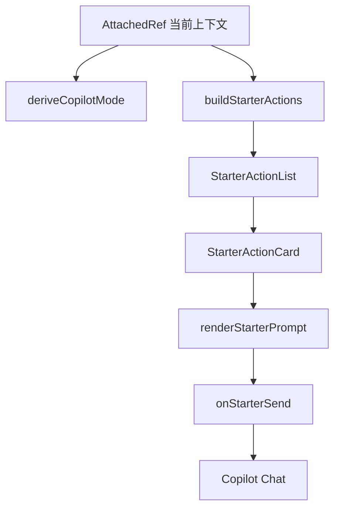

## 用户需求

- 重新整理 Copilot 在“已有项目 / 只读参考项目 / 项目内画布或 Story”场景下展示的预置问题卡片。
- 当前问题是：用户查看的是“瑞士私人银行业 · 解绑模式”这类行业案例/参考资料，但预置问题和快捷提问偏向“如何迁移到自己的项目”，导致和用户真实意图不匹配。
- 需要让预置问题更贴合当前上下文：行业案例应优先围绕行业结构、案例背景、战略机制、路径对比、证据来源和追问问题，而不是默认迁移。
- “迁移 / 复制 / 创建项目”仍然可以保留，但应作为明确的复制或创建动作，而不是普通理解类问题的默认表达。
- 重点整理项目内相关卡片，包括项目、画布、Story、只读案例项目等不同上下文下的预置问题差异。

## 产品概览

Copilot 的建议操作区应根据当前附带资料类型自动切换问题卡片，让用户一眼看到与当前材料最相关的提问方向。只读行业案例侧重理解和分析；用户自己的项目侧重诊断、补充、推进；画布和 Story 侧重局部优化和串联表达。

## 核心功能

- 区分只读参考资料和用户自有项目的预置问题。
- 将只读案例/行业项目的默认卡片改为“理解行业结构、拆解战略逻辑、对比不同路径、补充资料与追问”。
- 将“迁移到我的项目”从默认理解问题中移除，保留在明确复制/创建类动作中。
- 针对项目、画布、Story 分别提供更匹配的项目内问题卡片。
- 同步优化中英文文案，确保中文场景自然、清晰、不误导。

## 技术方案

### Tech Stack Selection

- 前端：沿用现有 React + TypeScript 架构。
- 国际化：沿用 `apps/web/src/i18n/zh.json`、`apps/web/src/i18n/en.json`。
- Copilot 状态与上下文：沿用 `AttachedRef`、`CopilotMode`、`buildStarterActions`、`buildComposerQuickActions` 现有结构。
- 构建验证：继续使用项目既有门禁：
- `pnpm typecheck`
- `pnpm --filter @pingarden/web build`

### Implementation Approach

本次优先采用“小范围重构 + 文案语义纠偏”的方案，不引入新的架构层。核心是把 Copilot 预置问题按上下文拆分：策略库入口、只读参考项目、用户项目、单画布、单 Story 分别返回不同的 `StarterAction[]`。同时将 `askReference` 从“借鉴并迁移”改成“理解当前资料”，避免用户只是想问行业/案例时被引导到迁移。

关键决策：

1. **不优先扩展数据模型**

- 当前 `AttachedRef` 已能识别 `projectSource: 'library'`，足够区分只读参考和用户项目。
- 虽然无法直接识别 `case.kind = industry`，但可以通过更中性的只读参考卡片覆盖行业案例、公司案例和对比案例，避免扩大改动面。

2. **迁移动作显式化**

- 普通提问按钮和默认卡片不再写“如何迁移到自己的项目”。
- “复制项目 / 基于它创建项目”仍可保留迁移语义，因为这是用户明确点击的动作。

3. **项目内卡片细分**

- 用户项目：项目诊断、下一步推进、补全画布、实验验证。
- 用户画布：区块质量检查、缺口补充、跨画布联动、生成 Story。
- 用户 Story：结构润色、证据补强、内嵌画布检查、下一步行动。

4. **性能与可靠性**

- 仅调整前端静态配置函数和 i18n 文案，无新增网络请求。
- `buildStarterActions` 仍为纯函数，复杂度为 O(卡片数)，不会影响运行性能。
- 保持现有 `StarterActionCard` 渲染逻辑，避免 UI 回归。

### Implementation Notes

- 避免把“只读参考项目”都称为“案例项目”，文案使用“当前参考 / 当前资料 / 当前行业案例”更稳妥。
- `askReference` 的 prompt 应聚焦“解释核心问题、关键机制、证据和追问”，不要默认让 AI 说明迁移路径。
- 如果保留迁移卡片，应放在只读参考卡片列表靠后，或仅在复制/创建按钮中体现。
- 中英文文案必须同步，不新增硬编码用户可见字符串。
- 只改 Copilot 建议操作和文案，不改聊天发送、Kimi、打包、资源卡片等无关逻辑。

### Architecture Design

当前相关数据流：



调整后：

- `buildStarterActions` 内部根据 `AttachedRef` 精细分派：
- `null` → 策略库入口卡片
- `projectSource=library` → 只读参考卡片
- `type=project` 且用户项目 → 项目级卡片
- `type=canvas` 且用户项目 → 画布级卡片
- `type=story` 且用户项目 → Story 级卡片
- `case/pattern` → 通用参考内容卡片

### Directory Structure

```text
BusinessModelCanvas/
├── apps/
│   └── web/
│       └── src/
│           ├── components/
│           │   └── CopilotDrawer.tsx
│           │       # [MODIFY] Copilot 抽屉核心逻辑。
│           │       # 调整 buildStarterActions 分派逻辑；
│           │       # 重写只读参考项目卡片；
│           │       # 拆分用户项目、画布、Story 的预置问题；
│           │       # 调整 buildComposerQuickActions 中普通参考提问的语义。
│           └── i18n/
│               ├── zh.json
│               │   # [MODIFY] 中文 Copilot 文案。
│               │   # 修改 askReference 标签和 prompt；
│               │   # 如新增/调整按钮或提示文案，保持中文自然表达。
│               └── en.json
│                   # [MODIFY] 英文 Copilot 文案。
│                   # 与中文语义一致，避免 adapt/migrate 成为默认问法。
└── apps/web/dist/index.html
    # [AFFECTED] 若执行 Web build 会更新构建产物。
```

### Key Code Structures

不新增复杂类型。必要时只新增几个纯函数，保持现有 `StarterAction[]` 结构：

- `buildLibraryProjectStarterActions(isZh: boolean): StarterAction[]`
- `buildUserProjectStarterActions(isZh: boolean): StarterAction[]`
- `buildUserCanvasStarterActions(isZh: boolean): StarterAction[]`
- `buildUserStoryStarterActions(isZh: boolean): StarterAction[]`

## Agent Extensions

### SubAgent

- **code-explorer**
- Purpose: 复核 Copilot 预置问题在不同上下文中的调用链，确认没有遗漏项目、画布、Story、只读参考等分支。
- Expected outcome: 明确所有需要调整的函数和文案文件，避免只修单一卡片导致其他上下文仍不匹配。

### Skill

- **css-architecture**
- Purpose: 如调整建议卡片的布局密度或分组展示，确保样式改动沿用现有 Tailwind/组件结构，不引入零散样式。
- Expected outcome: 预置问题卡片在侧栏和全屏下保持稳定、紧凑、可维护。