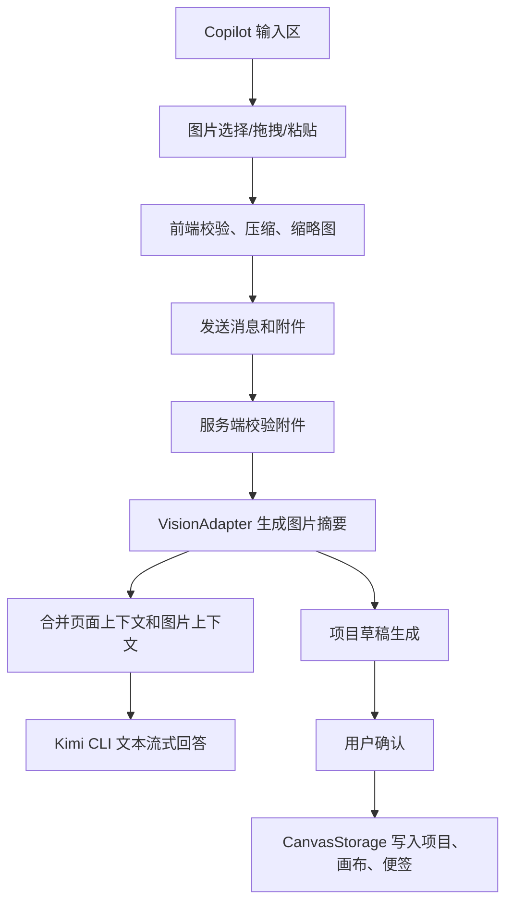

## User Requirements

Copilot 需要支持发送图片附件。用户可以在对话中添加一张或多张图片，并围绕图片提问。

## Product Overview

Copilot 对话区增加图片附件能力，用户可通过上传、拖拽或粘贴方式添加图片。发送后，对话历史中展示图片缩略图和附件信息。用户可基于图片内容发起分析，也可以要求 Copilot 根据图片内容生成一个新的项目草稿。

## Core Features

- 支持在 Copilot 输入区添加图片附件，并在发送前预览、删除。
- 支持粘贴截图、拖拽图片、点击选择图片三种入口。
- 支持图片大小、数量、格式校验，异常时给出明确提示。
- 支持将图片内容作为本轮对话上下文，和当前页面、项目、画布、story 上下文一起发送。
- 支持“根据图片生成项目”的流程：先生成项目草稿，展示项目名称、描述、推荐画布和关键便签，再由用户确认创建。
- 图片附件区域与文字输入区、历史消息区保持清晰层级，视觉上不干扰现有 Copilot 对话体验。

## Tech Stack Selection

- 前端沿用现有 `React + TypeScript`，继续在 `apps/web/src/components/CopilotDrawer.tsx` 内扩展 Copilot 抽屉体验。
- API client 沿用现有 `fetch + SSE` 模式，扩展 `apps/web/src/api/copilot.ts` 的请求类型和接口。
- 服务端沿用现有 `Fastify + TypeScript + zod`，通过新路由或现有 `/copilot/chat` 扩展图片附件处理。
- 项目、画布、便签写入必须继续走现有存储边界：`CanvasStorage`、`/projects`、`/canvases`、`/canvases/:id/stickies/bulk`，避免直接写文件。
- AI 通道沿用现有 Kimi CLI 流式文本通道，同时新增视觉分析适配层，隔离“图片理解能力”与聊天流式返回逻辑。

## Implementation Approach

采用“附件抽象 + 视觉分析适配 + 项目草稿确认”的方案。前端先完成图片选择、压缩、预览和附件状态管理；服务端接收经校验的图片输入，生成可注入 Copilot 的图片分析上下文；当用户要求根据图片生成项目时，先返回结构化项目草稿，再由用户确认后写入项目、画布和便签。

关键决策：

- 不把大体积 base64 图片直接持久化到聊天历史，历史只保存缩略图、文件名、大小和附件摘要，避免 localStorage 膨胀。
- 不直接自动创建项目，必须先展示草稿并由用户确认，降低误写入风险。
- 不把视觉能力硬编码进 `kimiCliAdapter.ts`，新增 `VisionAdapter` 抽象；如果当前 Kimi CLI 不支持图片输入，也能通过能力检测给出清晰提示，后续可替换为真正多模态实现。
- 图片处理限定格式和大小，默认支持 png、jpeg、webp、gif；gif 可先按静态图处理。
- 项目生成复用现有项目和画布创建链路，生成失败时尽量不产生半成品；如必须分步写入，应在 UI 中提示成功和失败的具体阶段。

## Implementation Notes

- 性能：前端上传前压缩长边和体积，单图建议限制在 2MB 内，附件数量建议默认 1 到 4 张；服务端 zod 校验后再进入视觉分析，避免大 payload 占用内存。
- 可靠性：发送时将附件与本轮 user message 绑定，流式返回失败不影响本地附件预览；重新发送需重新附带图片数据。
- 安全：校验 MIME 和 magic bytes，拒绝非图片内容；不记录 API Key、原图 base64、隐私图片内容到日志。
- 兼容：保留现有纯文本聊天请求；没有附件时 `/copilot/chat` 行为不变。
- 桌面端：支持 Electron 中的粘贴截图和文件选择；Web dev 模式同样可用。
- 写入控制：项目生成走“草稿预览 → 用户确认 → 创建项目”的闭环，不在普通聊天回答中偷偷写入。

## Architecture Design

当前链路是：`CopilotDrawer` 发送文本消息 → `copilotApi.streamChat()` → `/copilot/chat` → `streamKimiChat()` → SSE 返回。新方案在这一链路中增加图片附件上下文：



## Directory Structure

```
BusinessModelCanvas/
├── apps/
│   ├── web/
│   │   └── src/
│   │       ├── components/
│   │       │   └── CopilotDrawer.tsx
│   │       │       # [MODIFY] 扩展 Copilot 输入区。新增图片按钮、拖拽/粘贴处理、附件缩略图、删除操作、图片发送状态、项目草稿确认卡片，并保持现有聊天和推荐问题行为。
│   │       ├── copilot/
│   │       │   ├── useConversation.ts
│   │       │   │   # [MODIFY] 扩展 ConversationMessage，支持每轮消息携带图片附件元数据和缩略图，不持久化原图大数据。
│   │       │   └── imageAttachments.ts
│   │       │       # [NEW] 前端图片附件工具。负责文件类型校验、尺寸读取、canvas 压缩、缩略图生成、paste/drop/file input 统一转换。
│   │       ├── api/
│   │       │   └── copilot.ts
│   │       │       # [MODIFY] 扩展 CopilotStreamRequest、附件 DTO、图片分析接口、项目草稿生成和确认创建接口。
│   │       └── i18n/
│   │           ├── zh.json
│   │           │   # [MODIFY] 新增图片附件、校验错误、项目草稿、确认创建等中文文案。
│   │           └── en.json
│   │               # [MODIFY] 新增对应英文文案，保持现有双语能力。
│   └── server/
│       └── src/
│           ├── server.ts
│           │   # [MODIFY] 如拆分新 Copilot 图片/草稿路由，在这里注册；若统一放入 copilot.ts，则仅保持现有注册。
│           ├── http/
│           │   ├── copilot.ts
│           │   │   # [MODIFY] 扩展 /copilot/chat 请求 schema，接收图片附件摘要或分析结果；保持无附件请求兼容。
│           │   └── copilotProjectDraft.ts
│           │       # [NEW] 项目草稿相关路由。负责图片生成项目草稿、校验草稿、确认后通过 CanvasStorage 创建项目、画布和便签。
│           └── llm/
│               ├── kimiCliAdapter.ts
│               │   # [MODIFY] 接收图片分析文本作为上下文，不直接承担图片二进制解析，保持流式文本职责单一。
│               └── visionAdapter.ts
│                   # [NEW] 视觉分析适配层。定义图片输入、图片摘要输出、能力检测和 fallback 行为，便于后续替换真正多模态提供方。
└── packages/
    └── shared/
        └── src/
            └── index.ts
                # [MODIFY] 新增共享 DTO：CopilotImageAttachment、CopilotImageAnalysis、CopilotProjectDraft、DraftCanvas、DraftSticky 等前后端共用类型。
```

## Key Code Structures

```ts
export interface CopilotImageAttachment {
  id: string;
  kind: 'image';
  name: string;
  mimeType: 'image/png' | 'image/jpeg' | 'image/webp' | 'image/gif';
  sizeBytes: number;
  width?: number;
  height?: number;
  thumbnailDataUrl?: string;
}

export interface CopilotImageAnalysis {
  attachmentId: string;
  summary: string;
  extractedText?: string;
  businessSignals?: string[];
  warnings?: string[];
}

export interface CopilotProjectDraft {
  project: {
    name: string;
    description?: string;
  };
  canvases: Array<{
    defId: string;
    title: string;
    stickies: Array<{
      zoneId: string;
      text: string;
      color?: string;
    }>;
  }>;
}
```

## Design Approach

在现有 Copilot 抽屉中增加轻量但清晰的图片附件体验，不改变主对话结构。

## Interaction Layout

- 输入区左侧增加图片附件按钮，点击后选择图片。
- textarea 上方出现附件条，展示缩略图、文件名、大小和删除按钮。
- 拖拽图片进入 Copilot 时，输入区显示虚线高亮边框和“释放以上传图片”的提示。
- 粘贴截图后自动生成缩略图并聚焦输入框。
- 当附件存在时，推荐操作中突出“根据图片生成项目”，点击后先生成草稿卡片。
- 项目草稿卡片展示项目名称、描述、推荐画布、关键便签数量，并提供“创建项目”和“继续修改”两个操作。

## Visual Distinction

附件区域使用浅灰背景和清晰边框，与白色文字输入区分开。缩略图使用圆角卡片和轻阴影，避免和聊天气泡混淆。项目草稿确认卡片使用更强的边框和顶部标题区，强调这是可执行写入动作。

## Agent Extensions

### SubAgent

- **code-explorer**
- Purpose: 复核 Copilot、项目创建、画布写入、SSE 与存储边界，避免遗漏现有约定。
- Expected outcome: 明确所有需要改动的文件、接口和调用链，确认不破坏纯文本聊天。

### Skill

- **pingarden**
- Purpose: 对齐 PinGarden 的业务模型、画布选择、便签生成和项目创建工作流。
- Expected outcome: 图片生成项目草稿时，输出符合 PinGarden 画布结构和便签粒度的内容。