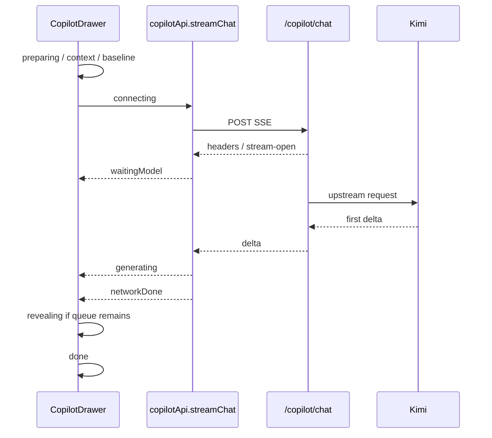

## 用户需求

用户希望把 Copilot 的优化重点放在“流式体验分层”上，让长等待过程不再只是笼统的“思考中”。

## 产品概述

Copilot 在用户发送消息后，需要根据真实请求阶段展示更清晰的等待状态，让用户知道当前是在准备资料、连接云端、等待 Kimi 分析、生成内容，还是正在整理长回复。视觉上应减少“卡住”的感觉，提供持续反馈、阶段说明、耗时提示和可追踪的 requestId。

## 核心功能

- 将固定跳步式等待提示改为真实事件驱动的阶段提示。
- 用户发送后立即出现用户消息和 assistant 占位状态。
- 区分准备问题、整理上下文、记录项目基线、连接云端、等待模型首段输出、生成中、整理长回复等阶段。
- 当等待超过阈值时显示更明确的解释，例如资料较多、模型正在深度分析。
- 保留 requestId 和简短耗时信息，便于用户反馈慢请求。
- 错误或停止时清理等待状态，并保留必要的排查信息。

## Tech Stack Selection

沿用当前项目技术栈：

- 前端：React、TypeScript、Vite。
- UI 样式：现有 Tailwind utility class 和项目内组件写法。
- 流式链路：`copilotApi.streamChat()` 读取 SSE，`CopilotDrawer` 负责对话状态和展示。
- 国际化：`apps/web/src/i18n/zh.json`、`apps/web/src/i18n/en.json`。
- 性能辅助：复用 `apps/web/src/copilot/performance.ts` 中已有 timing 类型和安全格式化工具。
- 展示节奏：复用并扩展 `apps/web/src/copilot/reveal.ts`。

## Implementation Approach

采用“真实阶段状态机 + 超时文案升级 + 轻量诊断信息”的方式优化体验。当前 `CopilotDrawer.tsx` 已有 `streamProgressIndex` 和 `CopilotStreamingProgress`，但它按固定 2.2 秒推进，不能反映真实阶段；本次应改为基于 `handleSend()` 的准备阶段、`streamChat()` 的 `onTiming/onRequestId/onSnapshot`、以及 reveal queue 状态来驱动 UI。

关键技术决策：

1. 用阶段状态替代固定 index

- 新增 `CopilotStreamPhase`，覆盖 `preparing`、`context`、`baseline`、`connecting`、`waitingModel`、`generating`、`revealing`、`done`、`error`。
- 当前 `streamProgressIndex` 可被替换或降级为 derived value，避免双状态不一致。

2. 前端事件驱动

- `handleSend()` 在 key resolve、context fetch、baseline capture、request built 时更新阶段。
- `copilotApi.streamChat()` 已有 `onTiming`：`responseHeaders` 切到已连接，`firstDelta` 切到生成中，`networkDone` 后如 reveal queue 未清空则切到整理长回复。
- `onRequestId` 设置 requestId，错误和完成状态也保留。

3. 超时提示不伪造进度

- 阶段不自动跳到下一阶段，只在同一阶段超过阈值后切换说明文字。
- 例如 `waitingModel` 超过 5 秒显示“模型正在分析资料”，超过 15 秒显示“资料较多，仍在等待首段输出”。

4. 保持安全和低侵入

- UI 只展示阶段、耗时、requestId，不展示 prompt、API Key、图片 dataUrl 或完整 payload。
- 不改服务端协议；优先复用已有 SSE timing 回调，降低改动面。

## Implementation Notes

- 避免把“等待 Kimi”误显示成“正在生成”；只有收到 `firstDelta` 后才进入 generating。
- `contextFetchMs` 和 `baselineCaptureMs` 较长时应直接提示当前正在处理资料或项目状态。
- `networkDone` 后如果 `revealQueueRef.current.length > 0`，进入 `revealing`；队列清空后结束 streaming。
- `handleStop()`、`onError()`、组件卸载时必须清理阶段 timer，避免悬挂更新。
- 阶段耗时使用 `performance.now()` 或现有 `nowMs()`，只用于 UI 和 console 安全诊断。
- 国际化文案要中英文同时补齐，不硬编码用户可见字符串。

## Architecture Design



## Directory Structure

```
BusinessModelCanvas/
├── apps/
│   └── web/
│       └── src/
│           ├── components/
│           │   └── CopilotDrawer.tsx
│           │       # [MODIFY] 将 streamProgressIndex 固定跳步改为真实阶段状态。
│           │       # 在 handleSend、onTiming、onDelta、onDone、onError、reveal 队列变化中更新阶段。
│           │       # 重构 CopilotStreamingProgress，展示阶段标题、说明、耗时、requestId 和慢等待提示。
│           ├── api/
│           │   └── copilot.ts
│           │       # [MODIFY] 如现有 timing 事件不足，补充更明确的阶段事件或 done payload 类型。
│           │       # 保持 SSE 协议兼容，不改变已有 onDelta/onDone/onError 基本行为。
│           ├── copilot/
│           │   ├── performance.ts
│           │   │   # [MODIFY] 新增 CopilotStreamPhase、阶段阈值、阶段到文案 key 的映射工具。
│           │   └── reveal.ts
│           │       # [MODIFY] 暴露 reveal 队列状态所需工具，支持 networkDone 后的 revealing 阶段。
│           └── i18n/
│               ├── zh.json
│               │   # [MODIFY] 新增中文阶段文案、慢等待提示、requestId/耗时辅助文案。
│               └── en.json
│                   # [MODIFY] 新增英文阶段文案，保持中英文能力一致。
└── docs/
    └── COPILOT_PERFORMANCE.md
        # [MODIFY] 补充流式体验分层说明、阶段定义、慢等待阈值和排查方式。
```

## Key Code Structures

```ts
type CopilotStreamPhase =
  | 'idle'
  | 'preparing'
  | 'context'
  | 'baseline'
  | 'connecting'
  | 'waitingModel'
  | 'generating'
  | 'revealing'
  | 'done'
  | 'error';

interface CopilotStreamStatus {
  phase: CopilotStreamPhase;
  startedAt: number;
  phaseStartedAt: number;
  requestId?: string;
  details?: Record<string, string | number | boolean | null>;
}
```

## 设计方案

本次是对现有 Copilot 等待态的体验升级，不改变整体抽屉布局和对话结构。核心是在 assistant 空消息气泡中展示一个更可信的“阶段进度卡”。

## 视觉结构

1. 顶部阶段标题

- 使用简短动词短语，例如“正在整理项目资料”“正在等待 Kimi 分析”。
- 标题左侧保留轻量动效点阵或细线 loading，避免过度动画。

2. 阶段说明

- 一句话解释当前为什么需要等待。
- 超过阈值后文案升级，但不虚假推进阶段。

3. 细粒度状态行

- 显示已等待秒数。
- 已拿到 requestId 后显示短 requestId。
- 可选显示“资料较多”或“正在生成长回复”。

4. 阶段列表

- 用 4 到 5 个压缩步骤表现整体链路：准备、连接、分析、生成、整理。
- 已完成步骤为绿色，当前步骤为深色，未开始为灰色。

## 交互规则

- 发送后立即显示“正在准备问题”，不要等 context fetch 完成。
- context 或 baseline 超过 1.5 秒时，明确显示当前正在整理资料。
- headers 到达但 firstDelta 未到时，显示“正在等待 Kimi 分析”。
- firstDelta 到达后隐藏进度卡，显示流式文本；如果回答仍为空才显示 generating 卡。
- networkDone 后 reveal 队列仍有内容时，显示“正在整理长回复”或加速显示。
- 错误时在错误区保留 requestId，便于反馈。

## 响应式

- 侧栏宽度下保持单列、短文案。
- 扩展宽度下可显示完整 requestId title tooltip 和更多耗时信息。

## Agent Extensions

### SubAgent

- **code-explorer**
- Purpose: 核对 CopilotDrawer、streamChat、performance、reveal、i18n 的调用链，确认阶段状态不会遗漏。
- Expected outcome: 输出准确的改动点和潜在回归点，避免破坏现有 SSE 和对话行为。

- **browser-user**
- Purpose: 只读观察 Copilot 抽屉等待态、长等待态、生成态和错误态的浏览器表现。
- Expected outcome: 验证阶段文案、布局、requestId 和耗时提示在实际页面中可读且不遮挡输入区。