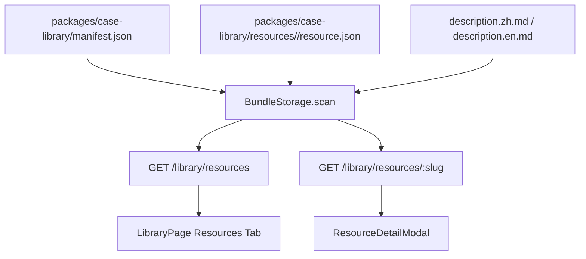

## User Requirements

用户认为当前“资料”Tab 的内容数量偏少、说明偏空，希望基于本地已有商业书籍 PDF 和可靠在线资源，系统性补充 PinGarden 策略库中的资料内容。

## Product Overview

资料库应成为策略库中的“来源层”，帮助用户理解每本书、报告或在线资源与 PinGarden 画布、案例、商业模式、实验方法和战略框架之间的关系。用户进入资料页后，不只是看到引用信息，而是能快速判断这份资料讲什么、适合解决什么问题、应该读哪些章节、能配合哪些画布使用。

## Core Features

- 补充本地书籍 PDF 对应的资料卡，优先覆盖商业模式、价值主张、蓝海战略、蓝海转型等核心书籍。
- 扩写已有资料的阅读说明，包括《The Invincible Company》《Testing Business Ideas》等，使其不再只是简短推荐。
- 为每条核心资料增加“阅读地图 / 目录概要 / 适配画布 / 关键问题 / 常见误读”等结构化说明。
- 将本地 PDF 与官方/出版社/可靠在线页面建立来源关系；在线资源只作为公开来源和目录参考，不依赖不可靠下载链接。
- 保持资料库与策略库现有层级一致：资料是来源层，服务于画布、案例、框架、实验和商业模式。

## Tech Stack Selection

- 继续使用现有 PinGarden 技术栈：
- 前端：React + TypeScript + Vite
- 后端：Fastify + TypeScript
- 内容包：`packages/case-library/resources/<slug>/`
- 共享类型：`packages/shared/src/index.ts`
- 资料内容优先通过现有静态 bundle 机制交付，不引入数据库、不新增后端写接口。
- PDF 不复制进应用包；只将其转化为可维护的资源元数据与阅读说明，避免包体膨胀和版权/分发风险。

## Implementation Approach

本次应作为“资料库内容扩容 + 资料说明质量升级”执行，而不是单纯添加几条引用。先用本地 PDF 的元数据、书签目录、可抽取目录信息建立书籍清单，再用官方页面或出版社页面补足公开来源，最后把每本书整理成资料卡和目录化阅读说明。

关键决策：

1. **使用现有 Resource schema**

- 当前 `LibraryResource` 已支持 `summary`、`recommendation`、`tags`、关联画布、关联案例、关联模式、关联实验、关联战略框架和 `sources`。
- “简单目录 / 阅读地图”先放在 `description.zh.md` / `description.en.md` 中，用 Markdown 标题呈现，无需新增 schema。

2. **第一批新增资源**

- `business-model-generation`：对应《Business Model Generation / 商业模式新生代》，连接 BMC、商业模式模式、商业模式环境、蓝海战略视角。
- `value-proposition-design`：对应《Value Proposition Design》，连接 VPC、客户画像、JTBD、实验画布。
- `blue-ocean-strategy-expanded`：对应《Blue Ocean Strategy, Expanded Edition / 蓝海战略扩展版》，连接蓝海战略画布、ERRC、非顾客、重构市场边界。
- `blue-ocean-shift`：先验证本地“蓝海战略2”PDF身份，再作为蓝海转型/落地方法资料加入，连接蓝海工具包、组织转型、买方效用图、非顾客等内容。

3. **扩写已有资源**

- `the-invincible-company`：扩写为“组合管理 + 创新指标 + 文化地图 + 实验节奏”的阅读地图。
- `testing-business-ideas`：扩写为“实验选择目录 + 证据强度 + 通过/失败标准 + 学习动作”的操作指南。
- `platform-revolution`：补充平台战略阅读地图，连接平台生态地图、多边平台模式和平台案例。
- `the-art-of-the-long-view`：补充情景规划阅读地图，连接商业模式环境、情景矩阵和战略稳健性。

4. **重复资料处理**

- 中文套装和蓝海中文译本不应盲目创建重复卡片。
- 若内容只是同一书籍的译本或合集，应作为对应 resource 的 `sources` 或说明补充。
- 若确认包含独立书籍或独立方法论，再创建独立资源卡。

5. **在线资源处理**

- 优先使用 Strategyzer、Wiley、Blue Ocean Strategy 官方工具页、出版社页面。
- 不把随机 PDF 下载站作为来源链接。
- 官方在线工具页可作为 `web` source 或补充资源来源，帮助用户查看公开目录/工具解释。

## Implementation Notes

- `BundleStorage` 对 resources 的加载已支持 manifest 顺序；新增资源只需放入 `packages/case-library/resources/<slug>/` 并更新 `packages/case-library/manifest.json`。
- 当前资源详情通过 Markdown description 渲染，目录化内容可直接用二级标题实现，避免新增 UI schema。
- 如资料卡只展示 `recommendation` 仍显得单薄，可小幅调整 `ResourceList.tsx` 或 `ResourceDetailModal.tsx`，让 `summary` 和 `recommendation` 分工更清晰；这属于轻量展示优化，不做大 UI 重构。
- 新增资源数量有限，列表和详情加载仍为小 JSON + 按需 Markdown，性能影响可忽略。
- 不复制大 PDF 到 `packages/case-library` 或 desktop bundle，避免构建产物膨胀。
- 新增资源后需运行 `case validate`、`pnpm typecheck`、Web build；若涉及桌面包，需同步 `apps/desktop/dist/case-library`。

## Architecture Design

当前资料链路：



本次不改变主架构，只补强 source-material 层：

- Resource metadata：用于资料卡、标签、关联数量、来源展示。
- Resource description：用于目录化阅读说明。
- Manifest order：控制资料 Tab 展示顺序。
- Related links：把资料连接到画布、案例、模式、实验和战略框架。

## Directory Structure

本次整体结构是在现有 `packages/case-library/resources/` 下扩展资料内容，并按需轻量优化前端展示。

```
BusinessModelCanvas/
├── packages/
│   └── case-library/
│       ├── manifest.json
│       │   # [MODIFY] 将新增资料 slug 加入 resources[]，调整展示顺序。
│       │   # 需要保持现有 cases/patterns/experiments/strategyFrameworks 不变。
│       │
│       └── resources/
│           ├── business-model-generation/
│           │   ├── resource.json
│           │   │   # [NEW] 《Business Model Generation》资料元数据。
│           │   │   # 关联 business-model-canvas、business-model-environment、商业模式模式和相关案例。
│           │   ├── description.zh.md
│           │   │   # [NEW] 中文阅读说明：问题定位、目录地图、九宫格、模式、设计、战略、流程、误读。
│           │   └── description.en.md
│           │       # [NEW] 英文阅读说明，与中文结构一致。
│           │
│           ├── value-proposition-design/
│           │   ├── resource.json
│           │   │   # [NEW] 《Value Proposition Design》资料元数据。
│           │   │   # 关联 value-proposition-canvas、empathy-map、jobs-to-be-done、experiment-canvas。
│           │   ├── description.zh.md
│           │   │   # [NEW] 中文阅读说明：客户画像、价值地图、匹配、测试、演化。
│           │   └── description.en.md
│           │       # [NEW] 英文阅读说明。
│           │
│           ├── blue-ocean-strategy-expanded/
│           │   ├── resource.json
│           │   │   # [NEW] 《Blue Ocean Strategy, Expanded Edition》资料元数据。
│           │   │   # 关联 blue-ocean-strategy-canvas、blue-ocean-strategy 框架和蓝海案例。
│           │   ├── description.zh.md
│           │   │   # [NEW] 中文阅读说明：战略画布、四步动作框架、六条路径、非顾客、执行原则。
│           │   └── description.en.md
│           │       # [NEW] 英文阅读说明。
│           │
│           ├── blue-ocean-shift/
│           │   ├── resource.json
│           │   │   # [NEW] 验证本地“蓝海战略2”身份后新增。
│           │   │   # 重点说明从战略概念到组织转型落地的路径。
│           │   ├── description.zh.md
│           │   │   # [NEW] 中文阅读说明：转型步骤、买方效用、非顾客、组织动员。
│           │   └── description.en.md
│           │       # [NEW] 英文阅读说明。
│           │
│           ├── the-invincible-company/
│           │   ├── resource.json
│           │   │   # [MODIFY] 补充 sources/tags/related links，如需要加入本地中文套装说明。
│           │   ├── description.zh.md
│           │   │   # [MODIFY] 扩写为目录化阅读地图。
│           │   └── description.en.md
│           │       # [MODIFY] 英文同步扩写。
│           │
│           ├── testing-business-ideas/
│           │   ├── resource.json
│           │   │   # [MODIFY] 补充 experiment links、官方资源来源和标签。
│           │   ├── description.zh.md
│           │   │   # [MODIFY] 扩写实验选择目录和证据强度说明。
│           │   └── description.en.md
│           │       # [MODIFY] 英文同步扩写。
│           │
│           ├── platform-revolution/
│           │   ├── resource.json
│           │   │   # [MODIFY] 视需要补充平台生态图和平台案例链接。
│           │   ├── description.zh.md
│           │   │   # [MODIFY] 扩写平台战略阅读地图。
│           │   └── description.en.md
│           │       # [MODIFY] 英文同步扩写。
│           │
│           └── the-art-of-the-long-view/
│               ├── resource.json
│               │   # [MODIFY] 视需要补充 scenario-matrix 链接。
│               ├── description.zh.md
│               │   # [MODIFY] 扩写情景规划阅读地图。
│               └── description.en.md
│                   # [MODIFY] 英文同步扩写。
│
├── apps/
│   └── web/
│       └── src/
│           └── components/
│               ├── ResourceList.tsx
│               │   # [MODIFY-OPTIONAL] 如卡片仍显空，展示 summary + recommendation 的清晰分工。
│               └── ResourceDetailModal.tsx
│                   # [MODIFY-OPTIONAL] 如详情页层级不清，强化 summary、阅读地图、关联内容展示。
│
└── docs/
    └── RESOURCE_LIBRARY_EXPANSION.md
        # [NEW] 记录本地 PDF 清单、官方在线来源、重复/译本处理规则和第一批资源选择理由。
```

## Validation Plan

- 使用 PDF 元数据和目录抽取结果确认本地书籍身份。
- 使用官方或出版社页面确认在线 sources。
- 校验新增 resource JSON 字段完整、slug 稳定、关联对象存在。
- 运行：
- `node apps/cli/dist/index.js case validate`
- `pnpm typecheck`
- `pnpm --filter @pingarden/web build`
- 如需桌面产物同步，再运行桌面构建流程并确认 bundled resources 数量。

## Agent Extensions

### Skill

- **pdf**
- Purpose: 读取 `/Users/siboli/Documents/CodeBuddy/BusinessBooks` 中 PDF 的元数据、页数、书签目录和可抽取文本片段。
- Expected outcome: 得到可靠的本地书籍清单、目录线索和是否重复/译本的判断依据。

- **pingarden**
- Purpose: 按 PinGarden 的资料库/策略库内容规范补充 resource、关联画布和阅读说明。
- Expected outcome: 新增和扩写的资料符合现有 Strategy Library 六层架构，并能被 PinGarden 正确加载。

- **browsing**
- Purpose: 核对官方/出版社/可靠网页上的书籍介绍、目录或工具说明，补充本地没有的在线来源。
- Expected outcome: 每条新增资料都有可信 sources，避免使用随机下载站作为引用来源。

### SubAgent

- **code-explorer**
- Purpose: 复核资料库前后端加载链路、Resource UI 展示方式和验证命令影响范围。
- Expected outcome: 明确最小改动文件，避免破坏现有案例、画布、框架和资源加载逻辑。