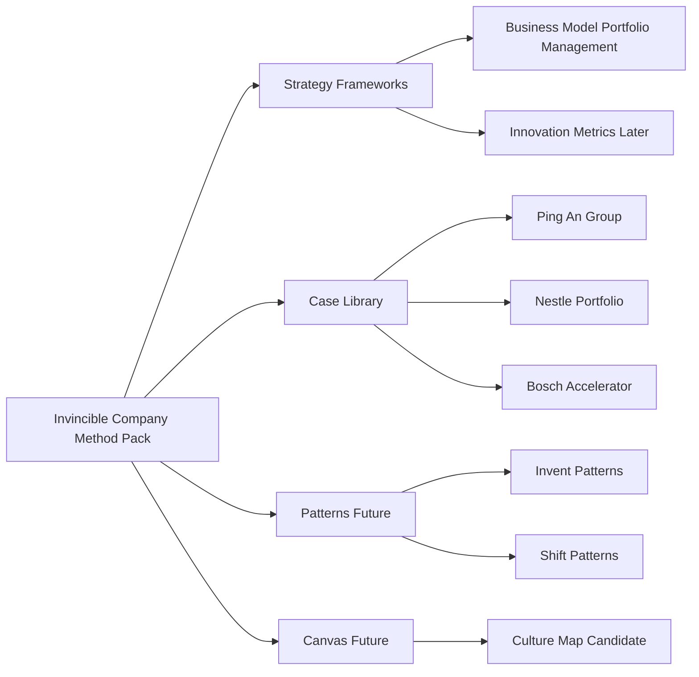

## User Requirements

- 基于 `/Users/siboli/Documents/CodeBuddy/BusinessBooks/The-invincible-company.pdf`，规划如何把《The Invincible Company》中的战略方法纳入 PinGarden。
- 本次计划需要吸收前面讨论过的建议：不要把整本书混成一个框架，而是做成一个结构化的 **Invincible Company 方法包**。
- 第一阶段重点新增一个战略分析框架：**Business Model Portfolio Management / 商业模式组合管理**。
- 框架需要围绕 `Explore / Exploit`、`Portfolio Map`、`Visualize → Analyze → Manage`、Explore/Exploit portfolio actions 展开。
- 需要补充或规划案例，而不是只给现有案例加标签。
- 需要明确哪些内容进入 `strategy-frameworks`，哪些内容未来进入 `patterns`，哪些内容暂不实施。
- `Culture Map / Innovation Culture` 用户感兴趣，但尚未确认加入本次范围；本次只提供候选 map 草案，不纳入实施待办。

## Product Overview

PinGarden 的案例库将增加来自《The Invincible Company》的组合管理方法，让用户可以用 Portfolio Map 管理当前业务与未来业务的组合，并通过案例理解公司如何同时开发现有业务、探索未来增长引擎、降低颠覆风险与创新风险。

## Core Features

- 新增“商业模式组合管理”战略分析框架
- 将框架关联到 Portfolio Map、Business Model Canvas、Experiment Canvas
- 提供双语框架说明、AI 使用指南、参考来源和案例入口
- 新增或规划 Ping An Group、Nestlé Portfolio、Bosch Accelerator 等组合管理案例
- 审计并选择性关联现有案例，避免弱关联滥标
- 更新 pingarden Skill 中的战略框架工作流
- 保留 Innovation Metrics、Invent/Shift Patterns、Culture Map 为后续扩展方向
- 提供 Culture Map 候选结构草案，等待用户确认是否进入后续实施

## Tech Stack Selection

- 项目类型：现有 PinGarden monorepo。
- 前端与应用结构：沿用现有 React + TypeScript + Tailwind CSS，不新增前端架构。
- 案例库内容体系：沿用 `packages/case-library/strategy-frameworks/<slug>/`、`packages/case-library/cases/<slug>/`。
- 共享类型：沿用 `packages/shared/src/index.ts` 中已存在的 `StrategyFramework`、`StrategyFrameworkDetail`、`StrategyFrameworkReference`、`CaseLibraryEntry`。
- 画布体系：复用已有 `packages/canvases/portfolio-map/`、`business-model-canvas`、`experiment-canvas`。
- Skill 同步：沿用 `apps/cli/src/skill/templates.ts` 和 `node apps/cli/dist/index.js skill install --local --json`。
- 内容来源：使用本地 PDF `/Users/siboli/Documents/CodeBuddy/BusinessBooks/The-invincible-company.pdf`，通过文本抽取形成可追溯摘要，不直接把整本书内容硬塞进代码。

## Implementation Approach

本次实施建议分为一个主线和三个边界清晰的后续池。

### 主线：新增商业模式组合管理战略框架

新增框架：

- slug：`business-model-portfolio-management`
- 英文名：`Business Model Portfolio Management`
- 中文名：`商业模式组合管理`

该框架作为 `strategy-frameworks`，不是 `patterns`。原因是它解决的是“如何管理一组商业模式”的战略问题，而不是描述单个商业模式的结构。

框架核心内容：

- **Business Model Portfolio**：公司正在开发的现有商业模式 + 正在探索的新商业模式。
- **Explore Portfolio**：创新项目、新商业模式、新价值主张、新产品服务，按 `Expected Return` 与 `Innovation Risk` 管理。
- **Exploit Portfolio**：现有业务、价值主张、产品服务，按 `Return` 与 `Death & Disruption Risk` 管理。
- **Portfolio Management**：`Visualize → Analyze → Manage`。
- **Explore Actions**：`Ideate`、`Persevere`、`Pivot`、`Retire`、`Spinout`、`Transfer`、`Invest`。
- **Exploit Actions**：`Acquire`、`Merge`、`Partner`、`Invest`、`Improve`、`Divest`、`Dismantle`。

### 案例策略

不要只补 `appliesStrategyFrameworks` 标签，需要让案例真正体现 portfolio 管理逻辑。

优先新增或规划：

1. `ping-an-group`

- 集团级组合转型案例。
- 用于表达 Ping An 从金融保险集团走向科技生态组合。
- 现有 `ping-an-good-doctor` 可作为其中一个子业务案例，但不能替代集团组合案例。

2. `nestle-portfolio`

- Exploit portfolio 管理案例。
- 重点展示 `Acquire / Improve / Divest` 等动作。

3. `bosch-accelerator`

- Explore portfolio 管理案例。
- 重点展示 `Ideate / Persevere / Retire / Transfer` 的探索漏斗。

选择性审计现有案例：

- `alibaba-group`
- `procter-gamble-cd`
- `nvidia-cuda`
- `transsion-africa`
- `ping-an-good-doctor`

只有当案例能明确展示 Explore/Exploit 组合关系时才关联，不能因为“公司创新”就标记。

### 后续池 1：Innovation Metrics

暂不放入本次实施主线，后续可作为独立战略框架：

- slug：`innovation-metrics`
- 中文名：`创新指标`
- 关联：`experiment-canvas`、Testing Business Ideas 实验库、`portfolio-map`
- 解决问题：探索项目不能只看传统 KPI，应衡量风险下降、证据强度、学习速度、成本和预期收益。

### 后续池 2：Invent / Shift Patterns

暂不放入 `strategy-frameworks`。

- `Invent Patterns` 与 `Shift Patterns` 应进入 `patterns` 体系。
- 它们是商业模式设计与迁移模式，不是组合管理框架。
- 后续可作为 pattern family 或拆成多个具体 pattern。

### 后续池 3：Culture Map

暂不进入本次实施待办，先给候选设计草案，等用户确认后再规划为新 canvas bundle。

## Implementation Notes

- 不新增后端接口；现有 `/library/strategy-frameworks` 与 `BundleStorage.loadStrategyFramework()` 已支持多框架。
- 新框架必须通过 `packages/case-library/manifest.json` 注册。
- 框架文件结构复用现有 `blue-ocean-strategy` 与 `business-model-environment-scan`。
- 新增案例若进入实施，必须保证双语 metadata、story、canvas sticky 实际内容一致，不能只翻译标题。
- 新增或修改案例后必须运行 `case validate --json`，利用现有中文内容门禁检查实际画布内容。
- 若触及 `packages/canvases/portfolio-map/manifest.json`，应顺手清理重复 `relatedNotes` 键，避免 JSON 语义歧义。
- 新增 Skill 内容时只改 `apps/cli/src/skill/templates.ts` 或框架源文件；`.claude/skills/pingarden/` 下生成文件通过 CLI 生成，不手写。
- PDF 抽取内容只作为框架摘要与引用依据，避免大段搬运原文；框架说明应转化为 PinGarden 可操作方法。

## Architecture Design

现有架构已经支持本次扩展，无需新增数据类型。

数据流如下：

```mermaid
flowchart TD
  A[The Invincible Company PDF] --> B[Source notes / extracted summary]
  B --> C[Strategy framework bundle]
  C --> D[packages/case-library/manifest.json]
  D --> E[BundleStorage]
  E --> F[/library/strategy-frameworks]
  F --> G[Web Library UI]
  C --> H[CLI skill install]
  H --> I[.claude/skills/pingarden]
  J[Case bundles] --> D
  J --> K[case validate]
```

框架与内容边界：



## Directory Structure Summary

本次计划新增一个战略框架内容包，并规划或补充组合管理案例。Culture Map 只作为候选设计，不进入本次文件改动。

```text
BusinessModelCanvas/
├── packages/
│   ├── case-library/
│   │   ├── manifest.json
│   │   │   # [MODIFY] 在 strategyFrameworks 中注册 business-model-portfolio-management。
│   │   │
│   │   ├── strategy-frameworks/
│   │   │   └── business-model-portfolio-management/
│   │   │       ├── framework.json
│   │   │       │   # [NEW] 商业模式组合管理框架元数据。
│   │   │       │   # 包含 slug、双语名称、双语摘要、references、examples、relatedCanvasDefIds。
│   │   │       │   # relatedCanvasDefIds 应包含 portfolio-map、business-model-canvas、experiment-canvas。
│   │   │       │
│   │   │       ├── description.en.md
│   │   │       │   # [NEW] 英文长说明。
│   │   │       │   # 说明 Explore/Exploit、Portfolio Map、三步管理法和组合动作。
│   │   │       │
│   │   │       ├── description.zh.md
│   │   │       │   # [NEW] 中文长说明。
│   │   │       │   # 面向用户解释如何用组合管理平衡现有业务和未来业务。
│   │   │       │
│   │   │       ├── skill.en.md
│   │   │       │   # [NEW] AI 使用指南英文版。
│   │   │       │   # 说明何时使用、分析顺序、案例读取方式、质量标准和反模式。
│   │   │       │
│   │   │       └── skill.zh.md
│   │   │           # [NEW] AI 使用指南中文版。
│   │   │           # 供 pingarden Skill 生成战略框架说明。
│   │   │
│   │   └── cases/
│   │       ├── ping-an-group/
│   │       │   # [NEW] 集团级组合转型案例，建议作为 primary example。
│   │       │   # 包含 case.json、双语 story、portfolio-map，以及必要的 BMC 摘要画布。
│   │       │
│   │       ├── nestle-portfolio/
│   │       │   # [NEW] Exploit portfolio actions 案例。
│   │       │   # 展示 acquire、improve、divest 等现有业务组合动作。
│   │       │
│   │       ├── bosch-accelerator/
│   │       │   # [NEW] Explore portfolio journey 案例。
│   │       │   # 展示 ideate、persevere、retire、transfer 等探索组合动作。
│   │       │
│   │       └── */case.json
│   │           # [MODIFY] 对现有候选案例审计后，选择性补充 appliesStrategyFrameworks。
│   │           # 不允许因为“创新”就弱关联，必须能解释 Explore/Exploit 组合逻辑。
│   │
│   └── canvases/
│       └── portfolio-map/
│           └── manifest.json
│               # [OPTIONAL MODIFY] 如本次触及该文件，清理重复 relatedNotes。
│
├── apps/
│   └── cli/
│       └── src/
│           └── skill/
│               └── templates.ts
│                   # [MODIFY] 更新 strategy-frameworks 工作流和参考说明。
│                   # 加入 Business Model Portfolio Management 使用方式。
│
└── .claude/
    └── skills/
        └── pingarden/
            └── strategy-frameworks/
                ├── business-model-portfolio-management.en.md
                └── business-model-portfolio-management.zh.md
                    # [GENERATED] 通过 CLI skill install 生成，不手写。
```

## Key Code Structures

无需新增 TypeScript 类型。继续使用现有 `StrategyFramework` 结构，关键字段如下：

```ts
interface StrategyFramework {
  slug: string;
  name: { en: string; zh: string };
  summary: { en: string; zh: string };
  sources: CaseSource[];
  references?: StrategyFrameworkReference[];
  examples: { slug: string; role?: 'primary' | 'secondary' }[];
  relatedCanvasDefIds?: string[];
}
```

## Validation Plan

- `pnpm typecheck`
- `pnpm --filter @pingarden/cli exec tsx src/index.ts case validate --json`
- `pnpm --filter @pingarden/web run build`
- `pnpm --filter @pingarden/cli run build`
- `node apps/cli/dist/index.js skill install --local --json`
- `node apps/cli/dist/index.js strategy-framework list --json`
- `node apps/cli/dist/index.js strategy-framework get business-model-portfolio-management --json`
- `./stop.sh && ./start.sh`
- API 验证：
- `/library/strategy-frameworks` 包含 `business-model-portfolio-management`
- `/library/strategy-frameworks/business-model-portfolio-management` 返回框架详情和案例
- 内容验证：
- 新增案例 `case read <slug> --lang zh --json` 能读到中文 story 与中文画布内容
- 现有候选案例的关联理由能在框架说明或案例 story 中解释清楚
- Skill 验证：
- `.claude/skills/pingarden/strategy-frameworks/` 生成中英文框架说明
- `workflows/strategy-frameworks.md` 包含组合管理的使用流程

## Culture Map 候选设计草案（不纳入本次实施）

### 候选 Canvas

- slug 候选：`innovation-culture-map`
- 中文名：`创新文化地图`
- 用途：诊断和设计支持创新、实验、组合管理和双元组织的文化系统。
- 当前状态：仅作为设计草案，等待用户确认是否新增 canvas bundle。

### 核心结构

建议采用上下或左右双态结构：

```text
┌──────────────────────────────────────────────────────────────┐
│ Innovation Culture Map / 创新文化地图                         │
├──────────────────────────────┬───────────────────────────────┤
│ Current State 当前状态        │ Desired State 目标状态          │
├──────────────────────────────┼───────────────────────────────┤
│ Outcomes 当前结果             │ Outcomes 目标结果                │
│ 现在文化实际产出的结果         │ 希望文化稳定产出的结果            │
├──────────────────────────────┼───────────────────────────────┤
│ Behaviors 当前行为            │ Behaviors 目标行为               │
│ 团队真实反复出现的行为         │ 希望被强化的日常行为              │
├──────────────────────────────┼───────────────────────────────┤
│ Enablers 当前促进因素          │ Enablers 需要建立的促进因素        │
│ 已经帮助创新发生的机制         │ 需要新增的机制、仪式、资源          │
├──────────────────────────────┼───────────────────────────────┤
│ Blockers 当前阻碍因素          │ Blockers 需要移除的阻碍因素        │
│ KPI、审批、恐惧、资源冲突等     │ 需要被削弱或移除的组织摩擦          │
└──────────────────────────────┴───────────────────────────────┘
```

### 四类核心区块

1. **Outcomes / 结果**

- 当前产生了什么结果：例如项目只按预算交付、探索项目少、失败被惩罚。
- 目标结果是什么：例如更快学习、更多高质量探索项目、更低创新风险。

2. **Behaviors / 行为**

- 真实发生的重复行为。
- 例如：团队是否做实验、是否暴露不确定性、是否愿意 kill idea、是否跨部门协作。

3. **Enablers / 促进因素**

- 支持目标行为的机制。
- 例如：创新预算、探索团队授权、实验节奏、领导保护、证据评审机制。

4. **Blockers / 阻碍因素**

- 阻止创新文化形成的制度或心理因素。
- 例如：只奖励短期收入、审批过重、失败污名化、核心业务资源挤压探索项目。

### 推荐颜色语义

- 绿色：促进因素 / Enabler
- 红色：阻碍因素 / Blocker
- 蓝色：目标行为 / Desired behavior
- 黄色：观察到的当前证据 / Current evidence
- 紫色：领导动作 / Leadership intervention

### 与现有画布关系

- `portfolio-map`：Culture Map 解释为什么组织能否同时做好 Explore 与 Exploit。
- `experiment-canvas`：创新文化要让低成本实验和证据决策成为日常。
- `business-model-canvas`：文化影响新商业模式能否被执行、保护和规模化。
- 未来 `innovation-metrics`：文化与指标必须配套，否则团队会被传统 KPI 拉回执行逻辑。

### 设计判断

Culture Map 值得做，但建议不要塞进本次实施。它需要新增 canvas bundle、SVG 背景、i18n、Skill 文档和填写规范，工作量明显高于新增一个 strategy framework。建议用户确认后，单独开一个计划实施。

## Agent Extensions

### Skill

- **pdf**
- Purpose: 从 `/Users/siboli/Documents/CodeBuddy/BusinessBooks/The-invincible-company.pdf` 抽取目录、关键章节和组合管理术语。
- Expected outcome: 形成可追溯的书籍摘要，支撑框架说明、参考来源和案例选择。

- **pingarden**
- Purpose: 对齐 PinGarden 的案例库、战略框架、Portfolio Map、Skill 生成和验证流程。
- Expected outcome: 新增框架、案例关联和 Skill 输出符合现有项目约定。

### SubAgent

- **code-explorer**
- Purpose: 审计现有 strategy-frameworks、case-library、portfolio-map、skill templates 的结构和调用链。
- Expected outcome: 明确所有需新增或修改的文件，避免遗漏 manifest、案例反向引用或 Skill 同步。