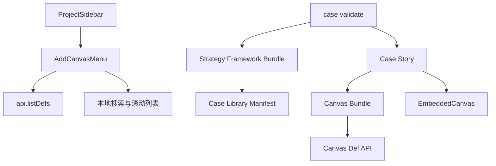

## User Requirements

用户希望在原 Phase 1 战略框架扩展计划中补充一个前置问题：当前“添加画布”菜单里的画布模板越来越多，但菜单不支持滚动，导致列表过长、容易被底部按钮或视口遮挡，操作体验变差。需要先评估并调整这个界面，使后续新增 Phase 1 画布时仍然可用。

## Product Overview

本次计划分为两部分：先优化项目侧边栏的“添加画布”模板选择体验，再继续推进 Phase 1 的三个战略框架整合。新增框架与新增画布都必须能被案例 story 正确承接，不允许只添加标签。

## Core Features

- 优化“添加画布”菜单：支持滚动、避免超出视口、保持底部“写故事”按钮可见
- 在画布模板选择器中增加搜索能力，便于快速定位模板
- 保持侧边栏与弹层视觉风格一致，不做过度重设计
- 新增 Phase 1 三个战略框架：创新指标、情景规划、平台战略
- 按需新增 evidence-scorecard、scenario-matrix、platform-ecosystem-map 三个同风格画布
- 为重点案例补充框架 story、画布实例和 story 嵌入
- 更新案例校验、Story 质量规则和 pingarden Skill，防止只加标签不加支撑内容

## Tech Stack Selection

沿用当前 PinGarden 项目技术栈：

- 前端：React + TypeScript + Vite
- 样式：Tailwind CSS
- 后端：Fastify + TypeScript
- 数据与协作：Yjs
- 内容包：Canvas bundles、Strategy framework bundles、Case library bundles
- CLI / Skill：`apps/cli/src/`

不引入新的前端框架或组件库，不改动 `CanvasStorage`、Yjs 文档模型和核心渲染架构。

## Implementation Approach

采用“先修 UI 扩展性，再做内容扩展”的实施顺序。

第一步先处理 `AddCanvasMenu` 的可扩展性问题，因为 Phase 1 计划会继续增加新画布，模板列表会更长。如果不先修复菜单滚动、搜索和视口边界，新增画布会进一步恶化操作体验。

第二步继续推进 Phase 1 三个战略框架：

1. `innovation-metrics`

- 新增框架包
- 建议新增 `evidence-scorecard`
- 连接 `experiment-canvas`、`portfolio-map`、`innovation-culture-map`

2. `scenario-planning`

- 新增框架包
- 建议新增 `scenario-matrix`
- 连接 `business-model-environment`、`portfolio-map`、`business-model-canvas`

3. `platform-strategy`

- 新增框架包
- 建议新增 `platform-ecosystem-map`
- 连接 `business-model-canvas`、`value-proposition-canvas`、`customer-journey`、`business-model-environment`

关键技术决策：

- `AddCanvasMenu` 继续使用现有 `api.listDefs()`，不新增接口。
- 菜单内部增加本地搜索过滤，数据量很小，O(n) 过滤即可，不需要服务端搜索。
- 弹层设置最大高度和内部滚动，避免撑出视口。
- 暂不引入模板分类字段，避免扩大后端和 schema 修改范围；如后续模板继续增长，再考虑 `category`。
- 新画布优先使用普通 zones + sticky，不新增插件。
- Story 嵌入继续使用已修正的 `::canvas[def-id]{canvasId="..."}` 语法。

## Implementation Notes

- `AddCanvasMenu` 当前问题集中在 `apps/web/src/workspace/AddCanvasMenu.tsx`：
- 直接 `defs.map(...)`
- 没有搜索
- 没有列表滚动容器
- popover 使用 `overflow-hidden`，但内部没有 `max-height`
- `ProjectSidebar` 已经有 `flex-1 overflow-y-auto`，底部按钮固定在 footer；本次应避免破坏这个结构。
- 弹层应保留现有 Escape 关闭和外部点击关闭逻辑。
- 搜索输入必须使用真实 `<input>`，不能用 div 模拟。
- 新增画布视觉必须参考：
- `packages/canvases/business-model-canvas/bg.zh.svg`
- `packages/canvases/customer-journey/bg.zh.svg`
- `packages/canvases/innovation-culture-map/bg.zh.svg`
- 画布 bundle 必须包含双语 SVG、i18n、knowledge 和 skill 文档。
- 校验规则应尽量防止三类新框架出现“只有 tag，没有 story/画布支撑”。

## Architecture Design

本次不改变系统架构，只在现有层次中扩展。



## Directory Structure Summary

```text
BusinessModelCanvas/
├── apps/
│   ├── web/
│   │   └── src/
│   │       └── workspace/
│   │           ├── AddCanvasMenu.tsx
│   │           │   # [MODIFY] 将当前模板列表改为可搜索、可滚动、受视口约束的模板选择器。
│   │           │   # 保留现有 api.listDefs、Escape 关闭、外部点击关闭和 compact 模式。
│   │           └── ProjectSidebar.tsx
│   │               # [AFFECTED] 验证 expanded / collapsed 两种侧边栏下 AddCanvasMenu 弹层位置与底部按钮关系。
│   └── cli/
│       └── src/
│           ├── commands/caseAuthor.ts
│           │   # [MODIFY] 为 innovation-metrics、scenario-planning、platform-strategy 增加 story 支撑校验。
│           └── skill/templates.ts
│               # [MODIFY] 更新 Phase 1 三类战略框架的 story 写作和画布嵌入规则。
├── packages/
│   ├── canvases/
│   │   ├── evidence-scorecard/
│   │   │   # [NEW] 创新指标证据记分卡画布 bundle。
│   │   ├── scenario-matrix/
│   │   │   # [NEW] 情景规划矩阵画布 bundle。
│   │   └── platform-ecosystem-map/
│   │       # [NEW] 平台生态地图画布 bundle。
│   └── case-library/
│       ├── manifest.json
│       │   # [MODIFY] 注册新增 strategy frameworks。
│       ├── strategy-frameworks/
│       │   ├── innovation-metrics/
│       │   │   # [NEW] 创新指标框架包。
│       │   ├── scenario-planning/
│       │   │   # [NEW] 情景规划框架包。
│       │   └── platform-strategy/
│       │       # [NEW] 平台战略框架包。
│       └── cases/
│           # [MODIFY] 为重点案例补充 framework tag、story、canvas 实例和嵌入。
└── docs/
    ├── CASE_STORY_QUALITY.md
    │   # [MODIFY] 增加 Phase 1 三类框架 story 质量标准。
    └── PHASE1_STRATEGY_FRAMEWORKS.md
        # [NEW] 记录 Phase 1 框架边界、画布关系、案例候选和实施说明。
```

## Design Approach

本次 UI 调整集中在“添加画布”菜单，不重做整个侧边栏。目标是让模板数量继续增长时仍然好用。

### Add Canvas Menu

- 弹层保持白底、浅灰边框、轻阴影，与当前侧边栏一致。
- 弹层设置最大高度，例如 `min(70vh, calc(100vh - 120px))`。
- 头部标题和搜索框固定在弹层顶部，模板列表区域独立滚动。
- 搜索框支持按画布中文名、英文名、id、tagline 过滤。
- 列表项继续保留缩略图、标题、简短说明。
- 搜索无结果时显示轻量空状态。
- compact 侧边栏模式下，弹层向右展开，同样限制高度并可滚动。
- 底部“添加画布”和“写故事”按钮保持可见，不被长列表挤压。

### New Canvas Visual Style

Phase 1 新画布必须延续现有画布体系：

- 米白纸张底色
- 黑色或深灰细线网格
- 清晰矩阵、分区或流程结构
- 少量辅助文字
- 不使用大面积彩色卡片、渐变、玻璃拟态或复杂阴影
- 中英文 SVG 与 i18n 完整对应

## Agent Extensions

### SubAgent

- **code-explorer**
- Purpose: 审计 AddCanvasMenu、ProjectSidebar、现有画布 bundle、strategy framework bundle 和案例 story 的实际结构。
- Expected outcome: 明确所有修改点，避免遗漏 compact 模式、story 嵌入、校验规则和框架注册。

### Skill

- **css-architecture**
- Purpose: 指导 AddCanvasMenu 的弹层滚动、搜索区、列表区和 compact 模式样式组织。
- Expected outcome: UI 改动局部、可维护，不引入散乱样式或破坏现有 Tailwind 结构。

- **pingarden**
- Purpose: 遵循 PinGarden 的 canvas、case、story、strategy framework 和 Skill 约定。
- Expected outcome: 新框架、新画布和 story 能被本地 app、CLI、Skill 一致识别。

- **pdf**
- Purpose: 从相关商业书籍中提取创新指标、情景规划、平台战略的定义、流程和质量标准。
- Expected outcome: 框架说明和画布 guidance 有内容来源，而不是泛泛总结。