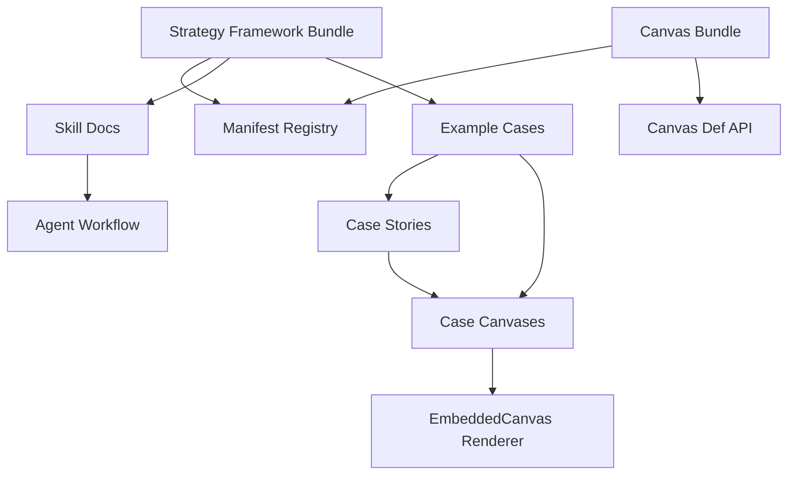

## User Requirements

用户希望将 Phase 1 的战略分析框架扩展拆成可执行计划，重点纳入三类框架：

1. **Innovation Metrics / 创新指标**

- 用于补齐探索项目的衡量体系。
- 连接 Portfolio Map、Experiment Canvas、Innovation Culture Map。
- 解决“探索项目为什么继续投、转向、终止或转入”的判断问题。

2. **Scenario Planning / 情景规划**

- 将 Business Model Environment 从外部扫描升级为多未来情景下的战略选择。
- 帮助判断不同情景下商业模式、业务组合和战略动作的稳健性。

3. **Platform Strategy / 平台战略**

- 用于解释平台型案例中的冷启动、多边关系、网络效应、治理、变现与监管风险。
- 与 Multi-sided Platforms pattern 区分：pattern 解释商业模式结构，strategy framework 解释平台如何启动、增长、治理和失效。

## Product Overview

本次计划将 PinGarden 从“商业模式画布与案例库”进一步扩展为“战略分析框架 + 画布 + 案例 story + pattern + experiment”的组合系统。新增框架必须能被案例 story 清晰讲解，不能只添加标签。

## Core Features

- 新增 Phase 1 三个战略框架：创新指标、情景规划、平台战略
- 评估并新增必要画布，视觉风格必须与现有画布一致
- 为每个框架建立 story 质量规范和案例标注规则
- 为重点案例补充框架专属 story、必要画布与嵌入
- 更新本地 Skill、案例校验和框架索引
- 保持现有画布、案例、Story、Pattern、Experiment 的联动关系

## Tech Stack Selection

当前项目沿用现有技术体系：

- 前端：React + TypeScript + Vite
- 后端：Fastify + TypeScript
- 数据与协作：Yjs
- 内容包：
- Canvas bundles：`packages/canvases/<id>/`
- Strategy frameworks：`packages/case-library/strategy-frameworks/<slug>/`
- Case library：`packages/case-library/cases/<slug>/`
- CLI / Skill：`apps/cli/src/`

不引入新的前端框架，不改动核心 CanvasStorage / Yjs 架构。新增框架优先通过现有 bundle、manifest、story、validation 和 Skill 机制落地。

## Implementation Approach

本次 Phase 1 采用“框架先行、画布按需、案例验证”的方式：

1. 先建立三个战略框架的定义、边界、使用场景和 story 质量标准。
2. 再判断每个框架是否需要新画布：

- `innovation-metrics`：建议新增轻量 `evidence-scorecard`，用于项目/假设层证据和风险下降记录。
- `scenario-planning`：建议新增 `scenario-matrix`，用于多情景、关键不确定性和战略动作。
- `platform-strategy`：建议新增 `platform-ecosystem-map`，用于平台多边、核心交互、网络效应和治理机制。

3. 最后选择已有案例做高质量示范，确保每个 framework tag 都有 story 和必要画布支撑。

关键原则：

- 不做“只加 tag”的框架扩展。
- 新画布必须遵循现有 Canvas display contract。
- 新画布视觉统一采用现有画布语言：米白底、黑/深灰网格、简洁标题、低装饰、无卡片化/渐变化风格。
- 所有画布文本走 i18n，不把 zone 标题硬编码进 SVG。
- Story 中嵌入画布必须使用 `::canvas[def-id]{canvasId="..."}`。
- 如果框架没有足够案例支撑，应先作为 candidate，不进入 featured。

## Implementation Notes

- 复用现有 strategy framework bundle 结构：`framework.json`、`description.en.md`、`description.zh.md`、`skill.en.md`、`skill.zh.md`。
- 复用现有 canvas bundle 结构：`manifest.json`、`bg.en.svg`、`bg.zh.svg`、`i18n/en.json`、`i18n/zh.json`、`knowledge/*`、`skill.*.md`。
- 新画布不应引入新插件，除非普通 zone + sticky/pin 无法表达。
- 新增 canvas 如果使用 pin，要明确是否连线；默认遵循当前 `showPinConnections` 规则。
- 新增 story 必须包含画布阅读引导，不允许连续嵌入画布而无解释。
- 校验应尽量扩展到框架特定要求：
- innovation metrics：必须解释 evidence / risk / next experiment
- scenario planning：必须解释 uncertainty / scenario / implication / robust move
- platform strategy：必须解释 sides / core interaction / network effect / governance
- 性能方面避免新增重型运行时逻辑；主要是静态 bundle 与 story 内容，现有懒加载 EmbeddedCanvas 已可承接。

## Architecture Design

本次扩展仍沿用现有内容架构：



三个 Phase 1 框架分别连接：

- `innovation-metrics`
- related canvases: `evidence-scorecard`, `experiment-canvas`, `portfolio-map`, `innovation-culture-map`
- cases: `bosch-accelerator`, `ping-an-group`, `procter-gamble-cd`

- `scenario-planning`
- related canvases: `scenario-matrix`, `business-model-environment`, `portfolio-map`, `business-model-canvas`, `design-criteria-canvas`
- cases: `alibaba-group`, `transsion-africa`, `patagonia`, `airbnb`, `carvana`

- `platform-strategy`
- related canvases: `platform-ecosystem-map`, `business-model-canvas`, `value-proposition-canvas`, `customer-journey`, `business-model-environment`
- cases: `alibaba-group`, `uber`, `airbnb`, `visa`, `google-multi-sided`, `cainiao`, `aliexpress`, `nvidia-cuda`

## Directory Structure

## Directory Structure Summary

本计划会新增三个战略框架，建议新增三个轻量画布，并补充对应案例 story、校验和 Skill 文档。所有新增画布保持与现有 BMC / Customer Journey / Innovation Culture Map 一致的视觉风格。

```text
BusinessModelCanvas/
├── packages/
│   ├── case-library/
│   │   ├── manifest.json
│   │   │   # [MODIFY] 注册 Phase 1 三个新 strategyFrameworks；必要时注册新示范案例或更新 featured 状态。
│   │   ├── strategy-frameworks/
│   │   │   ├── innovation-metrics/
│   │   │   │   ├── framework.json        # [NEW] 创新指标框架元数据，声明 relatedCanvasDefIds 和示范案例。
│   │   │   │   ├── description.en.md     # [NEW] 英文长说明：Explore metrics、evidence、risk reduction。
│   │   │   │   ├── description.zh.md     # [NEW] 中文长说明：探索项目与传统 KPI 的区别。
│   │   │   │   ├── skill.en.md           # [NEW] 英文 AI 使用指南。
│   │   │   │   └── skill.zh.md           # [NEW] 中文 AI 使用指南。
│   │   │   ├── scenario-planning/
│   │   │   │   ├── framework.json        # [NEW] 情景规划框架元数据。
│   │   │   │   ├── description.en.md     # [NEW] 英文说明：uncertainties、scenarios、robust moves。
│   │   │   │   ├── description.zh.md     # [NEW] 中文说明：多未来情景与商业模式压力。
│   │   │   │   ├── skill.en.md           # [NEW] 英文 AI 使用指南。
│   │   │   │   └── skill.zh.md           # [NEW] 中文 AI 使用指南。
│   │   │   └── platform-strategy/
│   │   │       ├── framework.json        # [NEW] 平台战略框架元数据。
│   │   │       ├── description.en.md     # [NEW] 英文说明：platform sides、core interaction、governance。
│   │   │       ├── description.zh.md     # [NEW] 中文说明：冷启动、网络效应、治理与变现。
│   │   │       ├── skill.en.md           # [NEW] 英文 AI 使用指南。
│   │   │       └── skill.zh.md           # [NEW] 中文 AI 使用指南。
│   │   └── cases/
│   │       ├── bosch-accelerator/        # [MODIFY] 补 innovation-metrics story 或 story section，并嵌入 evidence-scorecard。
│   │       ├── ping-an-group/            # [MODIFY] 补 innovation-metrics 或 scenario story，避免仅依赖 portfolio story。
│   │       ├── alibaba-group/            # [MODIFY] 补 scenario-planning 与 platform-strategy story/canvas。
│   │       ├── airbnb/                   # [MODIFY] 候选 platform-strategy / scenario-planning story。
│   │       ├── uber/                     # [MODIFY] 候选 platform-strategy story。
│   │       ├── cainiao/                  # [MODIFY] 候选 platform-strategy story。
│   │       └── transsion-africa/         # [MODIFY] 候选 scenario-planning story。
│   └── canvases/
│       ├── evidence-scorecard/
│       │   ├── manifest.json            # [NEW] 创新指标证据记分卡：假设、证据、风险、学习速度、下一步。
│       │   ├── bg.en.svg                # [NEW] 英文 SVG，统一米白底黑线网格。
│       │   ├── bg.zh.svg                # [NEW] 中文 SVG，统一米白底黑线网格。
│       │   ├── i18n/en.json             # [NEW] 英文 block 标题、prompt、examples。
│       │   ├── i18n/zh.json             # [NEW] 中文 block 标题、prompt、examples。
│       │   ├── knowledge/               # [NEW] 使用说明与每个 block 的中英文 guidance。
│       │   ├── skill.en.md              # [NEW] 英文填写指南。
│       │   └── skill.zh.md              # [NEW] 中文填写指南。
│       ├── scenario-matrix/
│       │   └── ...                      # [NEW] 情景规划矩阵画布，结构与视觉遵循现有 canvas bundle 规范。
│       └── platform-ecosystem-map/
│           └── ...                      # [NEW] 平台生态地图画布，表达多边、核心交互、治理和网络效应。
├── apps/
│   ├── cli/
│   │   └── src/
│   │       ├── commands/caseAuthor.ts   # [MODIFY] 增加三类新 strategy framework 的 story 支撑校验。
│   │       └── skill/templates.ts       # [MODIFY] 更新 strategy-framework workflow、story 质量规则、Skill 引用。
│   └── server/
│       └── src/canvasDefs/loader.ts     # [MODIFY] 仅当新画布 manifest 需要新增显示配置时调整 schema；优先避免。
└── docs/
    ├── CASE_STORY_QUALITY.md            # [MODIFY] 增加 innovation metrics / scenario / platform 的 story 质量要求。
    └── PHASE1_STRATEGY_FRAMEWORKS.md    # [NEW] Phase 1 框架整合说明、边界、案例候选和后续路线。
```

## Key Code Structures

本计划优先不新增核心类型。若新画布需要额外显示配置，应优先复用 `CanvasDisplayConfig`；只有无法表达时再扩展。

## Design Approach

Phase 1 如新增画布，视觉必须与 PinGarden 现有画布一致，而不是应用页面式 UI。

### 统一画布视觉规则

- 背景：延续 `#FAFAF7` 米白画布底色
- 线条：使用深灰/黑色细线网格，参考 `business-model-canvas`、`customer-journey`、`innovation-culture-map`
- 结构：以清晰区块、行列、矩阵或流程带表达，不使用彩色大卡片
- 标题：SVG 中只放必要的主标题和结构辅助文字；zone 标题和 prompt 主要来自 i18n
- 装饰：避免渐变、玻璃、阴影、圆角卡片化
- 双语：每个新画布必须有 `bg.en.svg`、`bg.zh.svg`、`i18n/en.json`、`i18n/zh.json`
- 嵌入 Story 时：每张画布前后必须有文字解释，不连续堆叠画布

### 建议画布结构

1. `evidence-scorecard`

- 行：关键假设、证据、风险下降、学习速度、下一步动作
- 列：Desirability / Feasibility / Viability / Adaptability 或假设层级
- 用途：连接 Experiment Canvas 与 Portfolio Map

2. `scenario-matrix`

- 结构：两条关键不确定性形成 2x2 情景，底部可放 robust moves / early signals
- 用途：将 Business Model Environment 的信号转成战略选择

3. `platform-ecosystem-map`

- 结构：需求侧、供给侧、核心交互、治理规则、网络效应、变现、信任风险
- 用途：解释平台如何启动、增长、治理和承受监管压力

## Agent Extensions

### Skill

- **pingarden**
- Purpose: 读取和遵循 PinGarden 的 canvas、case、story、strategy framework 约定；生成或更新画布、story、Skill 文档时使用。
- Expected outcome: 新增框架、画布、案例 story 与现有 PinGarden 架构一致，并通过 CLI 校验。

- **pdf**
- Purpose: 从《The Invincible Company》及必要商业书籍中提取 Innovation Metrics、Scenario Planning、Platform Strategy 相关定义和质量标准。
- Expected outcome: 新框架说明和画布 guidance 有可靠来源，不是凭空总结。

### SubAgent

- **code-explorer**
- Purpose: 审计现有案例、framework tags、canvas bundles、story 嵌入和验证逻辑，找出最适合 Phase 1 的案例和修改点。
- Expected outcome: 输出可执行的案例补强清单，避免重复出现“只加 tag，没有 story/画布支撑”的问题。