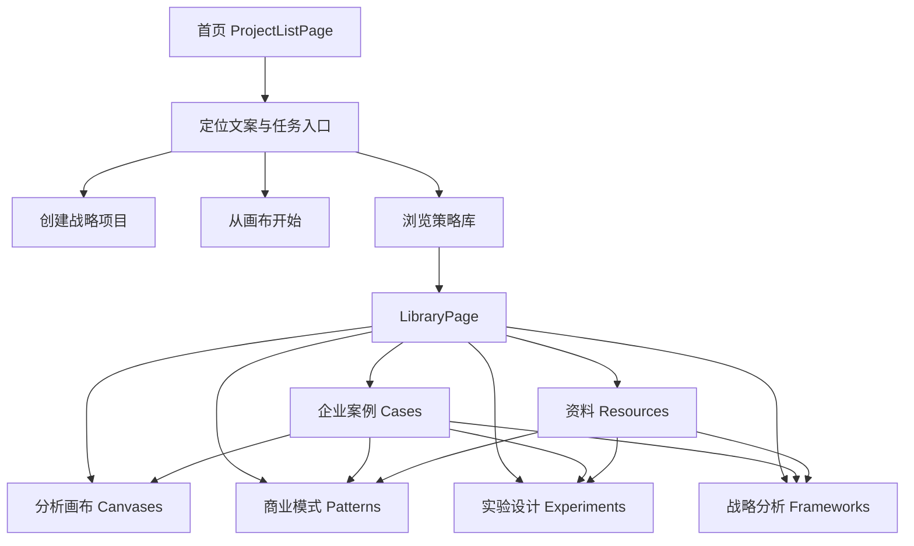

## User Requirements

用户希望围绕 PinGarden 当前逐渐成型的“商业与战略分析画布平台”定位，制定一份优化进入体验的计划。重点不是简单改几句文案，而是重新梳理首页、欢迎语、库页命名、库内容结构，以及用户进入产品后的理解路径。

## Product Overview

PinGarden 应从“选择画布模板、整理想法”的泛化工具表达，升级为更明确的“战略画布工作台 / 商业分析与案例推演空间”。用户进入后应快速理解：这里可以用结构化画布拆解商业模式、阅读真实案例、学习战略框架、选择实验方法、追溯参考资料，并将这些内容转化为自己的项目。

## Core Features

- 优化首页中间欢迎区，让文案突出商业设计、战略分析、案例推演和假设验证。
- 重新定义欢迎语：保留温暖品牌气质，但增加差异化定位，不再只强调“整理想法”。
- 评估“案例库 / 资料库 / 档案库”等命名，明确库的准确产品定义。
- 梳理当前 5 个 Tab：企业案例、商业模式、实验设计、战略分析、资料。
- 明确是否新增“画布工具 / 分析画布”Tab，将已发布画布作为方法说明和起步入口。
- 统一每个 Tab 的说明、空状态、内容口径和更新时间感知。
- 定义各 Tab 之间的逻辑关系：案例是应用场景，画布是工作工具，模式是商业结构，实验是验证方法，战略框架是分析视角，资料是来源依据。
- 优化用户进入后的决策路径：从空白项目、模板、案例、框架、资料等入口中选择最合适路径。

## Tech Stack Selection

沿用当前 PinGarden 项目技术栈：

- 前端：React + TypeScript + Vite
- 样式：Tailwind CSS
- 国际化：`apps/web/src/i18n/{zh,en}.json`
- 库内容：`packages/case-library/manifest.json` 与各内容目录
- 画布模板：`packages/canvases/*`
- 后端读取：Fastify routes + `BundleStorage`
- Skill / Workflow：`apps/cli/src/skill/templates.ts`

本计划不引入新框架，不改动 Yjs 数据模型，不改动 CanvasStorage 架构。

## Implementation Approach

采用“产品定位梳理 → 信息架构重命名 → 首页体验优化 → 库页结构优化 → 内容审计规则沉淀”的顺序推进。

第一步先完成产品语言和命名决策。当前“案例库”只准确覆盖企业案例，但已经无法覆盖商业模式、实验、战略分析、资料和未来可能加入的画布说明。因此建议将顶层库从“案例库”升级为更宽的概念，例如：

- 推荐方向：**策略库** 或 **战略资料库**
- 保留“企业案例”作为第一个 Tab
- 避免把顶层继续叫“资料库”，因为“资料”更像其中一个 Tab
- 避免“档案库”作为主名，因为它偏归档，不够行动导向

第二步优化首页首屏，强调 PinGarden 是用于“商业模式拆解、战略推演、假设验证、案例学习”的工作台。首页 CTA 应更贴近用户任务：

- 创建战略项目
- 从画布开始
- 浏览策略库
- 打开我的项目

第三步重构库页的信息表达。当前 `LibraryPage` 已经支持 5 个内容面，但页面标题、副标题和各 Tab intro 不一致，需要统一成一套“策略库”信息架构。可考虑新增第 6 个 Tab：`画布工具 / Analysis Canvases`，将 `packages/canvases/*` 作为方法工具层展示，而不仅只出现在首页模板列表和项目内添加画布弹层。

第四步沉淀规则到 Skill / Workflow。未来新增画布、案例、战略框架、资料时，应先判断内容层级，再决定是否需要：

- 新画布模板
- 新案例项目
- 新 strategy framework
- 新 resource
- 新 story 嵌入
- 新 validator 规则
- 新 Skill workflow

## Implementation Notes

- 首页实现位置：`apps/web/src/pages/ProjectListPage.tsx`。
- 首页文案位置：`apps/web/src/i18n/zh.json` 和 `apps/web/src/i18n/en.json`。
- 库页实现位置：`apps/web/src/pages/LibraryPage.tsx`。
- 当前库页数据来源：
- 企业案例：`packages/case-library/cases/`
- 商业模式：`packages/case-library/patterns/`
- 实验设计：`packages/case-library/experiments/`
- 战略分析：`packages/case-library/strategy-frameworks/`
- 资料：`packages/case-library/resources/`
- 画布模板来源：`packages/canvases/`，目前尚未作为库页 Tab 明确呈现。
- 不应一次性大改数据结构；优先用现有 API 和 bundle 结构完成 UI 与文案升级。
- 如果新增“画布工具”Tab，优先复用已有 `/canvas-defs` 或 `api.listDefs()`，避免新增服务端模型。
- 内容审计可以先以静态清单和文案状态为主，不要在第一轮引入复杂 CMS 或版本系统。

## Architecture Design



## Directory Structure Summary

```text
BusinessModelCanvas/
├── apps/
│   └── web/
│       └── src/
│           ├── pages/
│           │   ├── ProjectListPage.tsx
│           │   │   # [MODIFY] 优化首页首屏定位、欢迎语、CTA 信息架构和模板入口表达。
│           │   └── LibraryPage.tsx
│           │       # [MODIFY] 将“案例库”升级为更宽的策略内容入口，统一 Tab intro，可选新增“画布工具”Tab。
│           ├── components/
│           │   └── CanvasMethodList.tsx
│           │       # [NEW/OPTIONAL] 若新增画布工具 Tab，用于展示画布模板、用途、关联案例和开始入口。
│           └── i18n/
│               ├── zh.json
│               │   # [MODIFY] 更新首页、库页标题、副标题、Tab 名称、Tab 说明和 CTA 中文文案。
│               └── en.json
│                   # [MODIFY] 更新对应英文文案，保持中英文语义一致。
├── packages/
│   ├── case-library/
│   │   └── manifest.json
│   │       # [AFFECTED] 保持当前 5 类内容注册；若新增画布工具 Tab，不必修改此文件。
│   └── canvases/
│       # [AFFECTED] 作为“画布工具 / 分析画布”内容来源，展示每张画布的用途和关联关系。
├── apps/
│   └── cli/
│       └── src/
│           └── skill/
│               └── templates.ts
│                   # [MODIFY] 更新 library-evolution workflow，加入产品定位、库命名、Tab 层级规则。
└── docs/
    ├── PRODUCT_POSITIONING.md
    │   # [NEW] 记录 PinGarden 的定位、目标用户、首页话术、库命名和内容层级。
    └── LIBRARY_INFORMATION_ARCHITECTURE.md
        # [NEW] 记录 5/6 个 Tab 的定义、关系、内容来源、更新规则和未来扩展原则。
```

## Key Code Structures

可选新增一个轻量本地类型，仅用于前端“画布工具”Tab 的展示，不影响后端模型：

```ts
export interface CanvasMethodCard {
  id: string;
  name: string;
  tagline: string;
  related: string[];
  useCase: string;
}
```

## Design Approach

本次是首页和库页的信息架构与视觉表达升级，属于轻量但关键的 UI 体验优化。整体风格继续保持 PinGarden 当前的温暖、克制、纸张式策略画布气质，不做重型视觉重构。

### 首页首屏

- 保留芽苗图标和诗句卡片，继续体现 PinGarden 的“生长、推演、培育”品牌意象。
- 将副标题从“整理想法”升级为更明确的战略定位，例如：
- “用结构化画布拆解商业模式、推演战略选择、验证关键假设。”
- “从真实案例、战略框架和画布模板开始，构建你的商业判断。”
- CTA 重新体现任务路径：
- 主按钮：创建战略项目
- 次按钮：从画布开始
- 次按钮：浏览策略库
- 次按钮：我的项目
- 中部可增加一行小型能力标签：商业模式、战略分析、实验验证、案例学习。

### 库页

- 顶层标题建议从“案例库”升级为“策略库”或“战略资料库”。
- 副标题说明它不是单纯案例集合，而是：
- 真实企业案例
- 商业模式模式
- 实验方法
- 战略分析框架
- 参考资料
- 可选：分析画布工具
- 每个 Tab 顶部统一增加 intro 卡片，说明：
- 这个 Tab 是什么
- 适合什么时候用
- 它和其他 Tab 的关系
- 若新增“画布工具”Tab，使用卡片展示每张画布的用途、适用问题和关联内容。

### Visual Style

- 延续当前浅色、留白、圆角卡片、细边框。
- 强调“策略工作台”而非娱乐化设计。
- 轻微提升首页首屏的专业感：更清晰的标题层级、更强的 CTA 语义、更稳定的内容路径。

## Agent Extensions

### SubAgent

- **code-explorer**
- Purpose: 审计首页、库页、Tab 数据来源、画布模板展示入口和现有文案结构。
- Expected outcome: 明确所有实现路径和现有结构，避免计划遗漏入口、i18n 或内容来源。

### Skill

- **pingarden**
- Purpose: 对齐 PinGarden 的画布、案例、框架、资料和 Skill workflow 约定。
- Expected outcome: 首页定位与库页 IA 不破坏现有 canvas/case/story 体系。

- **css-architecture**
- Purpose: 指导首页和库页的局部 UI 改造，保持 Tailwind 结构清晰、样式局部可维护。
- Expected outcome: 不引入散乱样式，不重构无关页面。

- **skill-creator**
- Purpose: 评估并更新现有 PingGarden Skill / workflow / rule 的边界。
- Expected outcome: 将未来新增画布、案例、框架、资料的规则沉淀为可复用 workflow，而不是一次性口头约定。