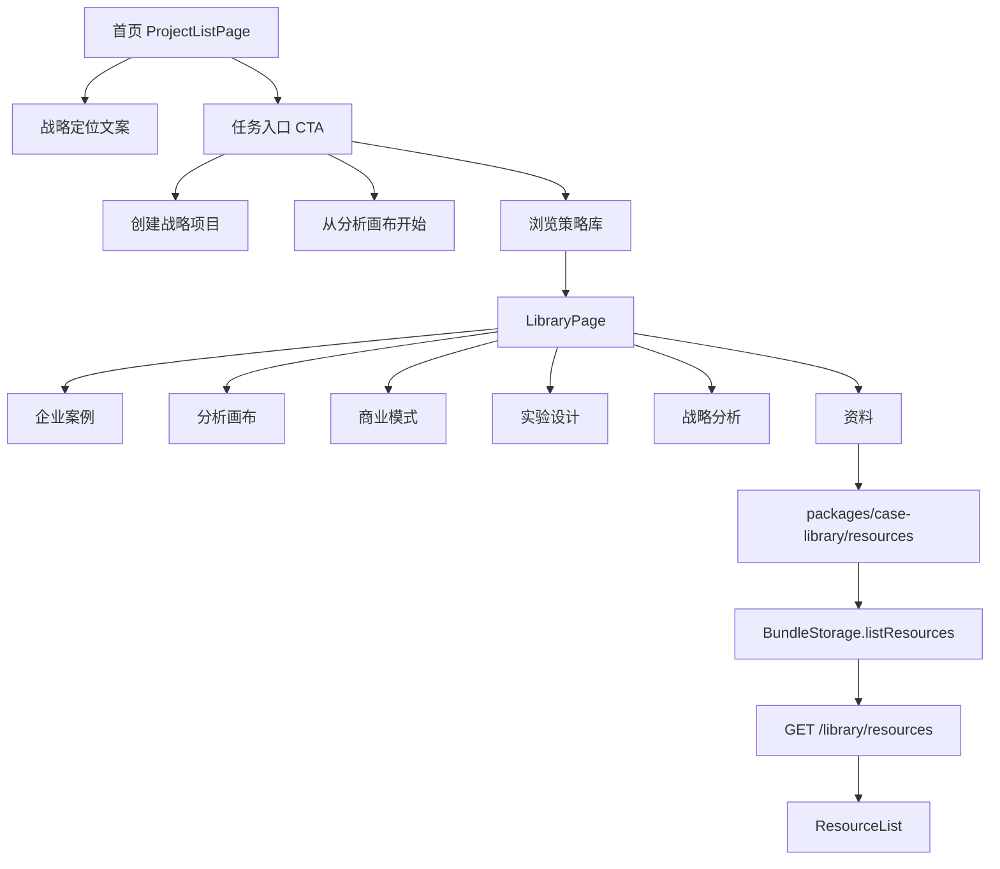

## User Requirements

用户希望在 PinGarden 当前“商业与战略分析画布平台”定位逐渐清晰的基础上，进一步优化用户进入产品后的整体使用体验，并把最新发现的“资料 Tab 为空”问题纳入修复范围。

## Product Overview

PinGarden 需要从“选择画布模板、创建项目、整理想法”的泛化表达，升级为更明确的“战略画布工作台 / 商业分析与案例推演空间”。用户进入后应能快速理解：这里可以用画布拆解商业模式、阅读真实企业案例、学习战略框架、选择实验方法、追溯参考资料，并将这些内容转化为自己的战略项目。

## Core Features

- 优化首页欢迎区文案，突出商业设计、战略分析、案例推演和假设验证。
- 保留“欢迎来到 PinGarden”的温暖品牌气质，但补充差异化定位，弱化泛泛的“整理想法”。
- 评估“案例库 / 资料库 / 档案库 / 策略库”等命名，确定更准确的顶层定义。
- 梳理当前 5 个 Tab：企业案例、商业模式、实验设计、战略分析、资料。
- 修复“资料”Tab 当前显示为 0 和空状态的问题，确保已注册资料能正常展示。
- 明确是否新增“画布工具 / 分析画布”Tab，把已发布画布作为方法说明和起步入口。
- 统一各 Tab 的说明、空状态、内容口径和关系定义。
- 建立进入路径：从战略项目、画布模板、案例学习、框架分析、资料阅读之间自然流转。

## Tech Stack Selection

沿用当前 PinGarden 项目技术栈和架构：

- 前端：React、TypeScript、Vite
- 样式：Tailwind CSS
- 国际化：`apps/web/src/i18n/zh.json`、`apps/web/src/i18n/en.json`
- 首页：`apps/web/src/pages/ProjectListPage.tsx`
- 库页：`apps/web/src/pages/LibraryPage.tsx`
- 库 API：`apps/web/src/api/library.ts`
- 后端：Fastify routes，`apps/server/src/http/library.ts`
- 内容加载：`apps/server/src/storage/BundleStorage.ts`
- 内容注册：`packages/case-library/manifest.json`
- 资料内容：`packages/case-library/resources/*`
- 画布模板：`packages/canvases/*`
- Skill 和规则：`apps/cli/src/skill/templates.ts`

不引入新框架，不改动 Yjs 数据模型，不改动 `CanvasStorage` 主架构。

## Implementation Approach

采用“先修复资料 Tab 数据链路，再做产品定位和信息架构升级”的顺序。

当前代码探索确认：

- `LibraryPage.tsx` 已定义 `resources` state，并在初始化时调用 `libraryApi.listResources()`。
- `apps/web/src/api/library.ts` 已存在 `listResources()`，请求路径为 `/library/resources`。
- `apps/server/src/http/library.ts` 已注册 `GET /library/resources` 和 `GET /library/resources/:slug`。
- `BundleStorage.ts` 已有 `resourcesBySlug`、`listResources()`、`getResource()` 和 `loadResource()`。
- `packages/case-library/manifest.json` 已注册 4 条资源。
- `packages/case-library/resources/` 下已存在 4 个资源目录，每个包含 `resource.json` 和双语说明。

因此截图中的“资料 0”不应只通过 UI 文案遮掩，必须前置排查运行时链路：当前服务是否加载到了最新 `packages/case-library/manifest.json`，`CASE_LIBRARY_DIR` 是否指向正确目录，服务是否未重启，前端是否仍使用旧构建，或 `BundleStorage` 是否静默吞掉资源加载错误。

推荐命名方向：

- 顶层不继续叫“资料库”，因为“资料”已经是一个 Tab。
- 顶层“案例库”对当前 5 类内容偏窄。
- 优先评估“策略库”或“战略资料库”。
- 保留“企业案例”作为第一个 Tab，避免失去真实案例入口。
- “档案库”偏归档，不够行动导向，作为备选而非首选。

推荐信息结构：

1. 企业案例：真实公司如何应用商业模式、战略框架和画布。
2. 分析画布：用户实际操作的结构化工具。
3. 商业模式：可复用的商业结构和模式。
4. 实验设计：验证关键假设的方法。
5. 战略分析：拆解竞争、环境、平台、组合和未来情景的框架。
6. 资料：书籍、文章、报告和公开来源，说明方法从哪里来。

## Implementation Notes

- 资料为空问题优先修复，避免后续“策略库”升级建立在错误数据状态上。
- 对 `BundleStorage.ts` 的资源加载错误应增加可定位日志或至少避免完全静默，但不要打印大 payload。
- `LibraryPage.tsx` 应区分“加载中 / 加载失败 / 确实无资料”三种状态，避免所有异常都变成“本版本暂未附带资料”。
- 首页和库页改造优先复用现有 Tailwind 结构，不做全站视觉重构。
- 如果新增“分析画布”Tab，优先复用现有 `/canvas-defs` 或已有 canvas defs API，不新增后端内容模型。
- 库内容关系先用展示层和文档规则表达，不在第一轮引入复杂 CMS 或版本系统。
- 修改 i18n 时中英文同步，避免首页、库页、按钮和空状态语义不一致。

## Architecture Design



## Directory Structure Summary

```text
BusinessModelCanvas/
├── apps/
│   ├── web/
│   │   └── src/
│   │       ├── pages/
│   │       │   ├── ProjectListPage.tsx
│   │       │   │   # [MODIFY] 优化首页欢迎区、战略定位表达、CTA 入口和模板入口说明。
│   │       │   └── LibraryPage.tsx
│   │       │       # [MODIFY] 重构库页标题、副标题、Tab intro；修复资料 Tab 加载状态与空状态表达。
│   │       ├── components/
│   │       │   ├── ResourceList.tsx
│   │       │   │   # [MODIFY] 保持资料卡片展示，补充错误/空状态承接；确认 4 条资源可见。
│   │       │   └── CanvasMethodList.tsx
│   │       │       # [NEW/OPTIONAL] 若新增“分析画布”Tab，用于展示画布用途、适用问题和开始入口。
│   │       ├── api/
│   │       │   └── library.ts
│   │       │       # [VERIFY/MODIFY] 检查 listResources 请求、错误传播和前端状态处理。
│   │       └── i18n/
│   │           ├── zh.json
│   │           │   # [MODIFY] 更新首页、库页、Tab、资料状态和 CTA 中文文案。
│   │           └── en.json
│   │               # [MODIFY] 更新对应英文文案，保持语义一致。
│   └── server/
│       └── src/
│           ├── http/
│           │   └── library.ts
│           │       # [VERIFY] 确认 /library/resources 路由返回真实资料列表。
│           └── storage/
│               └── BundleStorage.ts
│                   # [MODIFY] 排查资源加载静默失败，增加可定位的资源加载诊断。
├── packages/
│   ├── case-library/
│   │   ├── manifest.json
│   │   │   # [VERIFY] 确认 resources 注册与实际目录一致。
│   │   └── resources/
│   │       # [VERIFY/MODIFY] 确认 4 条资料 resource.json 和双语说明可被加载。
│   └── canvases/
│       # [AFFECTED] 作为“分析画布”内容来源，参与库页方法工具层展示。
├── apps/
│   └── cli/
│       └── src/
│           └── skill/
│               └── templates.ts
│                   # [MODIFY] 更新 library-evolution workflow，沉淀库命名、Tab 层级和资料维护规则。
└── docs/
    ├── PRODUCT_POSITIONING.md
    │   # [NEW] 记录 PinGarden 定位、首页话术、目标用户和主入口定义。
    └── LIBRARY_INFORMATION_ARCHITECTURE.md
        # [NEW] 记录 5/6 个 Tab 的定义、关系、内容来源、更新规则和扩展原则。
```

## Key Code Structures

如新增“分析画布”Tab，可在前端展示层新增轻量类型，不改变后端模型：

```ts
export interface CanvasMethodCard {
  id: string;
  name: string;
  tagline: string;
  related: string[];
  useCase: string;
}
```

## Design Approach

本次属于首页和库页的信息架构与局部 UI 升级，不是全站重做。视觉方向继续保持 PinGarden 当前的温暖、克制、纸张式策略画布气质，同时提高专业感和任务引导。

### 首页首屏

- 保留芽苗图标和诗句卡片，延续“生长、培育、推演”的品牌意象。
- 将副标题从“整理想法”升级为战略定位表达，例如“用结构化画布拆解商业模式、推演战略选择、验证关键假设”。
- CTA 改为更贴近任务路径：创建战略项目、从画布开始、浏览策略库、我的项目。
- 增加轻量能力标签：商业模式、战略分析、实验验证、案例学习。

### 库页

- 顶层标题从“案例库”升级为更宽的策略内容入口，候选为“策略库”或“战略资料库”。
- 每个 Tab 顶部统一 intro 卡片，说明这个内容是什么、何时使用、和其他内容的关系。
- 资料 Tab 必须展示已注册资料，不能继续显示空状态。
- 若新增“分析画布”Tab，使用卡片展示画布用途、适用问题、关联案例和开始入口。

### Visual Style

- 浅色背景、充足留白、圆角卡片、细边框。
- 重点 CTA 使用当前绿色主色，次级入口保持白底边框。
- Tab intro 使用轻量暖色提示卡，不制造强烈视觉噪声。
- 列表卡片保持当前 3 列布局，避免大改交互模式。

## Agent Extensions

### SubAgent

- **code-explorer**
- Purpose: 审计首页、库页、资料 API、BundleStorage、manifest 和资源目录的实际链路。
- Expected outcome: 明确“资料 0”的真实原因，并确认首页和库页所有修改点。

### Skill

- **pingarden**
- Purpose: 对齐 PinGarden 的画布、案例、框架、资料和 story 体系。
- Expected outcome: 库页 IA 与画布方法层不破坏现有 canvas/case/story 关系。

- **css-architecture**
- Purpose: 指导首页欢迎区、CTA、库页 Tab intro 和资料列表的局部样式组织。
- Expected outcome: UI 改动局部清晰，Tailwind 结构可维护，不引入散乱样式。

- **skill-creator**
- Purpose: 更新现有 PingGarden Skill / workflow 中关于资料、画布、案例和策略库扩展的规则。
- Expected outcome: 将未来新增内容的判断流程沉淀为可复用 workflow。