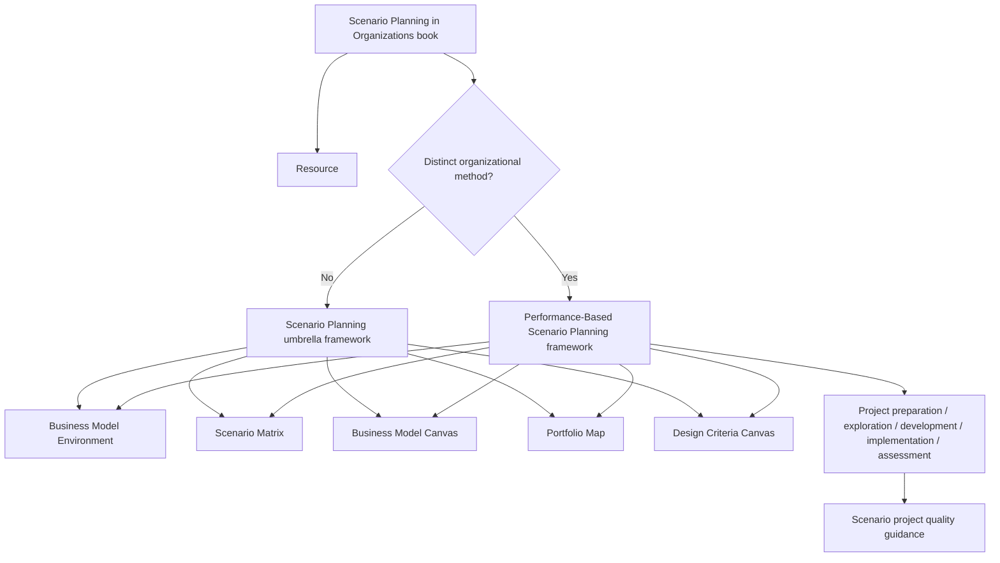

## User Requirements

用户在 `/Users/siboli/Documents/CodeBuddy/BusinessBooks` 新放入一本 Scenario Planning 相关 PDF，希望系统性阅读和研究其中的方法逻辑，判断是否需要在 PinGarden 中新增战略分析框架，并补充相关资料、框架说明、画布知识和案例/资源关联。

## Product Overview

PinGarden 当前已有 `scenario-planning` 战略框架、`scenario-matrix` 画布和 `The Art of the Long View` 资料卡。本次需要基于新书《Scenario Planning in Organizations: How to Create, Use, and Assess Scenarios》补强情景规划体系，使其不只停留在“构造多个未来”，还覆盖组织如何准备、开展、使用和评估情景规划项目。

## Core Features

- 阅读并抽取本地 Scenario Planning PDF 的目录、章节结构、核心方法、案例和流程。
- 判断新书内容与现有 `scenario-planning` 是否重叠，决定是增强现有框架，还是新增独立框架。
- 补充一条新资料资源，说明该书如何用于组织内情景规划项目。
- 如方法足够独立，新增 `performance-based-scenario-planning` 战略框架，定位为情景规划的组织执行层。
- 增强现有 `scenario-planning` 框架、`scenario-matrix` 知识说明和 AI skill，使其包含项目准备、探索、开发、实施、评估等完整流程。
- 保持与现有画布关系清晰：`business-model-environment` 收集信号，`scenario-matrix` 构造情景，`business-model-canvas` 压力测试模型，`portfolio-map` 比较选项，`design-criteria-canvas` 固化稳健动作。

## Tech Stack Selection

继续沿用当前 PinGarden 内容包架构，不新增数据库、不改 API schema、不做 UI 重构：

- 内容包：`packages/case-library/`
- 战略框架层：`packages/case-library/strategy-frameworks/`
- 资料层：`packages/case-library/resources/`
- 画布包：`packages/canvases/`
- 当前情景规划框架：`packages/case-library/strategy-frameworks/scenario-planning/`
- 当前情景矩阵画布：`packages/canvases/scenario-matrix/`
- 当前经典情景规划资料：`packages/case-library/resources/the-art-of-the-long-view/`
- 本地新书：`/Users/siboli/Documents/CodeBuddy/BusinessBooks/Scenario+Planning+in+Organizations+How+to+Create,+Use,+and+Assess+Scenarios.pdf`

已核实新书 PDF 信息：

- 文件存在，大小约 1.77 MB。
- PDF 页数：297 页。
- 标题：`Scenario Planning in Organizations`
- 作者：`Thomas J. Chermack`
- 出版相关元数据：`Berrett Koehler`
- ISBN 元数据包含：`9781605094137`、PDF e-book ISBN `9781605094144`、IDPF e-book ISBN `9781605099088`
- 目录结构显示它重点不是泛泛情景思考，而是 **Performance-Based Scenario System**：
- Project Preparation
- Scenario Exploration
- Scenario Development
- Scenario Implementation
- Project Assessment
- Managing Scenario Projects
- Human Perceptions in the Scenario System

## Implementation Approach

本次采用“先抽取、后判断、再补充”的方案。

### 1. 框架归属判断

当前已有 `scenario-planning` 框架，不应重复新增一个泛泛的同名框架。新书的差异点在于它强调组织内情景规划项目如何被准备、执行、使用和评估，因此初步建议：

- 保留 `scenario-planning` 作为总框架。
- 新增 `scenario-planning-in-organizations` 作为资料资源。
- 如果抽取结果确认 Chermack 的五阶段系统足够独立，则新增 `performance-based-scenario-planning` 战略框架，定位为：
- `scenario-planning` 的组织执行层 / 项目管理层；
- 不替代 `scenario-matrix`；
- 补充“如何让情景规划在组织中产生绩效和决策影响”。

### 2. 内容补强方向

新书贡献的重点应写入：

- 项目准备：目的、范围、赞助者、参与者、成功标准。
- 情景探索：信号、驱动力、趋势、不确定性。
- 情景开发：构造情景、叙事、内部一致性。
- 情景实施：把情景用于战略选择、BMC 压力测试、组合选择和行动设计。
- 项目评估：记录结果、学习、影响和后续监测。
- 人的认知因素：偏见、心智模型、组织学习和参与式对话。

### 3. 版权和内容处理

- 不复制长段原文。
- 只记录章节、页码、方法结构和原创摘要。
- 如书中案例信息不足，不直接创建案例，只写入抽取审计文档。
- 新增框架和资料说明必须中英文等深。

## Implementation Notes

- 优先使用 PDF outline 和章节页码作为结构来源。
- 使用 PDF 文本抽取定位关键术语：`Performance-Based Scenario System`、`Project Preparation`、`Scenario Exploration`、`Scenario Development`、`Scenario Implementation`、`Project Assessment`、`case study`、`assessment`、`human perceptions`。
- 如果新增战略框架，必须更新 `packages/case-library/manifest.json.strategyFrameworks[]`。
- 如果新增资料，必须更新 `packages/case-library/manifest.json.resources[]`。
- 修改内容包后需重启服务，因为 `BundleStorage` 启动时扫描 case-library。
- 若新增框架 examples，要使用高置信既有案例；没有足够案例证据时宁可先少量或不新增 examples，避免弱关联。

## Architecture Design



## Directory Structure Summary

```
BusinessModelCanvas/
├── docs/
│   └── SCENARIO_PLANNING_BOOK_EXTRACTION.md
│       # [NEW] 记录新 PDF 的元数据、目录结构、关键方法抽取、框架归属判断、
│       #       是否新增 Performance-Based Scenario Planning、案例/示例处理结论和版权原则。
│
├── packages/
│   └── case-library/
│       ├── manifest.json
│       │   # [MODIFY] 如新增框架或资源，加入 strategyFrameworks[] / resources[]。
│       │
│       ├── resources/
│       │   └── scenario-planning-in-organizations/
│       │       ├── resource.json
│       │       │   # [NEW] Thomas J. Chermack 新书资料卡，关联 scenario-planning、
│       │       │   #       scenario-matrix、business-model-environment、portfolio-map 等。
│       │       ├── description.en.md
│       │       │   # [NEW] 英文阅读地图：五阶段系统、组织使用方式、评估逻辑、局限性。
│       │       └── description.zh.md
│       │           # [NEW] 中文阅读地图，与英文等深。
│       │
│       └── strategy-frameworks/
│           ├── scenario-planning/
│           │   ├── framework.json
│           │   │   # [MODIFY] 补充 Chermack / performance-based scenario system 引用。
│           │   ├── description.en.md
│           │   │   # [MODIFY] 扩写现有框架：从情景矩阵扩展到组织使用和评估。
│           │   ├── description.zh.md
│           │   ├── skill.en.md
│           │   │   # [MODIFY] 增加项目准备、实施、评估和常见误用。
│           │   └── skill.zh.md
│           │
│           └── performance-based-scenario-planning/
│               ├── framework.json
│               │   # [NEW-CONDITIONAL] 若抽取确认独立性足够，则新增组织执行层框架。
│               ├── description.en.md
│               ├── description.zh.md
│               ├── skill.en.md
│               └── skill.zh.md
│
└── packages/
    └── canvases/
        └── scenario-matrix/
            ├── knowledge/body.en.md
            │   # [MODIFY] 从简单 5 步扩展为信号输入、情景开发、实施、评估。
            ├── knowledge/body.zh.md
            ├── skill.en.md
            │   # [MODIFY] 增强 AI 使用指引。
            └── skill.zh.md
```

## Validation Plan

执行完成后验证：

- 新增/修改 JSON 均可解析。
- 如新增 framework/resource，manifest 中 slug 与目录一致。
- 运行：
- `pnpm --filter @pingarden/cli exec tsx src/index.ts case validate --json`
- `pnpm typecheck`
- `pnpm --filter @pingarden/web build`
- 重启服务：
- `./start.sh`
- 验证 API：
- `/library/strategy-frameworks/scenario-planning`
- `/library/resources/scenario-planning-in-organizations`
- 如新增：`/library/strategy-frameworks/performance-based-scenario-planning`

## Agent Extensions

### Skill

- **pdf**
- Purpose: 读取新 Scenario Planning PDF，抽取页数、元数据、书签目录、章节结构、关键方法和案例线索。
- Expected outcome: 得到可引用的章节/页码结构、五阶段系统摘要、是否支持新增框架的证据。

- **pingarden**
- Purpose: 判断新书内容应进入 Resource、现有 Strategy Framework、还是新增 Strategy Framework，并维护与现有画布关系。
- Expected outcome: 保持 PinGarden 六层架构一致，不重复创建泛泛框架，明确 `scenario-planning` 与可能新增框架的边界。

- **browsing**
- Purpose: 核对 Chermack 新书书目信息，以及 Shell / Schwartz / Schoemaker / Chermack 等情景规划方法来源。
- Expected outcome: 新增资料和框架说明有可靠来源，避免只依赖本地 PDF 单一来源。

### SubAgent

- **code-explorer**
- Purpose: 复核现有 scenario framework、scenario resource、scenario-matrix canvas、manifest 和校验规则。
- Expected outcome: 明确最小改动范围，避免破坏现有情景规划框架、资源和画布链路。