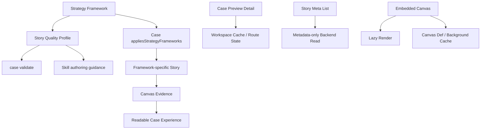

## User Requirements

- 复盘此前案例库与战略分析框架建设中遗留的问题，不能只补标签，必须让案例故事真正解释战略框架如何发生作用。
- 为不同战略分析框架制定差异化的 story 质量规范，避免蓝海战略、组合管理等框架反复出现“画布有了但故事讲不清”的问题。
- 支持同一个公司拥有多个 story：保留原业务模式故事，同时新增某个战略框架专属 story。
- 补强组合管理相关案例，重点包括平安集团、阿里巴巴、宝洁，并复核 NVIDIA、Nestlé、Bosch 等案例是否真的讲清楚组合逻辑。
- 审计所有已打战略框架标签的案例，明确哪些需要补 story、补画布、去掉弱关联标签或重写。
- 统一修复案例打开速度问题，重点减少 Story 信息、图片/画布资源、嵌入画布加载过程中的重复请求和慢加载。

## Product Overview

案例库需要升级为“框架驱动的案例阅读系统”：每个战略分析框架不仅有定义和画布，还要有对应的故事质量标准、案例验收规则和性能稳定的阅读体验。用户打开案例时，应能快速理解事件、关系、战略动作与画布之间的因果链。

## Core Features

- 战略框架 story 质量规范体系
- 多 story 支持与框架专属 story 写作规则
- 组合管理案例内容补强
- 蓝海战略、环境扫描、组合管理案例统一审计
- 弱关联标签清理机制
- 案例阅读加载性能优化
- 校验、构建、Skill 同步与性能回归验证

## Tech Stack Selection

- Monorepo：沿用现有 PinGarden 工作区结构。
- 前端：继续使用 React + TypeScript + Tailwind CSS。
- 后端：沿用 Fastify API、`CanvasStorage` 抽象、`BundleStorage` / `FileSystemStorage` / `FederatedStorage` 分层。
- 内容模型：继续使用 `CaseLibraryEntry`、`StoryMeta`、`Story`、`StrategyFramework`、`CaseLibraryDetail`。
- 案例与框架内容：沿用 `packages/case-library/cases/<slug>/` 与 `packages/case-library/strategy-frameworks/<slug>/`。
- Skill：继续通过 `apps/cli/src/skill/templates.ts` 生成 `.claude/skills/pingarden/`，不手写生成目录。
- 校验：扩展现有 `case validate`，将“内容存在”升级为“框架故事质量可验收”。

## Implementation Approach

本次不继续单纯补案例标签，而是先补系统能力，再补案例内容。

### 1. 建立战略框架 story 质量规范

现有 `docs/CASE_STORY_QUALITY.md` 已有通用 story 标准和蓝海战略补充，但不足以覆盖未来多个战略框架。需要升级为“通用标准 + 框架专属标准”：

- 通用 story 必须解释背景、战略动作、画布阅读方式、机制、风险、迁移启发。
- `blue-ocean-strategy` 必须解释红海基线、非顾客、ERRC、价值曲线、BMC 后果。
- `business-model-portfolio-management` 必须解释组合颗粒度、Explore/Exploit 拆分、portfolio item 位置、组合动作、时间移动、证据和风险。
- `business-model-environment-scan` 必须解释外部力量、机会/威胁、对 BMC 的压力点、战略响应和不确定性。
- 后续新增框架必须在框架 bundle 或统一文档中补充 story quality profile。

### 2. 扩展校验与 Skill 工作流

在 `apps/cli/src/commands/caseAuthor.ts` 中扩展 `case validate`：

- 对带 `appliesStrategyFrameworks[]` 的案例检查是否存在对应框架的 story 解释。
- 不强制每个框架都单独一个 story，但必须至少在 story 正文中明确提及框架关键术语。
- 对组合管理框架，检查 story 是否包含 Explore/Exploit、Portfolio Map、组合动作或等价中文表达。
- 对蓝海战略沿用并增强现有要求，避免只有 Strategy Canvas 但 story 没讲 ERRC / 非顾客。
- 对环境扫描检查是否提及外部力量及其对 BMC 的影响。
- 将规则写入 `apps/cli/src/skill/templates.ts`，确保后续 AI 写案例前先按框架质量标准组织 story。

校验应以 warning 起步，对明显“仅 tag 无 story”的情况可设为 error。这样可以控制 blast radius，同时逐步提高案例库质量。

### 3. 升级组合管理案例内容

采用用户认可的方式：同一公司可以有多个 story。

- `ping-an-group`：保留现有画布，重写/补强组合管理 story，讲清楚平安金融核心、医疗、车主、金融科技平台之间的事件关系与 Explore/Exploit 迁移逻辑。
- `alibaba-group`：保留原 BMC / 生态故事，新增组合管理 story；必要时增加 Portfolio Map，拆解 Alibaba.com、淘宝、天猫、支付宝/蚂蚁、菜鸟、阿里云等 portfolio 角色。
- `procter-gamble-cd`：保留开放式创新 story，新增组合管理 story，解释 Connect & Develop 如何作为成熟消费品主业周边的 Explore 管道。
- `nvidia-cuda`：复核是否保留组合管理标签；若保留，必须新增 Explore → Exploit / GPU → CUDA 平台的组合 story，否则移除标签。
- `nestle-portfolio`、`bosch-accelerator`：按新质量标准补强 story，避免只做 portfolio 点位说明。
- 对蓝海战略和环境扫描已打标签案例做批量审计，列出“补 story / 补画布 / 去标签”清单后再执行。

### 4. 性能系统升级

根据已完成只读探索，主要性能瓶颈包括：

- 打开只读案例工作区时，预览弹窗已有 `CaseLibraryDetail`，但 `ProjectWorkspacePage` 仍重新请求 project / canvases / stories / case detail。
- Story 中每个 embedded canvas 会重复加载 `state`、`canvas-defs/:defId`、背景 SVG，并完整渲染画布树。
- `FileSystemStorage.listStories()` 路径可能读取完整 `content.md` 后只返回 meta，造成不必要 I/O。

优化策略：

- 后端为 story 列表提供 metadata-only 读取路径，避免 list 操作读取正文。
- 前端增加案例 detail 轻量缓存或 route state 复用，减少从预览进入 read-only workspace 的重复请求。
- 对 canvas def / background 加 client-side cache 或请求去重，避免同一 story 中多个同类型嵌入画布重复加载定义。
- Embedded canvas 默认 lazy render：进入视口或用户展开时才加载 state 和渲染完整画布。
- 增加开发环境 timing / request count 观测，避免后续案例数量增加后性能退化。

## Implementation Notes

- 不再把“加 `appliesStrategyFrameworks` 标签”视为完成，标签必须有 story 或画布支撑。
- 多 story 是正式能力，不要强行把所有战略阅读塞进一个 story。
- 先扩展规则和性能，再批量补案例，避免继续生产低质量内容。
- 内容修复时继续保留已存在的 BMC / pattern story，不做破坏性重写。
- 性能优化优先减少 N+1、重复请求和不必要 I/O，不引入复杂全局状态库。
- Embedded canvas lazy loading 必须保持 read-only story 阅读体验可用，提供清晰占位和加载失败提示。
- 校验规则要可扩展，未来 `innovation-metrics`、`innovation-culture-design` 等框架可继续增加 profile。

## Architecture Design



## Directory Structure Summary

```text
BusinessModelCanvas/
├── docs/
│   ├── CASE_STORY_QUALITY.md
│   │   # [MODIFY] 升级为通用 story 标准 + 各战略框架专属 story 标准。
│   │   # 增加组合管理、环境扫描、蓝海战略完整验收清单。
│   │
│   └── STRATEGY_FRAMEWORK_CASE_REVIEW.md
│       # [NEW] 记录所有已打战略框架标签案例的复盘结果。
│       # 输出每个案例需要补 story、补画布、保留标签或移除标签的决策。
│
├── apps/
│   ├── cli/
│   │   └── src/
│   │       ├── commands/
│   │       │   └── caseAuthor.ts
│   │       │       # [MODIFY] 扩展 case validate。
│   │       │       # 增加 strategy framework story quality checks。
│   │       │       # 检查 tagged case 是否有框架相关 story 内容。
│   │       │
│   │       └── skill/
│   │           └── templates.ts
│   │               # [MODIFY] 更新 story、case-library、strategy-frameworks 工作流。
│   │               # 明确同一公司可有多个 story，且框架 tag 必须有 story 支撑。
│   │
│   ├── server/
│   │   └── src/
│   │       ├── storage/
│   │       │   ├── CanvasStorage.ts
│   │       │   │   # [MODIFY IF NEEDED] 如需新增 metadata-only story list seam，则在接口中声明。
│   │       │   │
│   │       │   ├── FileSystemStorage.ts
│   │       │   │   # [MODIFY] 优化 listStories，避免读取 content.md。
│   │       │   │   # 新增或复用 readStoryMeta，仅 getStory 读取正文。
│   │       │   │
│   │       │   ├── BundleStorage.ts
│   │       │   │   # [VERIFY/MODIFY] 维持当前内存 meta 读取；必要时补充注释或接口实现。
│   │       │   │
│   │       │   └── FederatedStorage.ts
│   │       │       # [MODIFY IF NEEDED] 对齐 metadata-only story list 行为。
│   │       │
│   │       └── http/
│   │           └── library.ts
│   │               # [MODIFY] 减少 case detail 路径上的重复读取。
│   │               # 确保返回 detail 时不触发 story 正文读取。
│   │
│   └── web/
│       └── src/
│           ├── api/
│           │   ├── library.ts
│           │   │   # [MODIFY] 支持案例详情缓存或复用预加载 detail。
│           │   │
│           │   └── canvasDefs.ts
│           │       # [MODIFY IF EXISTS] 对 canvas def / background 请求做缓存或去重。
│           │
│           ├── pages/
│           │   ├── LibraryPage.tsx
│           │   │   # [MODIFY] 从 CasePreviewModal 打开 read-only workspace 时传递预加载 detail。
│           │   │
│           │   └── ProjectWorkspacePage.tsx
│           │       # [MODIFY] 复用预加载 case detail，减少重复请求。
│           │
│           └── story/
│               └── EmbeddedCanvas.tsx
│                   # [MODIFY] 对 story 内嵌画布做 lazy loading、def/cache 复用和加载占位。
│
├── packages/
│   └── case-library/
│       ├── cases/
│       │   ├── ping-an-group/
│       │   │   # [MODIFY] 补强组合管理 story，解释事件关系、Explore/Exploit 和组合动作。
│       │   │
│       │   ├── alibaba-group/
│       │   │   # [MODIFY] 新增组合管理 story；必要时新增 Portfolio Map。
│       │   │
│       │   ├── procter-gamble-cd/
│       │   │   # [MODIFY] 保留开放式创新 story，新增组合管理 story。
│       │   │
│       │   ├── nvidia-cuda/
│       │   │   # [MODIFY] 若保留组合管理标签，则新增对应 story；否则移除弱关联标签。
│       │   │
│       │   ├── nestle-portfolio/
│       │   │   # [MODIFY] 按组合管理质量标准补强 story。
│       │   │
│       │   └── bosch-accelerator/
│       │       # [MODIFY] 按组合管理质量标准补强 story。
│       │
│       └── strategy-frameworks/
│           ├── blue-ocean-strategy/
│           │   └── skill.zh.md / skill.en.md
│           │       # [MODIFY] 明确蓝海 story 质量要求。
│           │
│           ├── business-model-environment-scan/
│           │   └── skill.zh.md / skill.en.md
│           │       # [MODIFY] 明确环境扫描 story 质量要求。
│           │
│           └── business-model-portfolio-management/
│               └── skill.zh.md / skill.en.md
│                   # [MODIFY] 明确组合管理 story 质量要求。
│
└── .claude/
    └── skills/
        └── pingarden/
            # [GENERATED] 通过 CLI skill install 重新生成，不手写。
```

## Validation Plan

- `pnpm typecheck`
- `pnpm --filter @pingarden/cli exec tsx src/index.ts case validate --json`
- `pnpm --filter @pingarden/web run build`
- `pnpm --filter @pingarden/cli run build`
- `node apps/cli/dist/index.js skill install --local --json`
- `node apps/cli/dist/index.js case validate --json`
- 抽查：
- `case read ping-an-group --lang zh --json`
- `case read alibaba-group --lang zh --json`
- `case read procter-gamble-cd --lang zh --json`
- 性能验证：
- 对含多个 embedded canvas 的 story 记录请求数量和首屏可读时间。
- 确认 story list 不读取正文。
- 确认重复 `canvas-defs/:defId` 与背景 SVG 请求减少或被缓存命中。
- 确认 embedded canvas 未进入视口前不加载完整 state。

## Agent Extensions

### Skill

- **pingarden**
- Purpose: 对齐 PinGarden 的案例、画布、story、Skill 和 CLI 校验规范。
- Expected outcome: 案例 story、战略框架规则、画布关联和 Skill 输出符合项目约定。

### SubAgent

- **code-explorer**
- Purpose: 审计战略框架案例关联、story 质量缺口和案例加载性能路径。
- Expected outcome: 明确需要补强的案例、文件路径、请求链路和性能瓶颈。

### Skill

- **pdf**
- Purpose: 如需继续核对《The Invincible Company》原文中的组合管理、Innovation Metrics、Culture Map 章节。
- Expected outcome: 为 story 补强和质量标准提供可追溯内容依据。