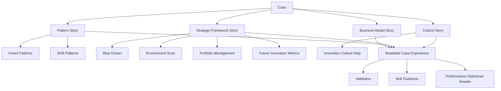

## User Requirements

- 将此前候选池中的 **Invent / Shift Patterns** 和 **Culture Map** 纳入当前系统升级计划。
- 判断这些内容是否能提升案例 story 的可读性、信息量和解释力；结论是：可以提升，应纳入计划。
- 不再只依赖战略框架标签，而是通过 pattern、框架、Culture Map、story 共同解释案例中的业务动作、组织能力和因果关系。
- 继续保留“同一家公司可以有多个 story”的原则：原有业务模式故事可以保留，新增战略框架 story、pattern story 或文化/组织能力 story。
- 继续统一修复案例阅读性能问题，避免案例数量和嵌入画布增加后导致打开速度进一步下降。

## Product Overview

案例库将从“画布与标签集合”升级为“框架、模式、组织文化和故事互相支撑的案例阅读系统”。用户阅读案例时，不仅能看到公司做了什么，还能理解它属于哪类商业模式动作、采用了什么战略框架、组织文化如何支撑这些动作，以及这些内容如何在画布中体现。

## Core Features

- 战略框架 story 质量规范
- 商业模式 pattern story 质量规范
- Invent / Shift Patterns 首批内容纳入
- Culture Map 新画布纳入
- 组合管理、蓝海战略、环境扫描案例 story 补强
- 多 story 案例结构
- 弱标签清理与校验机制
- 案例阅读性能优化
- Skill、校验、构建和性能回归验证

## Tech Stack Selection

- 项目结构：沿用现有 PinGarden monorepo。
- 前端：继续使用 React + TypeScript + Tailwind CSS。
- 后端：继续使用 Fastify API 与 `CanvasStorage` 抽象。
- 存储：继续沿用 `BundleStorage` / `FileSystemStorage` / `FederatedStorage`。
- 案例内容：继续使用 `packages/case-library/cases/<slug>/`。
- Pattern 内容：继续使用 `packages/case-library/patterns/<slug>/`。
- Strategy Framework 内容：继续使用 `packages/case-library/strategy-frameworks/<slug>/`。
- Canvas Bundle：新增 `packages/canvases/innovation-culture-map/`。
- Skill 生成：继续通过 `apps/cli/src/skill/templates.ts` 和 CLI 生成 `.claude/skills/pingarden/`，不手写生成目录。
- 校验：扩展现有 `apps/cli/src/commands/caseAuthor.ts` 中的 `case validate`。

## Implementation Approach

本次将当前计划升级为四条主线：质量规范、内容体系、Culture Map 画布、性能系统。

### 1. 建立统一 story 质量系统

现有 `docs/CASE_STORY_QUALITY.md` 已经包含通用 story 标准和蓝海战略要求，但现在需要扩展成可持续的质量体系：

- 通用案例 story：背景、战略动作、画布阅读、机制、风险、迁移启发。
- 战略框架 story：必须解释该框架如何在案例中发生作用。
- Pattern story：必须解释案例体现了哪种可复用商业模式动作。
- 组合管理 story：解释 Explore / Exploit、组合颗粒度、组合动作、时间移动、证据和风险。
- 蓝海战略 story：解释红海基线、非顾客、ERRC、价值曲线和 BMC 后果。
- 环境扫描 story：解释外部力量、机会/威胁、BMC 压力点和战略响应。
- Culture Map story：解释组织结果、行为、促进因素、阻碍因素如何影响创新与转型。
- 未来 `innovation-metrics` story：预留风险下降、证据强度、学习速度、成本和预期收益的质量 profile。

### 2. 纳入 Invent / Shift Patterns

《The Invincible Company》中的 Business Model Pattern Library 不应进入 `strategy-frameworks`，而应进入 `patterns` 体系。

原因：

- `strategy-frameworks` 解释“如何分析或管理”。
- `patterns` 解释“商业模式结构或迁移动作是什么”。
- Invent / Shift Patterns 能提升 story 可读性，因为它为案例提供“命名机制”，避免故事只停留在事件描述。

实施策略：

- 先从书中 Invent / Shift Patterns 做 V1 子集，不一次性导入全量。
- 优先选择当前案例库能支撑的 pattern。
- 每个 pattern 必须有：
- `pattern.json`
- `description.en.md`
- `description.zh.md`
- `skill.en.md`
- `skill.zh.md`
- 只给能在 story 中解释机制的案例加 `appliesPatterns[]`。
- 对已有案例新增 pattern 标签时，必须同步补 story 或 story 段落，不允许只加标签。

### 3. 新增 Culture Map / Innovation Culture Map

Culture Map 应作为新 canvas bundle，而不是 pattern 或 strategy framework。

推荐新增：

- slug：`innovation-culture-map`
- 英文名：`Innovation Culture Map`
- 中文名：`创新文化地图`

核心结构：

- Current State / 当前状态
- Desired State / 目标状态
- 每侧包含：
- Outcomes / 结果
- Behaviors / 行为
- Enablers / 促进因素
- Blockers / 阻碍因素

它能提升 story 的信息量，因为很多案例不仅需要解释业务模式，还需要解释组织为什么能持续探索、实验、转入和规模化。尤其适用于：

- `business-model-portfolio-management`
- 未来 `innovation-metrics`
- `ping-an-group`
- `bosch-accelerator`
- `procter-gamble-cd`
- `alibaba-group`

### 4. 升级案例内容

优先补强：

- `ping-an-group`：补强组合管理 story，解释金融核心、医疗、车主、金融科技平台之间的事件关系。
- `alibaba-group`：新增 portfolio story，必要时新增 Portfolio Map，拆解 Alibaba.com、淘宝、天猫、支付宝/蚂蚁、菜鸟、阿里云等组合角色。
- `procter-gamble-cd`：保留开放式创新 story，新增组合管理 story，解释 Connect & Develop 如何成为成熟主业周边的 Explore 管道。
- `nvidia-cuda`：若保留组合管理标签，必须新增 GPU → CUDA → AI 平台的 Explore / Exploit story，否则移除弱关联。
- `nestle-portfolio`、`bosch-accelerator`：按组合管理标准补强 story。
- 蓝海战略与环境扫描案例：审计是否存在“有标签但 story 没讲清楚”的问题，并列出补 story / 补画布 / 去标签清单。

### 5. 性能系统升级

继续保留当前计划中的性能修复：

- 后端 `FileSystemStorage.listStories()` 改为 metadata-only，避免读取 `content.md`。
- 从 `CasePreviewModal` 进入 read-only workspace 时复用已加载的 `CaseLibraryDetail`，减少重复请求。
- 对 `canvas-defs/:defId` 和背景 SVG 做客户端缓存或请求去重。
- `EmbeddedCanvas` 改为懒加载，进入视口或用户展开时再加载完整 state 与渲染树。
- 加入开发态 timing / request count 检查，防止案例数量增加后再次退化。

## Implementation Notes

- 先制定质量规范和校验，再批量补内容，避免继续生产低质量 story。
- Pattern、Strategy Framework、Canvas 三类内容必须保持边界清晰。
- 同一公司可以多个 story：业务模式 story、战略框架 story、pattern story、文化 story 可并存。
- 不要因为案例“创新”就加 pattern 或 strategy framework 标签。
- Culture Map V1 先做结构清晰、可读性强的标准画布，不做复杂插件。
- 性能优化优先解决重复请求、N+1、无意义 I/O 和嵌入画布过早渲染。
- 所有新增内容必须双语，且实际 story / sticky 内容必须完成本地化。

## Architecture Design



## Directory Structure Summary

```text
BusinessModelCanvas/
├── docs/
│   ├── CASE_STORY_QUALITY.md
│   │   # [MODIFY] 升级为通用 story + strategy framework + pattern + culture story 质量标准。
│   │
│   ├── STRATEGY_FRAMEWORK_CASE_REVIEW.md
│   │   # [NEW] 记录所有战略框架案例审计结果：补 story、补画布、保留或移除标签。
│   │
│   └── PATTERN_CASE_REVIEW.md
│       # [NEW] 记录 Invent / Shift Patterns 候选、案例匹配和 story 支撑情况。
│
├── packages/
│   ├── canvases/
│   │   └── innovation-culture-map/
│   │       ├── manifest.json
│   │       │   # [NEW] Culture Map 画布定义，包含 Current/Desired × Outcomes/Behaviors/Enablers/Blockers。
│   │       │
│   │       ├── bg.en.svg
│   │       │   # [NEW] 英文画布背景。
│   │       │
│   │       ├── bg.zh.svg
│   │       │   # [NEW] 中文画布背景。
│   │       │
│   │       ├── i18n/
│   │       │   ├── en.json
│   │       │   │   # [NEW] 英文 block 标题、prompt、示例。
│   │       │   └── zh.json
│   │       │       # [NEW] 中文 block 标题、prompt、示例。
│   │       │
│   │       └── knowledge/
│   │           ├── body.en.md
│   │           │   # [NEW] 英文填写指南、质量标准、反模式。
│   │           └── body.zh.md
│   │               # [NEW] 中文填写指南、质量标准、反模式。
│   │
│   └── case-library/
│       ├── manifest.json
│       │   # [MODIFY] 注册新增 Invent / Shift pattern V1；新增相关案例时同步注册。
│       │
│       ├── patterns/
│       │   └── <invent-or-shift-pattern>/
│       │       ├── pattern.json
│       │       │   # [NEW] V1 pattern 元数据、双语名称、summary、examples、references。
│       │       ├── description.en.md
│       │       ├── description.zh.md
│       │       ├── skill.en.md
│       │       └── skill.zh.md
│       │
│       ├── strategy-frameworks/
│       │   ├── blue-ocean-strategy/
│       │   │   # [MODIFY] 补充 story 质量要求。
│       │   ├── business-model-environment-scan/
│       │   │   # [MODIFY] 补充环境扫描 story 质量要求。
│       │   └── business-model-portfolio-management/
│       │       # [MODIFY] 补充组合管理 story、pattern、Culture Map 关联要求。
│       │
│       └── cases/
│           ├── ping-an-group/
│           │   # [MODIFY] 补强组合管理 story；必要时新增 Culture Map story。
│           ├── alibaba-group/
│           │   # [MODIFY] 新增 portfolio story；必要时新增 Portfolio Map / Culture Map。
│           ├── procter-gamble-cd/
│           │   # [MODIFY] 保留开放式创新 story，新增组合管理 / pattern story。
│           ├── nvidia-cuda/
│           │   # [MODIFY] 补 Explore→Exploit story 或移除弱组合管理标签。
│           ├── nestle-portfolio/
│           │   # [MODIFY] 补强 Exploit portfolio actions story。
│           └── bosch-accelerator/
│               # [MODIFY] 补强 Explore portfolio journey 与文化支撑 story。
│
├── apps/
│   ├── cli/
│   │   └── src/
│   │       ├── commands/
│   │       │   └── caseAuthor.ts
│   │       │       # [MODIFY] 扩展 case validate，检查 framework / pattern story 支撑。
│   │       │
│   │       └── skill/
│   │           └── templates.ts
│   │               # [MODIFY] 更新 story、pattern、strategy-framework、canvas workflow。
│   │
│   ├── server/
│   │   └── src/
│   │       └── storage/
│   │           ├── CanvasStorage.ts
│   │           ├── FileSystemStorage.ts
│   │           ├── BundleStorage.ts
│   │           └── FederatedStorage.ts
│   │               # [MODIFY] story meta-only 读取路径与性能修复。
│   │
│   └── web/
│       └── src/
│           ├── pages/
│           │   ├── LibraryPage.tsx
│           │   └── ProjectWorkspacePage.tsx
│           │       # [MODIFY] 复用预加载 case detail，减少重复请求。
│           │
│           └── story/
│               └── EmbeddedCanvas.tsx
│                   # [MODIFY] 懒加载、占位、canvas def/background 去重。
│
└── .claude/
    └── skills/
        └── pingarden/
            # [GENERATED] 通过 CLI skill install 重新生成。
```

## Key Code Structures

继续复用现有类型，不新增大型模型。必要时只增加轻量校验 profile：

```ts
interface StoryQualityProfile {
  id: string;
  requiredTerms: {
    en: string[];
    zh: string[];
  };
  recommendedSections: {
    en: string[];
    zh: string[];
  };
  level: 'warn' | 'error';
}
```

该结构可作为 `case validate` 内部实现，不一定需要暴露到共享类型。

## Culture Map Canvas Design

新增 `Innovation Culture Map / 创新文化地图` 作为标准画布模板，不改变主应用框架。画布采用清晰的左右双态结构，帮助用户比较当前文化与目标文化，并解释组织如何支撑创新、实验、组合迁移和双元管理。

### Page / Canvas Blocks

1. **Top Header**

- 显示画布名称、简短说明和填写方向。
- 强调这是组织文化诊断图，不是单个商业模式图。

2. **Current State Column**

- 左侧展示当前文化。
- 包含当前结果、当前行为、当前促进因素、当前阻碍因素。
- 用于描述已经真实发生的组织现象。

3. **Desired State Column**

- 右侧展示目标文化。
- 包含目标结果、目标行为、需要建立的促进因素、需要移除的阻碍因素。
- 用于描述组织需要变成什么样。

4. **Cross-Canvas Guidance**

- 通过知识文档和 Skill 说明与 Portfolio Map、Experiment Canvas、BMC 的关系。
- 不在画布上堆复杂说明，保持视觉清晰。

### Interaction

- 采用普通 sticky 画布交互，不新增复杂插件。
- 用户可用颜色区分促进因素、阻碍因素、目标行为、当前证据和领导动作。
- 与现有画布一致，支持预览、故事嵌入和 Skill 填写规则。

## Agent Extensions

### Skill

- **pingarden**
- Purpose: 对齐 PinGarden 的 canvas、case、pattern、story、Skill 和 CLI 校验规范。
- Expected outcome: 新增 Culture Map、Invent / Shift Patterns、story 质量规则和案例补强符合现有项目约定。

- **pdf**
- Purpose: 继续从《The Invincible Company》核对 Invent / Shift Patterns、Culture Map、Innovation Metrics 等章节。
- Expected outcome: pattern 选择、Culture Map 结构和 story 质量标准有可追溯依据。

### SubAgent

- **code-explorer**
- Purpose: 审计现有 pattern、strategy framework、case story、canvas bundle 和性能路径。
- Expected outcome: 明确哪些案例需要补 story、哪些 pattern 可纳入 V1、哪些文件需改动以及性能瓶颈位置。