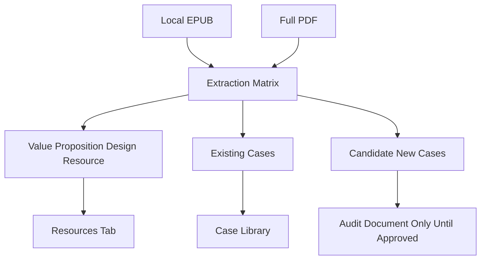

## User Requirements

用户在 `/Users/siboli/Documents/CodeBuddy/BusinessBooks` 新放入了《Value Proposition Design》的 EPUB 版本和完整版 PDF，希望整体阅读/抽取书中内容，判断是否可以补充到 PinGarden 的资料库和案例库中。

## Product Overview

本次重点是把《Value Proposition Design》从“书籍资料卡”升级为更有案例支撑的来源内容。资料页不仅说明这本书讲什么，还应补充书中出现的案例、示例、章节结构、价值主张设计方法，以及这些内容如何对应 PinGarden 的画布和已有案例。

## Core Features

- 读取并比对本地 EPUB 与完整版 PDF，确认完整性、目录、章节结构和可抽取文本质量。
- 从书中提取与价值主张设计相关的案例、公司、产品、示例和方法片段。
- 建立“案例/示例提取矩阵”，记录出处、章节、页码或 EPUB 章节、对应概念、可关联画布、是否已有 PinGarden 案例。
- 优先补充现有 `value-proposition-design` 资料说明，使阅读地图从高层概要升级为带案例索引的结构化内容。
- 对书中强相关且已有的案例，补充案例关联或教学说明；对信息不足的弱案例，只作为资料页索引，不创建完整案例。
- 遵守版权边界：只做原创摘要、结构化提炼和短引用级出处记录，不复制书中大段原文。

## Tech Stack Selection

继续沿用当前 PinGarden 项目架构：

- 内容包：`packages/case-library/`
- 资料层：`packages/case-library/resources/value-proposition-design/`
- 案例层：`packages/case-library/cases/<slug>/`
- 画布关联：`packages/canvases/`
- 校验入口：`apps/cli/src/commands/caseAuthor.ts`
- 本地书籍目录：`/Users/siboli/Documents/CodeBuddy/BusinessBooks`

本次不新增数据库、不改 API schema、不改 UI 结构；优先通过资源说明、案例关联和审计文档补充内容。

## Implementation Approach

采用“先抽取、再筛选、再写入”的方式，避免把书中所有提及品牌都盲目变成案例。

1. **书籍完整性与文本质量确认**

- 读取：
    - `/Users/siboli/Documents/CodeBuddy/BusinessBooks/Value+Proposition+FULL.pdf`
    - `/Users/siboli/Documents/CodeBuddy/BusinessBooks/Value+Proposition+Design_+How+to+Create+Products+and+Services+Customers+Want-Wil.epub`
- 对比 PDF 页数、元数据、目录、章节标题、EPUB nav/TOC。
- 选择文本抽取质量更好的版本作为主抽取源，另一个版本用于页码或章节交叉验证。

2. **案例/示例抽取矩阵**

- 抽取公司名、产品名、案例标题、图表标题、示例段落附近的上下文。
- 形成结构化矩阵：
    - case/example name
    - chapter/section
    - PDF page 或 EPUB chapter
    - VPC concept：Customer Profile / Value Map / Fit / Test / Evolve 等
    - related canvas
    - existing case slug
    - action：更新已有案例 / 只补资料页 / 候选新案例 / 放弃
    - confidence

3. **资料页增强优先**

- 先更新 `value-proposition-design` 资料，而不是马上大规模创建案例。
- 资料说明新增：
    - 完整版来源确认
    - 章节级阅读地图
    - 案例索引
    - 案例如何对应 VPC / JTBD / Empathy Map / Customer Journey / Experiment Canvas
    - 不纳入案例库的弱提及列表或处理原则

4. **案例库补充原则**

- 只补高置信案例。
- 已存在且与书中示例强相关的案例优先：
    - `nespresso`
    - `drybar`
    - `novo-nordisk-novopen`
    - `stitch-fix`
    - `patagonia`
- 如果书中出现强案例但库中不存在，先进入审计文档候选池；只有满足资料充分、可画布化、可教学时才创建新案例。

5. **版权与质量控制**

- 不复制长段原文。
- 只保留短出处、页码、章节名和原创摘要。
- 所有补充内容必须说明“它教会用户什么 VPC 用法”，而不是单纯堆品牌名。

## Implementation Notes

- EPUB 可通过 zip/HTML 结构读取 `container.xml`、OPF、nav/toc、章节 HTML；优先用于干净文本抽取。
- PDF 可通过 `pypdf` / `pdfplumber` 读取页数、目录、页码和章节附近文本；如果文本抽取噪声较高，只用于页码定位。
- 大型全文抽取结果不应提交到仓库；只提交提炼后的审计文档和资源/案例内容。
- 若修改 case `applies...` 或 case metadata，必须运行 case validate。
- 修改内容包后需要重启服务，因为 `BundleStorage` 启动时扫描 case-library。

## Architecture Design



## Directory Structure Summary

```
BusinessModelCanvas/
├── docs/
│   └── VALUE_PROPOSITION_BOOK_CASE_EXTRACTION.md
│       # [NEW] 记录 EPUB/PDF 完整性检查、目录结构、案例提取矩阵、筛选结论、放弃原因和版权处理原则。
│
├── packages/
│   └── case-library/
│       ├── resources/
│       │   └── value-proposition-design/
│       │       ├── resource.json
│       │       │   # [MODIFY] 补充完整版 PDF/EPUB 本地来源说明、可能新增 relatedCaseSlugs 或 tags。
│       │       ├── description.zh.md
│       │       │   # [MODIFY] 增加完整版章节阅读地图、案例索引、案例与画布对应关系、使用建议。
│       │       └── description.en.md
│       │           # [MODIFY] 与中文说明等深更新。
│       │
│       └── cases/
│           ├── nespresso/case.json
│           │   # [MODIFY-CANDIDATE] 若书中案例证据充分，补充 VPD/VPC 相关来源或标签。
│           ├── drybar/case.json
│           │   # [MODIFY-CANDIDATE] 若书中示例可支撑价值主张教学，补充关联说明。
│           ├── novo-nordisk-novopen/case.json
│           │   # [MODIFY-CANDIDATE] 若书中示例可支撑痛点缓解/客户任务说明，补充关联。
│           ├── stitch-fix/case.json
│           │   # [MODIFY-CANDIDATE] 若书中示例可支撑价值元素/个性化体验，补充关联。
│           └── patagonia/case.json
│               # [MODIFY-CANDIDATE] 若书中示例可支撑客户价值或价值观驱动主张，补充关联。
```

## Validation Plan

执行后需要验证：

- EPUB/PDF 抽取脚本只产生临时文件或审计文档，不提交完整版权文本。
- `resource.json` 和所有修改的 `case.json` JSON 可解析。
- 运行 case-library 校验：
- `pnpm --filter @pingarden/cli exec tsx src/index.ts case validate --json`
- 运行：
- `pnpm typecheck`
- `pnpm --filter @pingarden/web build`
- 如修改内容包，执行：
- `./start.sh`
- 验证：
- `/library/resources/value-proposition-design` 能读取更新后的说明和关联。

## Agent Extensions

### Skill

- **pdf**
- Purpose: 读取和分析本地 `Value+Proposition+FULL.pdf`，提取页数、目录、章节文本、案例出现位置和页码线索。
- Expected outcome: 得到完整 PDF 的结构化摘要、可引用页码范围和案例候选列表。

- **pingarden**
- Purpose: 按 PinGarden 策略库六层架构判断抽取内容应进入 Resource、Case 还是仅作为候选记录，并确保关联到正确画布。
- Expected outcome: 形成符合 PinGarden 内容规范的资料增强方案和案例筛选结论。

- **browsing**
- Purpose: 当书中出现潜在新增案例时，用公开来源补充最低限度事实核验，避免只依赖书中单一线索创建案例。
- Expected outcome: 对新增/更新案例的公开事实、公司名称和产品背景进行交叉确认。

### SubAgent

- **code-explorer**
- Purpose: 复核现有 `value-proposition-design` 资料、相关 case 目录、case validate 规则和既有案例内容结构。
- Expected outcome: 明确最小改动范围，避免破坏现有案例库、资源库和校验链路。