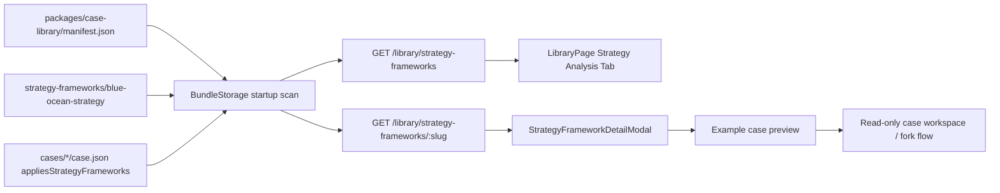

## User Requirements

用户希望把 Blue Ocean Strategy 相关工作从零散调研整理成一个可跟踪的大任务，并清理掉之前已完成或不再相关的旧实验模板任务，避免混在当前计划中。

## Product Overview

在案例库中新增“战略分析”能力，把 Blue Ocean Strategy 作为第一套战略分析方法上线。它不作为单一商业模式处理，而作为一种可复用的战略分析框架，帮助用户理解如何通过战略画布、价值曲线、剔除-减少-提升-创造、非顾客和市场边界重构来分析企业案例。

## Core Features

- 新增“战略分析”Tab，与“企业案例”“商业模式”“实验设计”并列。
- 新增“蓝海战略”方法页，提供中英文方法说明、适用场景、核心工具、反模式和推荐案例。
- 第一批落地 4 个蓝海相关案例：新增太阳马戏团、黄尾袋鼠葡萄酒、QB House 快剪，并增强已有任天堂 Wii。
- 所有新增内容都提供中英文版本。
- 第一批先跑通战略分析方法库、案例联动、页面展示、CLI 查询和验证链路。
- 后续批次保留扩展空间，可继续增加 Novo Nordisk、Bloomberg、Salesforce、citizenM、Nickel 等案例，也可扩展五力、PESTEL、SWOT/TOWS、情景规划等战略方法。

## Tech Stack Selection

- 复用现有 PinGarden 技术栈：React + TypeScript 前端、Fastify API、共享 TypeScript 类型、pnpm monorepo。
- 内容层继续沿用 `packages/case-library` 的 bundle 机制，新增战略分析方法作为与 cases、patterns、experiments 平级的只读内容类型。
- 案例仍使用现有 library case bundle：`case.json` + project/canvas/story + Yjs state，不改运行时 canvas 写入协议。
- 蓝海案例优先使用已有 `blue-ocean-strategy-canvas`，不新增画布定义；仅在案例中新增或补充该画布实例。
- Web UI 复用现有 LibraryPage、列表卡片、详情弹窗、分页和 i18n 模式，不引入新的 UI 框架或视觉体系。

## Implementation Approach

本次采用“先建内容类型，再落第一批样板案例”的策略。Blue Ocean Strategy 不放入 `patterns`，因为现有 patterns 表达的是商业模式结构类型，而 Blue Ocean Strategy 是战略分析框架。新增 `strategy-frameworks` 作为一等内容类型后，案例可以通过 `appliesStrategyFrameworks` 与方法建立双向关联，前端可以在“战略分析”Tab 中展示方法，也可以从案例卡片跳转到对应战略方法详情。

关键决策：

1. **新增 Strategy Framework 内容类型**

- 类似 `BusinessModelPattern`，但语义独立。
- 路径建议为 `packages/case-library/strategy-frameworks/blue-ocean-strategy/`。
- 包含 `framework.json`、`description.en.md`、`description.zh.md`、`skill.en.md`、`skill.zh.md`。
- `manifest.json` 增加 `strategyFrameworks` 数组。

2. **新增案例关联字段**

- 在 `CaseLibraryEntry` 增加 `appliesStrategyFrameworks?: string[]`。
- 第一批新增案例和增强的 `nintendo-wii` 都关联 `blue-ocean-strategy`。
- 验证器必须检查该字段引用的 framework 是否存在于 manifest。

3. **前端新增第四个 Tab**

- `LibraryTab` 从三类扩展为 `cases | patterns | experiments | strategyFrameworks`。
- 增加 `StrategyFrameworkList` 和 `StrategyFrameworkDetailModal`，复用 Pattern/Experiment 的列表、详情和案例跳转交互。
- CaseCard/CasePreviewModal 增加战略方法 chip，可点击切换到“战略分析”Tab 并打开详情。

4. **服务端与 CLI 对齐**

- `BundleStorage` 启动时扫描 `strategy-frameworks` 并缓存，列表和详情请求均为内存读取。
- 新增 API：`GET /library/strategy-frameworks` 和 `GET /library/strategy-frameworks/:slug`。
- 新增 CLI 命令：`strategy-framework list` 和 `strategy-framework get <slug>`。
- 扩展 `case validate`，把 framework bundle、examples 反向引用、case 正向引用纳入发布门禁。

5. **内容第一批范围**

- 新增 `blue-ocean-strategy` 方法。
- 新增 `cirque-du-soleil`、`yellow-tail`、`qb-house` 三个双语案例。
- 增强已有 `nintendo-wii`，补充 Blue Ocean Strategy Canvas 和双语战略故事，不重复创建新 slug。
- 第二批、第三批只写入计划/方法描述中的 roadmap，不在第一批实现。

## Implementation Notes

- 旧实验模板计划应从当前跟踪中移除或标记为已完成/不执行，本计划作为新的大任务源头。
- 不要复用 `patterns` 来承载 Blue Ocean Strategy，避免把“战略方法”和“商业模式结构”混淆。
- `BundleStorage` 当前已经支持 cases、patterns、experiments 的启动扫描和内存缓存；新增 framework 应复制这一架构，避免每次请求读磁盘。
- 前端列表页继续一次性拉取轻量 list 数据；详情弹窗按需拉取 markdown 和 exampleCases，避免首页加载过重。
- 新增案例必须双语完整：case summary、canvas title/meta、story、stickies 均需 en/zh。
- Blue Ocean Strategy Canvas 的每个案例必须包含竞争因素、至少两条价值曲线、ERRC 说明、非顾客和对 BMC 的影响。
- `nintendo-wii` 只增强现有 bundle，不新增重复案例。
- 对本地书籍 PDF 的使用仅作为内容来源辅助，实际写入时要提炼为原创摘要，避免大段复制书籍内容。
- 所有公开来源需要记录在 `sources` 或 framework `references` 中，便于后续追溯。
- 验证必须扩展到新类型：manifest 引用、孤儿目录、framework examples、case `appliesStrategyFrameworks`、双语文件存在性。

## Architecture Design

新增内容类型沿用现有 Library 分层：



数据关系：

- `StrategyFramework` 是只读方法内容，没有项目、没有 canvas、不能 fork。
- `CaseLibraryEntry` 是具体案例，可以有 canvases/stories，可 fork。
- `StrategyFramework.examples[]` 指向案例 slug。
- `CaseLibraryEntry.appliesStrategyFrameworks[]` 指向 framework slug。
- 双向引用通过 `case validate` 做发布前校验。

## Directory Structure Summary

本实现会新增战略分析内容类型、前后端读取链路、CLI 命令、验证规则和第一批案例内容。新案例内部的 UUID 目录由现有 case author/生成流程产生，不在计划阶段伪造具体 UUID。

```
/Users/siboli/Documents/CodeBuddy/BusinessModelCanvas/
├── packages/
│   ├── shared/
│   │   └── src/index.ts
│   │       # [MODIFY] 新增 StrategyFramework、StrategyFrameworkDetail、StrategyFrameworkExampleRef 等共享类型；
│   │       # 为 CaseLibraryEntry 增加 appliesStrategyFrameworks 字段；保持现有 pattern/experiment 类型兼容。
│   └── case-library/
│       ├── manifest.json
│       │   # [MODIFY] 增加 strategyFrameworks 数组，首个条目为 blue-ocean-strategy；
│       │   # 增加第一批新案例 slug，并保留 nintendo-wii 原 slug。
│       ├── strategy-frameworks/
│       │   └── blue-ocean-strategy/
│       │       ├── framework.json
│       │       │   # [NEW] 蓝海战略方法元数据，包含中英文名称、摘要、references、examples。
│       │       ├── description.en.md
│       │       │   # [NEW] 英文长文说明：定义、适用场景、工具、案例、反模式。
│       │       ├── description.zh.md
│       │       │   # [NEW] 中文长文说明，与英文等价但自然表达。
│       │       ├── skill.en.md
│       │       │   # [NEW] AI 面向的英文简明用法说明。
│       │       └── skill.zh.md
│       │           # [NEW] AI 面向的中文简明用法说明。
│       └── cases/
│           ├── cirque-du-soleil/
│           │   ├── case.json
│           │   ├── projects/
│           │   ├── canvases/
│           │   └── stories/
│           │       # [NEW] 太阳马戏团双语案例；包含 BMC 和 Blue Ocean Strategy Canvas。
│           ├── yellow-tail/
│           │   ├── case.json
│           │   ├── projects/
│           │   ├── canvases/
│           │   └── stories/
│           │       # [NEW] 黄尾袋鼠葡萄酒双语案例；强调成熟葡萄酒市场中的价值曲线重构。
│           ├── qb-house/
│           │   ├── case.json
│           │   ├── projects/
│           │   ├── canvases/
│           │   └── stories/
│           │       # [NEW] QB House 快剪双语案例；强调功能导向、10 分钟服务和 ERRC。
│           └── nintendo-wii/
│               ├── case.json
│               ├── canvases/
│               └── stories/
│                   # [MODIFY] 增加 appliesStrategyFrameworks；
│                   # 补充 Blue Ocean Strategy Canvas 与双语战略故事。
├── apps/
│   ├── server/
│   │   └── src/
│   │       ├── storage/BundleStorage.ts
│   │       │   # [MODIFY] 扫描 strategy-frameworks，提供 listStrategyFrameworks/getStrategyFramework 方法。
│   │       └── http/library.ts
│   │           # [MODIFY] 注册 /library/strategy-frameworks 和 /library/strategy-frameworks/:slug。
│   ├── web/
│   │   └── src/
│   │       ├── api/library.ts
│   │       │   # [MODIFY] 增加 listStrategyFrameworks/getStrategyFramework API。
│   │       ├── pages/LibraryPage.tsx
│   │       │   # [MODIFY] 新增战略分析 Tab、分页状态、详情弹窗状态、跨 Tab 跳转逻辑。
│   │       ├── components/StrategyFrameworkList.tsx
│   │       │   # [NEW] 战略方法卡片列表，复用 PatternList 的简洁卡片风格。
│   │       ├── components/StrategyFrameworkDetailModal.tsx
│   │       │   # [NEW] 战略方法详情弹窗，展示 description、references、exampleCases。
│   │       ├── components/CaseCard.tsx
│   │       │   # [MODIFY] 展示 appliesStrategyFrameworks chip，并支持点击跳转。
│   │       ├── components/CasePreviewModal.tsx
│   │       │   # [MODIFY] 在案例预览中展示战略方法关联。
│   │       ├── i18n/en.json
│   │       │   # [MODIFY] 增加 Strategy Analysis、framework modal、空状态等英文文案。
│   │       └── i18n/zh.json
│   │           # [MODIFY] 增加“战略分析”等中文文案。
│   └── cli/
│       └── src/
│           ├── index.ts
│           │   # [MODIFY] 注册 StrategyFrameworkListCommand 和 StrategyFrameworkGetCommand。
│           ├── commands/strategyFramework.ts
│           │   # [NEW] 新增 strategy-framework list/get 命令。
│           ├── commands/caseAuthor.ts
│           │   # [MODIFY] author schema 与 validate 支持 appliesStrategyFrameworks 和 framework bundle 校验。
│           ├── skill/discover.ts
│           │   # [MODIFY] 发现 strategy-frameworks 目录。
│           ├── skill/bundle.ts
│           │   # [MODIFY] 读取 StrategyFrameworkBundle。
│           ├── skill/generate.ts
│           │   # [MODIFY] 生成 skill 时纳入战略方法文档。
│           ├── skill/templates.ts
│           │   # [MODIFY] 更新 pingarden skill 索引、workflow/reference，加入战略分析方法。
│           └── commands/skill.ts
│               # [MODIFY] skill build/install 输出 strategy framework 数量。
└── .claude/
    └── skills/pingarden/
        # [GENERATED/VERIFY] 通过 skill install/build 更新本地 skill 输出；
        # 不手工编辑生成文件，除非当前项目流程要求同步本地安装结果。
```

## Key Code Structures

建议新增的共享类型保持与现有 Pattern/Experiment 风格一致：

```ts
export interface StrategyFramework {
  slug: string;
  name: LocalizedLabel;
  summary: LocalizedLabel;
  sources: CaseSource[];
  references?: StrategyFrameworkReference[];
  examples: StrategyFrameworkExampleRef[];
  relatedCanvasDefIds?: string[];
}

export interface StrategyFrameworkDetail {
  framework: StrategyFramework;
  description: { en: string; zh: string };
  exampleCases: CaseLibraryEntry[];
}

export interface CaseLibraryEntry {
  appliesStrategyFrameworks?: string[];
}
```

如果希望减少重复，可以让 `StrategyFrameworkReference` 复用现有 annotated reference 的字段形状，但不要让产品语义依赖 `BusinessModelPattern`。

## Research Traceability Appendix

本节用于保证第一批未完成、或第一批完成后继续第二/第三批时，仍能追溯最初盘点过的企业、案例来源、书籍来源和批次决策。

### 本地书籍与已提取资料

| 来源 | 路径 / 位置 | 用途 | 备注 |
| --- | --- | --- | --- |
| Blue Ocean Strategy Expanded Edition | `/Users/siboli/Documents/CodeBuddy/BusinessBooks/Blue Ocean Strategy, Expanded Edition_ How to Create Uncontested Market Space and Make the Competition Irrelevant ( PDFDrive.com ).pdf` | 蓝海战略核心理论、案例、术语英文源 | 后续写案例时只做原创提炼，不大段复制 |
| 蓝海战略 扩展版 | `/Users/siboli/Documents/CodeBuddy/BusinessBooks/蓝海战略  扩展版 -- (韩)W_钱·金,(美)勒妮·莫博涅著;吉宓译.pdf` | 中文术语、案例中文表达 | 与英文版对照，保证双语自然 |
| 蓝海战略 2 | `/Users/siboli/Documents/CodeBuddy/BusinessBooks/蓝海战略 2 (韩)W_钱·金(W_Chan Kim).pdf` | Blue Ocean Shift / 转型方法补充 | 用于后续第二/第三批方法扩展 |
| 蓝海战略1 | `/Users/siboli/Documents/CodeBuddy/BusinessBooks/蓝海战略1  超越产业竞争,开创全新市场 -- (韩)金,(美)莫博涅著;吉宓译.pdf` | 早期中文版本术语参考 | 用于核对“战略布局图/战略画布”等译法 |
| Business Model Generation | `/Users/siboli/Documents/CodeBuddy/BusinessBooks/Business model generation A handbook for visionaries, game changers, and challengers-Wiley (2010)(1).pdf`；已提取文本：`extracts/bmc-en/full.txt`、`extracts/bmc-zh/full.txt` | 解释 BMC 如何结合 Blue Ocean Strategy | 英文约 `extracts/bmc-en/full.txt:10488-10698`；中文约 `extracts/bmc-zh/full.txt:4488-4617` |
| Value Proposition Design | `/Users/siboli/Documents/CodeBuddy/BusinessBooks/Value-proposition-design.pdf`；已提取文本：`extracts/vpc-en/`、`extracts/vpc-zh/` | VPC 与竞争对手/战略画布结合 | 中文提取中有“价值主张设计 vs 竞争对手”与战略画布练习 |
| The Invincible Company | `/Users/siboli/Documents/CodeBuddy/BusinessBooks/The-invincible-company.pdf`；已提取文本：`extracts/invincible-en/full.txt` | 后续扩展 citizenM、Nintendo Wii、更多“更高价值+更低成本”案例 | citizenM 重点位于 `extracts/invincible-en/full.txt:11650-11759` 附近 |
| Testing Business Ideas | `/Users/siboli/Documents/CodeBuddy/BusinessBooks/Testing Business Ideas.pdf` | 后续若为战略案例补验证实验，可交叉引用 | 本计划不直接实施实验模板 |
| 商业模式决定成败套装 | `/Users/siboli/Documents/CodeBuddy/BusinessBooks/商业模式决定成败（套装共5册）(1).pdf` | 中文商业模式术语补充 | 待后续需要时再检索 |


### 方法论来源与可引用网页

| 来源 | URL | 已提取要点 | 建议使用位置 |
| --- | --- | --- | --- |
| What is Blue Ocean Strategy | `https://www.blueoceanstrategy.com/what-is-blue-ocean-strategy/` | 蓝海战略是同时追求差异化和低成本，开创新市场空间、创造新需求、使竞争无关紧要 | `blue-ocean-strategy/framework.json` references；方法说明开头 |
| 7 Powerful Blue Ocean Strategy Examples | `https://www.blueoceanstrategy.com/blog/7-powerful-blue-ocean-strategy-examples/` | 公开列出 Marvel、Nintendo Wii/Switch、Stitch Fix、HealthMedia、Nickel、Yellow Tail、Cirque du Soleil | 案例候选池和 roadmap |
| Blue Ocean Strategy & Shift Cases | `https://www.blueoceanstrategy.com/teaching-materials/all-cases/` | 官方教学案例总目录，含 20+ Harvard best-selling cases，列出大量教学材料入口 | 后续批次候选池，不等同于已核验可写案例 |
| Business Model Generation · Blue Ocean + BMC | 本地提取：`extracts/bmc-en/full.txt:10488-10698`、`extracts/bmc-zh/full.txt:4488-4617` | BMC 是 Blue Ocean Strategy 的延伸；四项行动框架可作用于 BMC 每个模块；右侧价值变化会影响左侧成本/基础设施 | 方法说明“与 BMC 的关系”章节 |
| Strategy Canvas skill docs | `.claude/skills/pingarden/canvases/blue-ocean-strategy-canvas.en.md`、`.zh.md` | X 轴竞争因素、Y 轴 0-5、每个竞争者一条价值曲线、ERRC 推导未来曲线 | 案例画布填写规范 |


### 第一批案例：实施范围

| slug | 企业 / 案例 | 中英文名 | 来源 | 蓝海机制 | 第一批动作 |
| --- | --- | --- | --- | --- | --- |
| `cirque-du-soleil` | Cirque du Soleil | 太阳马戏团 / Cirque du Soleil | `https://www.blueoceanstrategy.com/blue-ocean-strategy-examples/cirque-du-soleil/`；`https://www.blueoceanstrategy.com/teaching-materials/cirque-du-soleil/`；BMG 本地提取 | 传统马戏转向成人、企业客户、剧院/歌剧观众；剔除动物和明星演员；提升艺术性、主题、音乐、精致环境与票价 | 新增双语案例，作为蓝海案例样板 |
| `yellow-tail` | Casella Winery / [yellow tail] | 黄尾袋鼠葡萄酒 / [yellow tail] | `https://www.blueoceanstrategy.com/teaching-materials/yellowtail/`；官方 7 examples blog | 在成熟拥挤葡萄酒市场中，降低专业门槛和复杂选择，创造简单、有趣、易饮的大众社交葡萄酒 | 新增双语案例 |
| `qb-house` | QB House | QB House 快剪 / QB House | `https://www.blueoceanstrategy.com/blue-ocean-strategy-examples/qb-house/` | 从情感型理发服务转向功能型 10 分钟快剪；剔除热毛巾、按摩、饮品、传统洗吹；创造 air-wash 和交通灯等候系统 | 新增双语案例 |
| `nintendo-wii` | Nintendo Wii | 任天堂 Wii / Nintendo Wii | 现有案例 `packages/case-library/cases/nintendo-wii/`；BMG 本地提取；官方 7 examples blog | 不与 Sony/Microsoft 继续硬件性能竞赛，降低性能/图形/补贴，提升体感互动、家庭娱乐、休闲玩家吸引力 | 增强现有案例，补 Blue Ocean Strategy Canvas 和战略故事，不新增重复 slug |


### 第二批候选：建议下一轮优先

| slug 建议 | 企业 / 案例 | 中英文名 | 来源 | 蓝海机制 | 状态 |
| --- | --- | --- | --- | --- | --- |
| `novo-nordisk-novopen` | Novo Nordisk / NovoPen | 诺和诺德 NovoPen / Novo Nordisk NovoPen | `https://www.blueoceanstrategy.com/blue-ocean-strategy-examples/novo-nordisk/` | 从医生/药物纯度竞争转向患者使用体验；创造胰岛素笔和糖尿病护理解决方案 | 第二批候选 |
| `bloomberg-terminal` | Bloomberg Terminal | Bloomberg 终端 / Bloomberg Terminal | `https://www.blueoceanstrategy.com/blue-ocean-strategy-examples/bloomberg/` | 从 IT 采购者转向交易员/分析师；双屏、专业键盘、内置分析和生活服务 | 第二批候选 |
| `salesforce-blue-ocean` | Salesforce.com | Salesforce.com / Salesforce.com | `https://www.insead.edu/faculty-research/publications/case-studies/salesforcecom-creating-a-blue-ocean-b2b-space` | 在 B2B CRM 中通过产品、服务、交付平台进行价值创新 | 第二批候选 |
| `citizenm` | citizenM | citizenM 酒店 / citizenM | `extracts/invincible-en/full.txt:11650-11759`；官方 Blue Ocean Shift 相关材料待补 | 为 mobile citizens 去掉高端酒店中昂贵但非必要元素，提升床、隔音、WiFi、公共空间和低成本扩张 | 第二批候选 |
| `nickel-bank` | Nickel | Nickel 银行 / Nickel | 官方 7 examples blog；官方 all-cases `teaching-materials/nickel/` | 为被传统银行排斥或低收入人群提供低门槛、低成本、透明、快速开户的基础银行服务 | 第二批候选，需执行前补充单页来源 |


### 第三批候选：现代案例、行业扩展和反例

| slug 建议 | 企业 / 案例 | 中英文名 | 来源 | 蓝海机制 / 用途 | 状态 |
| --- | --- | --- | --- | --- | --- |
| `marvel-studios` | Marvel | 漫威影业 / Marvel Studios | 官方 7 examples blog；官方 all-cases `teaching-materials/marvel` | 从传统漫画转向人性化超级英雄与电影宇宙 | 第三批候选 |
| `stitch-fix` | Stitch Fix | Stitch Fix / Stitch Fix | 官方 7 examples blog；官方 all-cases `teaching-materials/stitch-fix/` | AI + 真人造型师，降低逛店和选择成本，创造规模化私人造型服务 | 第三批候选 |
| `healthmedia` | HealthMedia | HealthMedia / HealthMedia | 官方 7 examples blog | 数字健康教练，介于高成本电话咨询和低效果泛化健康内容之间 | 第三批候选 |
| `drybar` | Drybar | Drybar 吹发吧 / Drybar | 官方 all-cases `teaching-materials/drybar` | 美发服务业重构，可与 QB House 形成对照 | 第三批候选，需执行前补源 |
| `tata-nano` | Tata Nano | 塔塔 Nano / Tata Nano | 官方 all-cases `teaching-materials/tata-nano`；BMG 中低价汽车例子 | 可作为蓝海尝试但商业结果复杂的反思/反例 | 第三批候选，需谨慎写作 |
| `transsion-africa` | Transsion | 传音非洲手机 / Transsion Mobile | 官方 all-cases `teaching-materials/transsion-mobile-deep-blue-ocean-in-africa/` | 非洲本地化手机创新，中文语境价值高 | 第三批候选，需补源 |
| `ping-an-good-doctor` | Ping An Good Doctor | 平安好医生 / Ping An Good Doctor | 官方 all-cases `teaching-materials/ping-an-good-doctor/` | 中国医疗平台案例 | 第三批候选，需补源 |
| `nvidia-market-creating-moves` | NVIDIA | NVIDIA / NVIDIA | 官方 all-cases `teaching-materials/nvidias-market-creating-blue-ocean-moves/`、`nvidias-future-strategy/` | 市场创造型技术战略，适合现代高科技案例 | 第三批或更后，需谨慎核对时效 |


### 已盘点但暂不纳入前三批的官方教学材料入口

这些来自 `https://www.blueoceanstrategy.com/teaching-materials/all-cases/` 的公开目录。它们可作为未来候选池，但当前只记录，不承诺实现：

- `mei-ktv` / Mei KTV
- `petwellclinic` / PetWellClinic
- `meta-facebook-pivot-to-metaverse` / Meta-Facebook Pivot to Metaverse
- `andre-rieu` / André Rieu
- `webtoon-entertainment` / Webtoon Entertainment
- `driving-the-future`
- `apple` / Apple
- `ipl` / Indian Premier League
- `gillette` / Gillette
- `rehability` / Rehability
- `park24` / Park24
- `hello-sunshine` / Hello Sunshine
- `tgtg` / Too Good To Go
- `tongwei` / Tongwei
- `wawa` / Wawa
- `ntt-docomo` / NTT DoCoMo
- `skype` / Skype
- `lang-lang` / Lang Lang
- `huitongda` / 汇通达
- `taylor-swift` / Taylor Swift
- `deepseek` / DeepSeek
- `amazon` / Amazon
- `wikipedia` / Wikipedia
- `zappos` / Zappos
- `blue-ocean-finance`
- `innovation-changed-lives-women-india`
- `upb` / Bolivian Private University

### 追溯原则

- 第一批执行时，必须优先落地 `cirque-du-soleil`，把它作为内容质量样板。
- 后续批次不得凭记忆新增案例；必须先回到本节表格核对来源，再补充必要网页/书籍引用。
- 每个案例的 `case.json.sources` 至少包含 1 个公开网页来源；如使用本地书籍提炼，还要在 story 或 sources 中标明书名和章节/页码线索。
- 若某案例只有官方 all-cases 目录入口、尚未读取单案例页，则标记为“需补源”，执行前必须先补充来源。
- 不把官方目录中所有条目一次性做完；批次完成标准以计划中的 batch 范围为准。

## Validation Plan

实施完成后运行并通过：

- `node apps/cli/dist/index.js case validate --json`
- `pnpm typecheck`
- `pnpm --filter @pingarden/server run build`
- `pnpm --filter @pingarden/web run build`
- `pnpm --filter @pingarden/cli run build`
- 验证 `/library/strategy-frameworks` 返回 `blue-ocean-strategy`
- 验证 `/library/strategy-frameworks/blue-ocean-strategy` 返回 description 和 4 个第一批 exampleCases
- 验证 Library 页面出现“战略分析”Tab
- 验证从案例 chip 可打开蓝海战略详情
- 验证 `nintendo-wii` 没有重复 slug，只是被增强

## Agent Extensions

### Skill

- **pingarden**
- Purpose: 对齐 PinGarden 的案例库、Strategy Canvas、BMC、story、fork/read-only 语义，确保蓝海案例符合画布填写规则。
- Expected outcome: 每个蓝海案例都有可读、可 fork、可复用的双语 BMC 与 Blue Ocean Strategy Canvas。

- **pdf**
- Purpose: 读取用户本地 Blue Ocean Strategy 中英文书籍和相关商业书籍，补充案例来源和双语术语。
- Expected outcome: 蓝海战略方法说明和案例内容有可靠来源，避免凭空编写或机器直译。

### SubAgent

- **code-explorer**
- Purpose: 系统复核现有 cases、patterns、experiments、BundleStorage、LibraryPage、CLI validator 和 skill 生成链路。
- Expected outcome: 明确所有需要修改的文件与依赖链，避免遗漏验证、CLI、前端或 skill 同步。