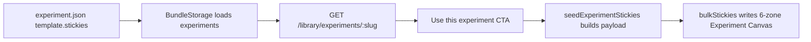

## User Requirements

- 用户希望实验模板的质量达到截图标杆，而不是仅满足“12 个实验都有模板”。
- 截图展示的是 Experiment Canvas 的 6 区模板：最高风险假设、可证伪假设、实验设置、指标与判定标准、结果与结论、下一步。
- 模板内容应像截图里的客户访谈示例一样具体、可执行、可直接替换：包含目标客户、样本量、招募渠道、执行方式、记录方式、通过/失败阈值和后续行动。
- 需要研究当前测试库模板质量，识别哪些模板偏泛化，并给出升级计划。

## Product Overview

测试库中的实验模板用于帮助用户从实验详情页一键创建实验画布。高质量模板应像一份轻量实验 SOP：用户创建画布后，不需要重新思考实验怎么跑，只需要替换自身业务变量即可开始执行。

## Core Features

- 保持 12 个实验都具备 6 区模板。
- 将偏泛化模板升级为高质量可执行模板。
- 每个实验模板都要体现该实验方法的专属动作，而不是通用占位话术。
- 每个模板都要支持中英文，中文表达要自然、清晰，接近截图中的可读性。
- 保留 Smoke Test、Wizard of Oz 等已有高质量模板风格，作为本次升级标杆。

## Tech Stack Selection

- 复用现有 PinGarden 项目架构：React + TypeScript 前端、Fastify 服务端、共享 TypeScript 类型、JSON 内容包。
- 不新增数据结构、不改 UI、不改服务端路由。
- 模板内容继续维护在 `packages/case-library/experiments/<slug>/experiment.json` 的 `template.stickies[]` 中。
- 继续使用现有 `ExperimentTemplate` 类型和 `seedExperimentStickies.ts` 写入链路。

## Implementation Approach

本次是内容质量升级，不是架构改造。现有链路已经能把 `experiment.json` 中的 6 区模板写入 Experiment Canvas，因此最佳方案是升级模板文本本身，使每个 sticky 从“泛化 scaffold”变为“可执行实验 SOP”。

质量标杆来自三类来源：

1. 用户截图中的 Customer Interview 模板：短小但具体，明确招募渠道、样本数、ICP、执行动作。
2. 现有 `smoke-test` 模板：具体到落地页工具、广告预算、样本量、UTM、分析工具、停跑条件。
3. 现有 `wizard-of-oz` 模板：具体到前端承诺、人工后台、SLA、吞吐上限、人工成本记录。

升级策略：

- 重点升级 9 个新补模板：
- `boomerang`
- `clickable-prototype`
- `concierge`
- `discussion-forums`
- `letter-of-intent`
- `online-survey`
- `pre-sale`
- `search-trend-analysis`
- `storyboard`
- 小幅增强 `customer-interview` 的指标、结果、下一步，使其和截图质量一致且判定更完整。
- 原则上不改 `smoke-test`、`wizard-of-oz`，仅复核格式一致性。
- 每个模板仍保持 6 个固定 zoneId：
- `riskiest-assumption`
- `falsifiable-hypothesis`
- `experiment-setup`
- `metrics-criteria`
- `results-conclusion`
- `next-steps`

## Implementation Notes

- `experiment-setup` 是本次升级重点：每个实验至少包含招募/样本、材料/工具、执行流程、记录/数据处理。
- `metrics-criteria` 必须包含 Pass / Fail / Inconclusive 或 Watch，不只写单一通过标准。
- `results-conclusion` 要预留可填写的关键数字、定性发现、异常/限制和结论。
- `next-steps` 要提供该实验专属的 Persevere / Pivot / Kill 路径，不能写泛泛的“继续观察”。
- 模板应保持“画布 sticky 可读”的长度：比普通提示更具体，但避免长篇 PRD。
- 中文应优先可用，英文同步完整；避免机器直译腔。
- 修改后需要重新运行 CLI build，确保实验库源文件与 CLI assets 镜像一致。
- 不扩大改动面：不改 `ExperimentTemplate` 接口，不改 `seedExperimentStickies.ts` 逻辑，不改 UI 渲染。

## Architecture Design

现有数据流保持不变：



## Directory Structure

本次主要修改实验模板内容，并同步/验证生成资产。

```
/Users/siboli/Documents/CodeBuddy/BusinessModelCanvas/
├── packages/
│   └── case-library/
│       └── experiments/
│           ├── boomerang/
│           │   └── experiment.json              # [MODIFY] 升级 Boomerang 模板，具体到竞品选择、观察任务、录屏记录、摩擦点聚类、后续原型验证。
│           ├── clickable-prototype/
│           │   └── experiment.json              # [MODIFY] 升级可点击原型模板，具体到原型范围、任务设计、主持测试、完成率与困惑点判定。
│           ├── concierge/
│           │   └── experiment.json              # [MODIFY] 升级 Concierge 模板，具体到人工承诺、SLA、人工履约、吞吐上限、满意度和人工成本。
│           ├── customer-interview/
│           │   └── experiment.json              # [MODIFY] 小幅增强客户访谈模板，保留截图风格，补强指标、结果记录和下一步分支。
│           ├── discussion-forums/
│           │   └── experiment.json              # [MODIFY] 升级论坛观察模板，具体到关键词、社区来源、帖子样本、编码方式、私信访谈。
│           ├── letter-of-intent/
│           │   └── experiment.json              # [MODIFY] 升级 LOI 模板，具体到 LOI 条款、目标对象、签署数量、预计金额和异议记录。
│           ├── online-survey/
│           │   └── experiment.json              # [MODIFY] 升级在线问卷模板，具体到筛选题、样本量、开放题、样本来源、偏差和后续访谈。
│           ├── pre-sale/
│           │   └── experiment.json              # [MODIFY] 升级预售模板，具体到真实收款、价格、交付承诺、退款政策、订单/收入阈值。
│           ├── search-trend-analysis/
│           │   └── experiment.json              # [MODIFY] 升级搜索趋势模板，具体到关键词组、地区周期、趋势导出、相关查询和后续验证。
│           ├── storyboard/
│           │   └── experiment.json              # [MODIFY] 升级故事板模板，具体到 6-8 格旅程、备选方案、用户讲述、缺失步骤和偏好判断。
│           ├── smoke-test/
│           │   └── experiment.json              # [REVIEW] 作为高质量标杆复核，原则上不改，避免破坏已有截图级体验。
│           └── wizard-of-oz/
│               └── experiment.json              # [REVIEW] 作为高质量标杆复核，原则上不改，保持现有模板质量。
└── apps/
    └── cli/
        └── assets/
            └── experiments/                     # [GENERATED/VERIFY] 通过 CLI build 同步源实验模板镜像，确认与 packages/case-library/experiments 一致。
```

## Validation Plan

完成后运行：

- 覆盖率校验：12 个实验都必须有 6 个 template stickies。
- zoneId 校验：每个 sticky 的 `zoneId` 必须属于 Experiment Canvas 6 区。
- 双语校验：每个 sticky 的 `text.en` 和 `text.zh` 必须存在且非空。
- 源库与 CLI assets 一致性校验。
- `pnpm typecheck`
- `pnpm --filter @pingarden/web run build`
- `pnpm --filter @pingarden/server run build`
- `pnpm --filter @pingarden/cli run build`

## Agent Extensions

### Skill

- **pingarden**
- Purpose: 对齐 Experiment Canvas 的 6 区语义、填写顺序和模板质量标准。
- Expected outcome: 每个实验模板都能创建出可执行、可替换、符合 PinGarden 画布语义的实验画布。

- **pdf**
- Purpose: 必要时回查《Testing Business Ideas.pdf》中对应实验章节的方法要求和案例上下文。
- Expected outcome: 模板内容不凭空发挥，能与书中实验方法保持一致。

### SubAgent

- **code-explorer**
- Purpose: 复核当前 12 个实验模板内容、模板写入链路、CLI assets 同步路径。
- Expected outcome: 明确哪些文件需要升级，避免遗漏模板镜像或破坏现有高质量模板。