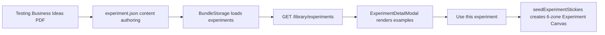

## User Requirements

- 盘点当前测试库中 12 个实验的「真实世界案例」完成情况，确认哪些已经做了、哪些还缺。
- 参考用户提供的书籍目录中关于测试的书《Testing Business Ideas.pdf》，补齐测试库内容。
- 目标是让 12 个实验都具备类似截图中 Smoke Test 的完整体验：打开实验详情后能看到真实世界案例，并能用该实验创建有预填内容的新实验画布。

## Product Overview

测试库是 PinGarden 中用于帮助用户选择和运行商业假设验证实验的内容库。每个实验应包含实验说明、风险类型、证据强度、真实案例和可直接使用的实验画布模板。

## Core Features

- 当前盘点结果：12 个实验中，只有 2 个已有真实世界案例：Smoke Test 的 Buffer、Wizard of Oz 的 Zappos。
- 当前模板结果：12 个实验中，只有 3 个已有完整实验画布模板：Customer Interview、Smoke Test、Wizard of Oz。
- 需要补齐剩余实验的真实世界案例，优先采用书中案例；案例足够完整时使用「假设 / 实验设计 / 证据 / 洞察 / 行动」结构，不足时使用简版案例。
- 需要补齐剩余实验的 6 区实验画布模板：最致命假设、可证伪假设、实验设置、指标与判定、结果结论、下一步。
- 所有内容需同时支持英文和中文显示，来源信息需可追溯。

## Tech Stack Selection

- 复用当前项目技术栈：React + TypeScript 前端、Fastify API、共享 TypeScript 类型、JSON 内容包。
- 内容数据继续存放在 `packages/case-library/experiments/<slug>/experiment.json`。
- 书籍来源使用本地 PDF：`/Users/siboli/Documents/CodeBuddy/BusinessBooks/Testing Business Ideas.pdf`。
- 验证沿用项目现有门禁：`pnpm typecheck`、`pnpm --filter @pingarden/web build`，并增加 JSON 覆盖率检查。

## Implementation Approach

本次优先做内容层补齐，不改实验库架构。现有系统已经支持 `examples[]` 和 `template.stickies[]`：服务端 `BundleStorage` 会读取 `experiment.json`，前端 `ExperimentDetailModal` 会渲染真实案例，`seedExperimentStickies.ts` 会用模板生成实验画布。因此最佳方案是补齐 12 个实验的数据，使现有 UI 和创建画布流程自然生效。

关键决策：

- 不新增新的数据模型，继续使用 `ExperimentExample` 和 `ExperimentTemplate`。
- 每个实验至少 1 个真实世界案例；书中有完整案例时采用 Featured 结构，否则采用 Compact 结构。
- 每个实验统一补齐 6 个模板便签，避免当前缺模板时只落一个通用 setup 便签。
- 内容来源以《Testing Business Ideas》为主，现有 `sources[]` 中的辅助书籍只作为补充。
- 不做 UI 重构，仅修正明显过期注释或文案不一致，降低改动面。

## Implementation Notes

- 真实案例字段必须双语完整：`company`、`headline`、`story`，Featured 案例还需 `hypothesis`、`experiment`、`evidence`、`insights`、`actions`。
- 模板便签必须覆盖 `experiment-canvas` 的 6 个 zoneId：`riskiest-assumption`、`falsifiable-hypothesis`、`experiment-setup`、`metrics-criteria`、`results-conclusion`、`next-steps`。
- 保留现有 Smoke Test / Wizard of Oz 的案例质量作为标杆，不破坏截图中已存在的 Buffer 展示效果。
- 增量内容会随 `/library/experiments` 一次返回；12 个实验的文本规模较小，对启动和接口性能影响可忽略。
- 避免硬编码 UI 文案；前端已有 `apps/web/src/i18n/{en,zh}.json`，如需新增界面文案才修改 i18n。
- 不引入数据库迁移，不改 HTTP 路由，不改 `CanvasStorage` 写入路径。

## Architecture Design

当前数据流保持不变：



## Directory Structure

本次实现主要修改实验内容文件，少量修正过期注释。

```
/Users/siboli/Documents/CodeBuddy/BusinessModelCanvas/
├── packages/
│   └── case-library/
│       └── experiments/
│           ├── boomerang/
│           │   └── experiment.json              # [MODIFY] 补齐真实案例与 6 区模板，来源优先使用 Testing Business Ideas。
│           ├── clickable-prototype/
│           │   └── experiment.json              # [MODIFY] 补齐可点击原型案例与模板，保持双语字段完整。
│           ├── concierge/
│           │   └── experiment.json              # [MODIFY] 补齐 Concierge 案例与模板，重点体现人工高触达验证。
│           ├── customer-interview/
│           │   └── experiment.json              # [MODIFY] 保留现有模板，补齐客户访谈真实案例并复核来源。
│           ├── discussion-forums/
│           │   └── experiment.json              # [MODIFY] 补齐论坛观察案例与模板，明确观察证据与后续行动。
│           ├── letter-of-intent/
│           │   └── experiment.json              # [MODIFY] 补齐 LOI 案例与模板，突出承诺强度和签署条件。
│           ├── online-survey/
│           │   └── experiment.json              # [MODIFY] 补齐在线问卷案例与模板，明确样本、偏差和判定阈值。
│           ├── pre-sale/
│           │   └── experiment.json              # [MODIFY] 补齐预售案例与模板，突出真实付款证据。
│           ├── search-trend-analysis/
│           │   └── experiment.json              # [MODIFY] 补齐搜索趋势案例与模板，明确关键词、周期和趋势判断。
│           ├── smoke-test/
│           │   └── experiment.json              # [MODIFY] 复核 Buffer 案例和模板格式，必要时只修正文案/来源一致性。
│           ├── storyboard/
│           │   └── experiment.json              # [MODIFY] 补齐故事板案例与模板，突出场景理解和反馈收集。
│           └── wizard-of-oz/
│               └── experiment.json              # [MODIFY] 复核 Zappos 案例和模板格式，必要时只修正文案/来源一致性。
└── apps/
    └── web/
        └── src/
            ├── components/
            │   └── ExperimentDetailModal.tsx    # [MODIFY] 修正“无案例 surface”等过期注释，不改变现有渲染逻辑。
            └── lib/
                └── seedExperimentStickies.ts    # [MODIFY] 复核注释与实际 12 个模板完成状态一致，逻辑保持不变。
```

## Key Code Structures

无需新增接口。继续使用现有结构：

- `Experiment.examples: ExperimentExample[]`
- `Experiment.template?: ExperimentTemplate`
- `ExperimentExample` 的 Compact / Featured 双密度渲染
- `ExperimentTemplate.stickies[]` 映射到实验画布 6 个 zone

## Agent Extensions

### Skill

- **pdf**
- Purpose: 读取和抽取 `/Users/siboli/Documents/CodeBuddy/BusinessBooks/Testing Business Ideas.pdf` 中 12 个实验对应案例、页码和原文依据。
- Expected outcome: 形成可追溯的实验案例来源清单，避免凭空编写案例。

- **pingarden**
- Purpose: 对齐 PinGarden 的 Experiment Canvas 语义、6 区模板结构和实验库使用方式。
- Expected outcome: 每个实验点击“用这个实验开个新画布”后，都能生成符合产品结构的可用画布。

### SubAgent

- **code-explorer**
- Purpose: 复核实验库、前端渲染、服务端读取和种子模板链路，确认没有遗漏的改动点。
- Expected outcome: 输出准确缺口清单，并保证修改范围只落在必要文件。