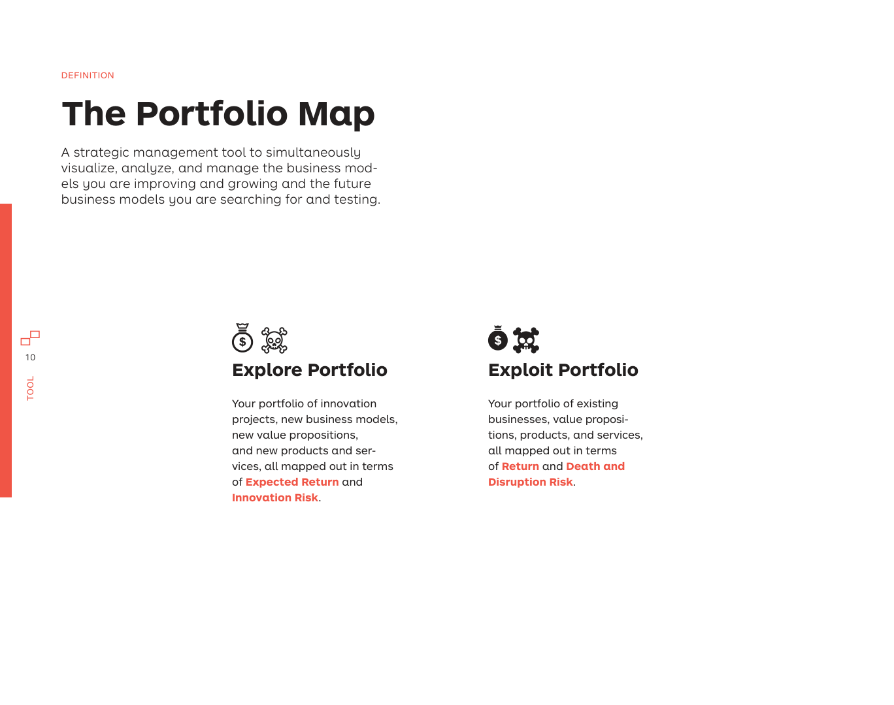
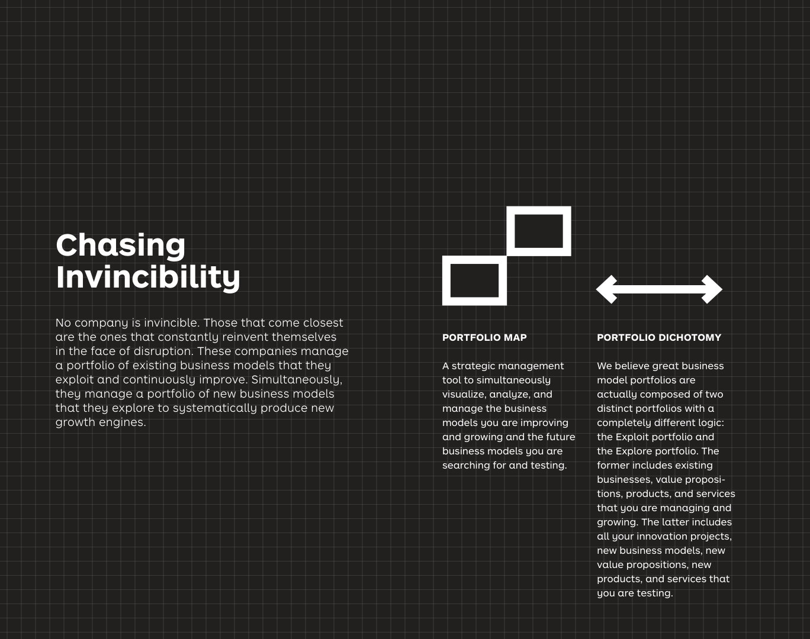
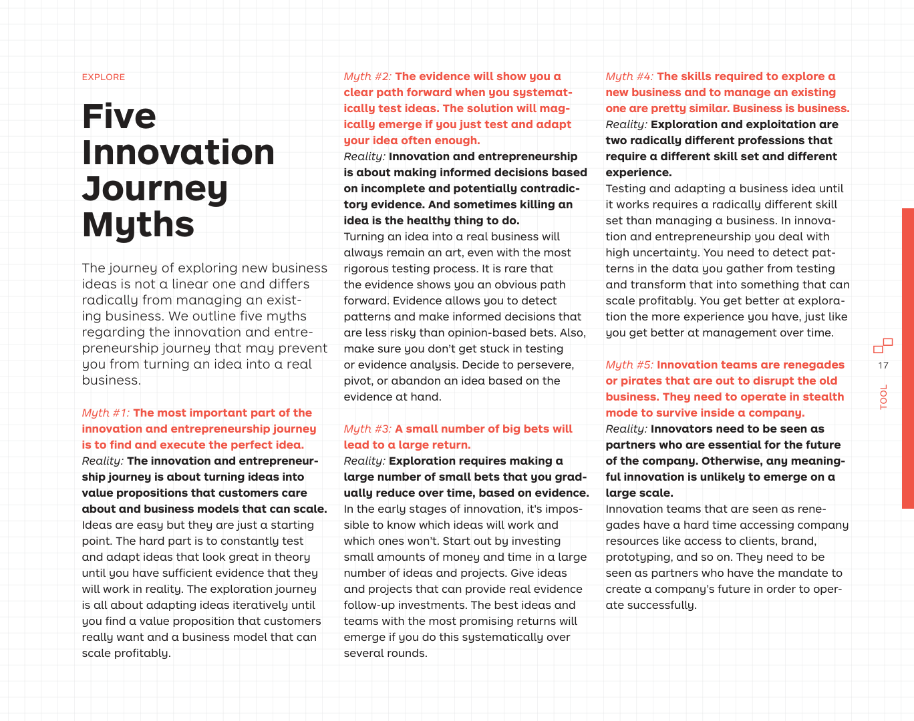

# Tool

> **Pages:** 1–46  
> **Keywords:** portfolio map, explore, exploit, innovation journey, business model portfolio  
> **Summary:** Introduces the Portfolio Map as a strategic tool to simultaneously visualize, analyze, and manage both existing businesses (Exploit) and new opportunities (Explore). Defines the core concepts, axes, and actions for both portfolios.

---

## 1. The Business Model Portfolio

No company is invincible. Those that come closest are the ones that constantly reinvent themselves in the face of disruption. These companies manage a portfolio of existing business models that they exploit and continuously improve. Simultaneously, they manage a portfolio of new business models that they explore to systematically produce new growth engines.

A **business model portfolio** is the collection of existing business models a company exploits and the new business models it explores in order to avoid disruption and ensure longevity.

> **Key takeaway:** Great business model portfolios are composed of two distinct portfolios with completely different logic: the **Exploit portfolio** (existing businesses you manage and grow) and the **Explore portfolio** (innovation projects and new business models you are testing).

### Portfolio Management

Designing and maintaining a strong business model portfolio requires three main activities:

- **Visualize** — Create a shared language and understanding of which business models you have and which ones you are exploring.
- **Analyze** — Identify if you are at risk of disruption and if you are doing enough against it. Analyze which business models are most profitable, most at risk, and which ones you are exploring for future growth.
- **Manage** — Take action to design and maintain a balanced portfolio. Continuously grow and improve existing business models by shifting outdated ones to new business models, while exploring completely new business models.

---

## 2. The Explore/Exploit Continuum

Invincible Companies do not prioritize exploitation over exploration. They are world class at simultaneously managing the entire continuum from exploring new businesses to exploiting existing ones. They keep a culture of "day one," maintaining a start-up spirit, while managing thousands or even hundreds of thousands of people and multibillion-dollar businesses.

| Dimension | Explore | Exploit |
|-----------|---------|---------|
| **Mindset** | Search and breakthrough | Focus, efficiency and growth |
| **Uncertainty** | High | Low |
| **Financial Philosophy** | Venture-capital style risk-taking, expecting few outsized winners | Safe haven with steady returns and dividends |
| **Culture & Processes** | Iterative experimentation, embracing speed, failure, learning, and rapid adaptation | Linear execution, embracing planning, predictability, and minimal failure |
| **People & Skills** | Explorers who excel in uncertainty, are strong at pattern recognition, and can navigate between big picture and details | Managers who are strong at organizing and planning and can design efficient processes to deliver on time and budget |

> **Key takeaway:** Increasingly, the ability to manage exploration and exploitation is not just limited to large established companies. It is also a matter of survival for SMEs and start-ups with the shortening lifespan of business models across industries.

---

## 3. The Portfolio Map

The **Portfolio Map** is a strategic management tool to simultaneously visualize, analyze, and manage the business models you are improving and growing and the future business models you are searching for and testing.

### Explore Portfolio

Your portfolio of innovation projects, new business models, new value propositions, and new products and services, all mapped out in terms of **Expected Return** and **Innovation Risk**.

- **Expected Return** — The financial potential (or impact) of a business idea if it is successful. This may be profitability, revenue potential, growth potential, margins, or any other financial metric. Alternatively, you may focus on social or environmental return.
- **Innovation Risk** — The risk that a (convincing) business idea is going to fail. Risk is high when there is little evidence beyond slides and spreadsheets to support the success chances of an idea. Risk decreases with the amount of evidence that supports desirability, feasibility, viability, and adaptability.

### Exploit Portfolio

Your portfolio of existing businesses, value propositions, products, and services, all mapped out in terms of **Return** and **Death and Disruption Risk**.

- **Return** — How lucrative a business area is for the company.
- **Death & Disruption Risk** — The risk that a business is going to die or get disrupted. Risk is high when a business is either emerging and still vulnerable, or when a business is under threat of disruption from technology, competition, regulatory changes, or other trends. Risk decreases with the moats protecting your business.

> **Key takeaway:** The Explore portfolio is all about the **search** for new ideas, value propositions, and business models. The Exploit portfolio is all about **growth** — keeping existing business models on a growth trajectory by scaling emerging ones, renovating declining ones, and protecting successful ones.

---

## 4. The Innovation Journey

The journey of exploring new business ideas is not a linear one and differs radically from managing an existing business. We outline five myths regarding the innovation and entrepreneurship journey that may prevent you from turning an idea into a real business.

### Five Innovation Journey Myths

1. **Myth:** The most important part of the innovation journey is to find and execute the perfect idea.  
   **Reality:** Ideas are easy but they are just a starting point. The hard part is to constantly test and adapt ideas until you have sufficient evidence that they will work in reality.

2. **Myth:** The evidence will show you a clear path forward when you systematically test ideas.  
   **Reality:** Innovation is about making informed decisions based on incomplete and potentially contradictory evidence. And sometimes killing an idea is the healthy thing to do.

3. **Myth:** A small number of big bets will lead to a large return.  
   **Reality:** Exploration requires making a large number of small bets that you gradually reduce over time, based on evidence.

4. **Myth:** The skills required to explore a new business and to manage an existing one are pretty similar.  
   **Reality:** Exploration and exploitation are two radically different professions that require a different skill set and different experience.

5. **Myth:** Innovation teams are renegades or pirates that are out to disrupt the old business.  
   **Reality:** Innovators need to be seen as partners who are essential for the future of the company. Otherwise, any meaningful innovation is unlikely to emerge on a large scale.

---

## 5. The Exploration Journey

The journey in the Explore portfolio is one of search and pivot until you have enough evidence that a new business idea will work. The search consists of two main activities that continuously nourish each other: **Business Design** (to increase expected return) and **Testing** (to reduce innovation risk).

### Four Types of Innovation Risk

There are four types of innovation risks that might kill a business idea:

- **Desirability Risk** — Customers aren't interested. The market is too small, too few customers want the value proposition, or the company can't reach, acquire, and retain targeted customers.
- **Viability Risk** — We can't earn enough money. The business can't generate successful revenue streams, customers are unwilling to pay (enough), or the costs are too high to make a sustainable profit.
- **Feasibility Risk** — We can't build and deliver. The business can't manage, scale, or get access to key resources (technology, IP, brand, etc.), key activities, or key partners.
- **Adaptability Risk** — External factors are unfavorable. The business won't be able to adapt to the competitive environment, technology, regulatory, social, or market trends.

### Potential Steps in the Exploration Journey

| Step | Description |
|------|-------------|
| **Discovery** | Customer understanding, context, and willingness to pay. Initial evidence indicates that customers care about what you intend to address (desirability). |
| **Validation** | Proven interest and indications of profitability. First mock sales or letters of intent signal how much customers will pay (viability). |
| **Acceleration** | Proven model at limited scale. First products and services to test your value proposition in a limited market. |
| **Reality Check** | Failure of initial trajectory. New evidence indicates that the idea you've been testing is unlikely to work. |
| **Change of Direction** | Testing a new direction after pivoting from an initial trajectory. |

> **Key takeaway:** Testing is the activity of reducing the risk of pursuing ideas that look good in theory, but won't work in reality. Design is the activity of turning vague ideas, market insights, and evidence from testing into concrete value propositions and solid business models.

---

## 6. Explore Portfolio Actions

There are seven actions you perform in your Explore portfolio. All are related to shaping and testing new business ideas in order to improve their return and reduce their innovation risk.

| Action | Description |
|--------|-------------|
| **Ideate** | Turn market opportunities, technologies, products, or services into first business model and value proposition prototypes. |
| **Invest** | Invest fully or partially in an outside start-up or exploration project to bolster your portfolio of internal projects. |
| **Persevere** | Continue testing an idea based on evidence. |
| **Pivot** | Make a significant change to one or more elements of your business model after learning that the idea won't work without major modifications. |
| **Transfer** | Move a business model idea from exploration to exploitation based on strong evidence of desirability, feasibility, viability, and adaptability. |
| **Spinout** | Sell a promising idea to another company, to investors, or to the team that explored it. |
| **Retire** | Kill a search project based on evidence or lack of strategic fit. |

### Bosch Accelerator Program Example

To illustrate the Explore portfolio we use Bosch, the German multinational engineering and technology company. Since 2017, Bosch has invested in more than 200 teams. From these teams, 70% retired their projects after the first investment round and 75% of the remaining teams stopped after the second. With this process, 15 teams have successfully transferred their projects to scale with follow-on funding.

> **Key takeaway:** All you touch will not turn to gold. You can't pick the winners. The larger the return you expect, the more projects you need to invest small sums in.

---

## 7. Exploit Portfolio Actions

The journey in the Exploit portfolio is one of growth and decline of a business. The aim is to continuously prevent existing business models from declining by protecting, improving, and reinventing them.

### Growth and Decline Trajectories

| Phase | Description |
|-------|-------------|
| **Scale** | Get the business off the ground. Turn a proven opportunity into a real business by scaling customer acquisition, retention, and delivery. |
| **Boost** | Bolster the performance of an established business with sustaining innovation, new product innovations, new channels, and adjacent markets. |
| **Protect** | Make a business more efficient and protect it from disruption. Efficiency innovation dominates this phase. |
| **Disruption** | External forces threaten your business. Changes in the environment make your business vulnerable. |
| **Crisis** | External forces disrupt your business and trigger decline. |
| **Shift & Reemergence** | Substantial business model shift and renewed growth. |

There are seven actions you can perform in your Exploit portfolio:

| Action | Description |
|--------|-------------|
| **Acquire** | Buy an outside business to create a new stand-alone business or merge it with an existing one. |
| **Partner** | Partner with an outside business to strengthen one or more of your business models. |
| **Invest** | Build up an investment stake in an outside business to take advantage of its success. |
| **Merge** | Merge an acquired outside or owned inside business with one or several owned businesses. |
| **Improve** | Renovate an outdated business model to shift it toward a new, more competitive business model. |
| **Divest** | Disengage from one of your business models by selling it to another company, investors, or management. |
| **Dismantle** | End and disintegrate a business. |

### Nestlé Portfolio Example

To illustrate the use of the Exploit portfolio, we outline how Swiss food company Nestlé managed its portfolio of existing businesses over the course of 2017 and 2018. Nestlé expanded its portfolio across categories by acquiring, investing in, or partnering with outside companies (Starbucks license, Blue Bottle Coffee, Atrium Innovations, tails.com, Sweet Earth). It improved brands like Gerber and Yinlu, and divested its U.S. confectionery business to Ferrero for $2.8 billion.

---

## 8. Types of Innovation

Not all innovations are equal. Different types of innovations require different skills, resources, experience levels, and support from the organization. We distinguish between three different types of innovation heavily borrowed from Harvard professor Clayton Christensen: efficiency, sustaining, and transformative innovation.

| Type | Description | Advantage | Disadvantage | Home |
|------|-------------|-----------|--------------|------|
| **Efficiency** | Improves operational aspects of existing business models without substantial change. | Low risk, immediate impact, predictability. | No protection from disruption; doesn't help position for the future. | Across the organization and at every level. |
| **Sustaining** | Builds on top of existing business models to strengthen them and keep them alive. | Low risk, immediate impact, predictability. | No protection from disruption; doesn't help position for the future. | Across the organization and at every level. |
| **Transformative** | Explores opportunities outside of the traditional field, usually requiring radical change. | Positions the company for the long-term; offers protection from disruption. | High risk and uncertainty; rarely quick returns. | Dedicated and autonomous innovation teams outside of business units. |

> **Key takeaway:** Use the Portfolio Map to visualize, analyze, and manage your existing businesses and the new ideas you are exploring. Whether you are an entrepreneur, corporate innovation team, or senior leader, the Portfolio Map provides a shared language for strategic discussions about your business model portfolio.
