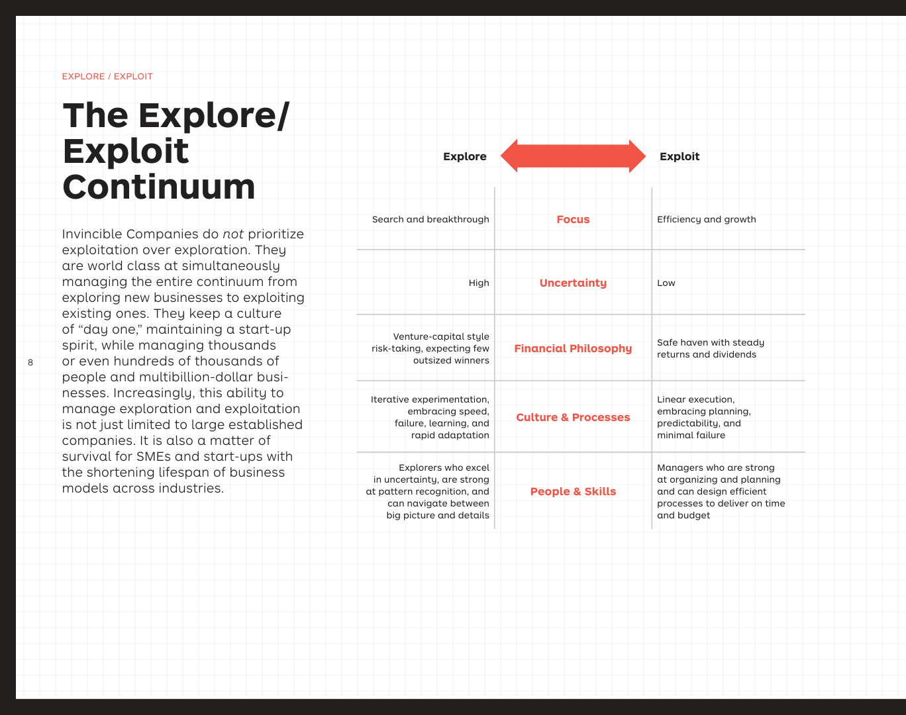

# When to use the Portfolio Map

The Portfolio Map (Osterwalder, Pigneur, Etiemble & Smith, *The Invincible
Company*, 2020) is a one-page picture of **every business model your
company is running or trying to run**. It puts two portfolios side by
side:

- **Exploit** — businesses you already operate. The question is whether
  they will keep producing returns, or whether they're being disrupted
  faster than you can defend them.
- **Explore** — bets you're testing for the future. The question is
  whether they'll graduate into real, profitable business models before
  you run out of patience or money.

Reach for it when you want to talk about **how the business model
portfolio is evolving** — which models are graduating, which are
declining, where the next one will come from — rather than the details
of any single model.

## First step

Start by listing the comparable business models, products, regions, or
ventures you want to place on the map. Do not place a bubble until you
can name what it sells, who it serves, which business model it uses, and
which evidence you will use for risk and return.

## Reach for it when

- You're preparing a board / leadership review and need a single page
  showing the *whole* company's model portfolio, not just the flagship.
- A team is stuck in "innovator's dilemma" territory: the cash cow gets
  every resource, exploration starves.
- You want to make portfolio actions explicit — what to **invest**,
  **pivot**, **kill**, **improve**, **defend**, or **reinvent** — and
  defend them with two axes instead of opinions.
- You're tracking innovation projects over time and want movement on the
  map (left → right as risk drops, bottom → top as expected return
  climbs) to be the unit of progress.

## Skip it when

- You're designing a single business model — use the **Business Model
  Canvas** for the inside of one bubble.
- You're aligning a single value proposition with a single segment — use
  the **Value Proposition Canvas**.
- You don't yet have multiple business models to compare. With one or
  two bubbles the map is overkill; come back when the portfolio is real.

## Output and next step

The output is not a prettier portfolio chart. It is a small set of
portfolio decisions: which bubbles need investment, which need evidence,
which should be defended, which should be reinvented, and which should
be killed or divested. Drill into any important bubble with the Business
Model Canvas, then use the Evidence Scorecard or Experiment Canvas to
reduce the risk behind the next move.
