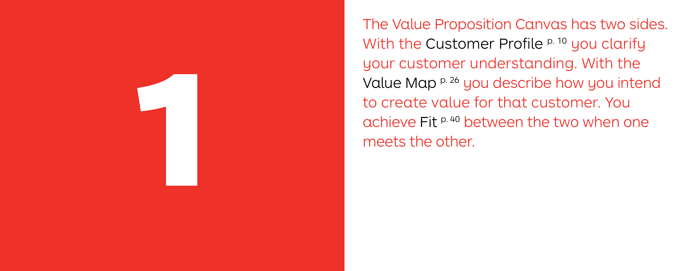
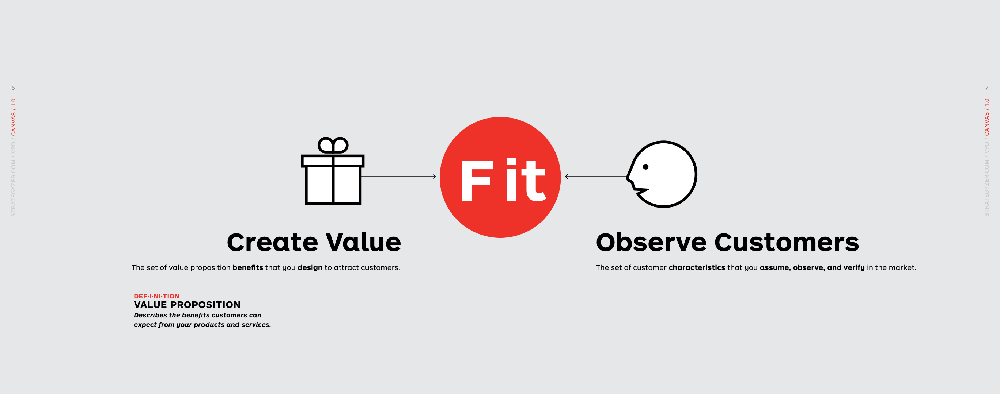
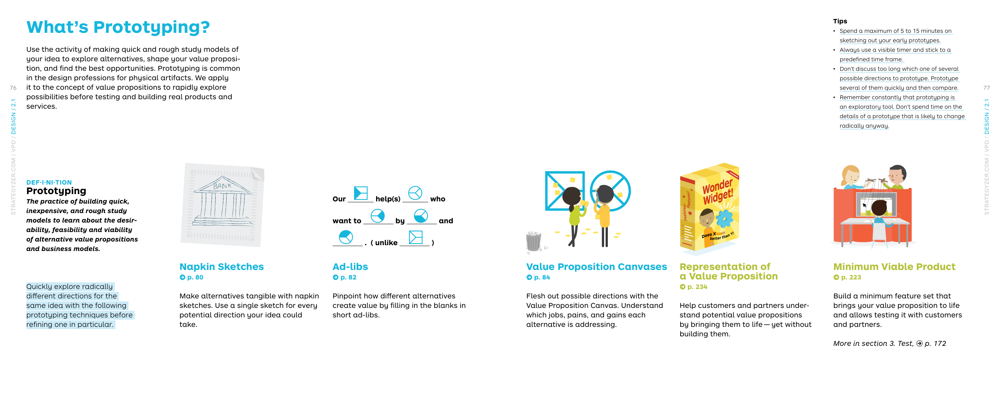

# Value Proposition Design

> **Authors:** Alex Osterwalder, Yves Pigneur, Greg Bernarda, Alan Smith  
> **Published:** 2014  
> **Language:** English  
> **Total Chapters:** 4

The sequel to *Business Model Generation* shows how to use the **Value Proposition Canvas** to design, test, and deliver what customers want. It is organized around four stages: **Canvas** (understand the tools), **Design** (create alternatives), **Test** (validate with evidence), and **Evolve** (continuously improve).

## Quick Navigation

| Chapter | Title | Pages | Key Topics |
|---------|-------|-------|------------|
| [01-canvas](01-canvas/) | Canvas | 6–69 | Customer Profile, Value Map, Fit |
| [02-design](02-design/) | Design | 70–187 | Prototyping, Starting Points, Understanding Customers, Making Choices |
| [03-test](03-test/) | Test | 188–259 | What to Test, Testing Step-by-Step, Experiment Library |
| [04-evolve](04-evolve/) | Evolve | 260–277 | Alignment, Measurement, Improvement, Reinvention |

## Key Visuals

- 
- 
- 
- 

## Related Knowledge

- [Value Proposition Canvas knowledge panels](../../assets/)
- [Business Model Generation book knowledge](../en/) (sister publication)
